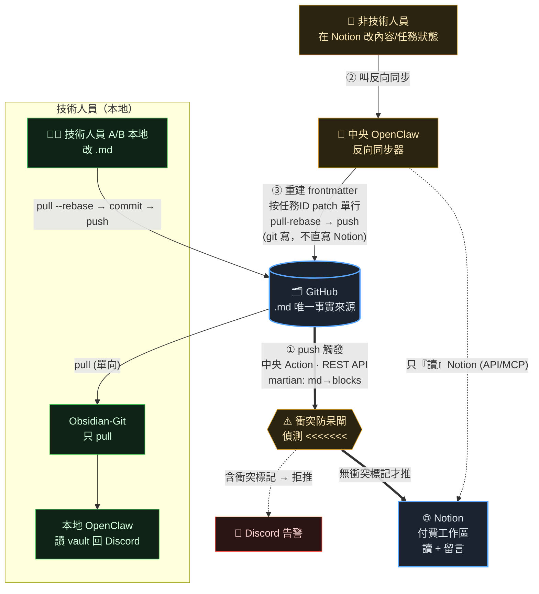
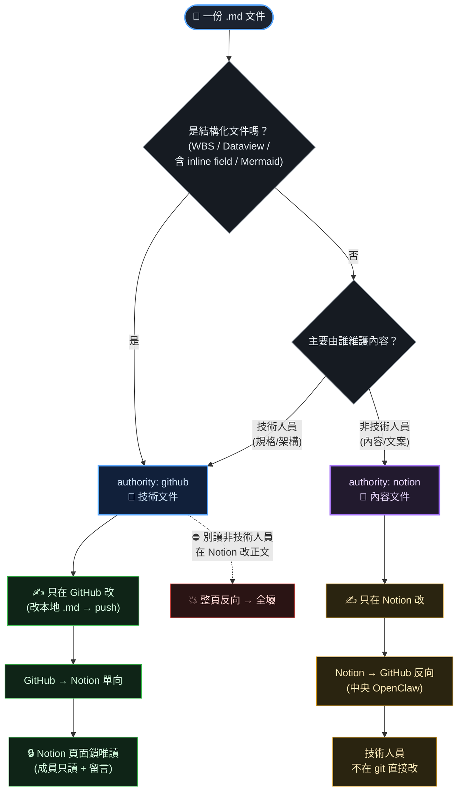
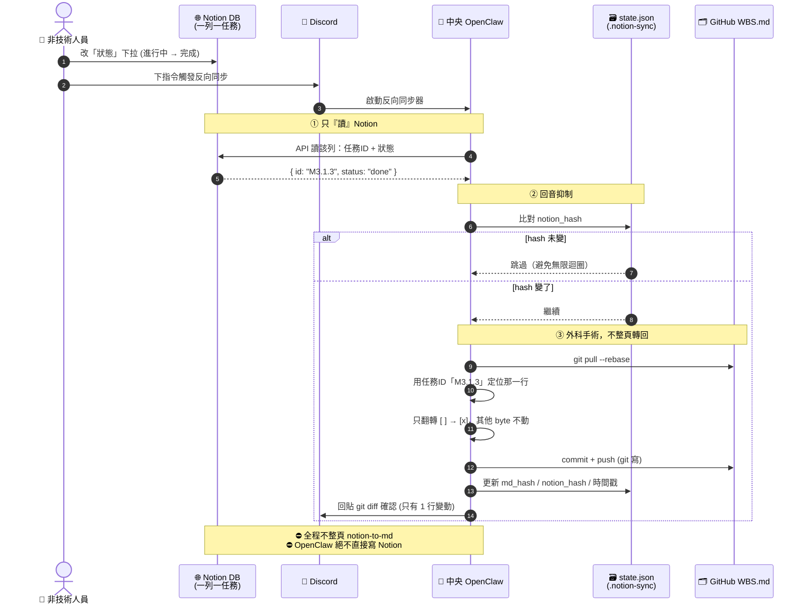
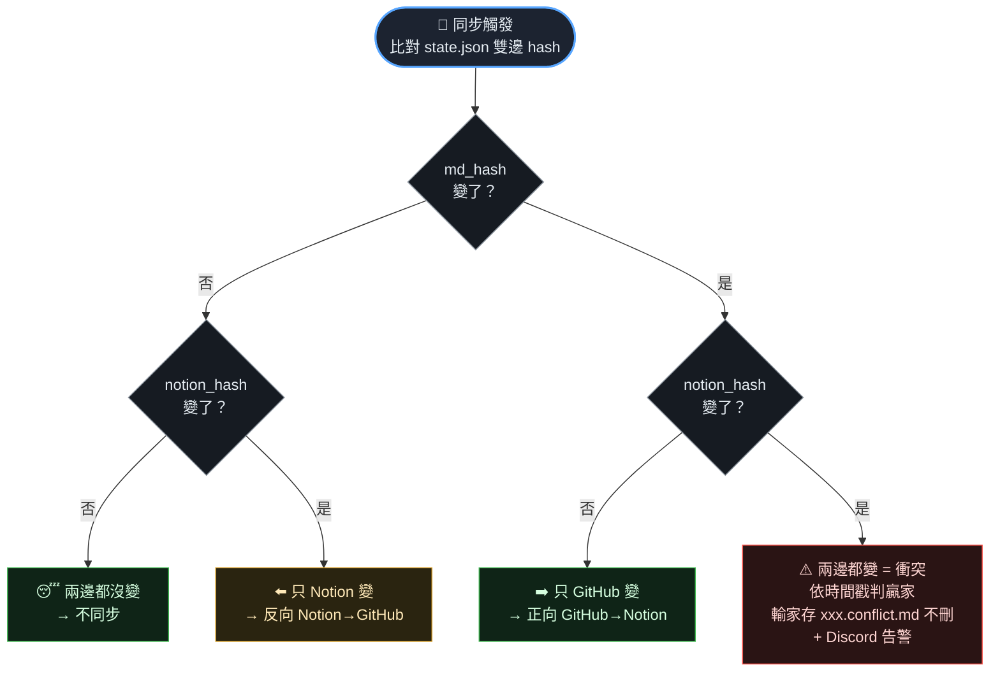

# Notion 同步流程圖

> 來源：`docs/Notion同步規劃_討論彙整.html`
> 架構定案：GitHub 當唯一事實來源 → 正向單向鏡像到 Notion + 受控反向（一檔一主人）
> 燈號：🟢 完全 OK ・ 🟡 可行但有風險（要配防護）・ ⛔ 紅線（別做）

---

## 一、整體架構流程圖

---

## 二、`authority` 一檔一主人 — 分流決策圖

> 系統層級「雙向」，但每份檔案都是**單向**——衝突機率趨近零。判斷沒把握時預設歸 `authority: github`。

---

## 三、WBS 任務狀態反向同步 — 「外科手術 patch 單行」序列圖

---

## 四、回音抑制 + 衝突偵測 — 四象限狀態判斷

---

## ⛔ 紅線總表（會壞，別做）

| 別做 | 原因 |
|---|---|
| 結構化文件用整頁 `notion-to-md` 反向 | 整份重序列化 → Dataview/表格/owner/縮排全壞 |
| 讓非技術人員在 Notion 改結構化文件正文 | 同上，這類文件應 GitHub 單向 + Notion 鎖唯讀 |
| 讓 OpenClaw 直接「寫」Notion | 繞過 GitHub，重新製造雙向衝突 |
| 每台本地機器各自推 Notion | 多寫入者搶同一 Notion → 競態 |
| block 級智慧合併 | 雙向同步最大的坑，免費方案無法可靠維護 |
