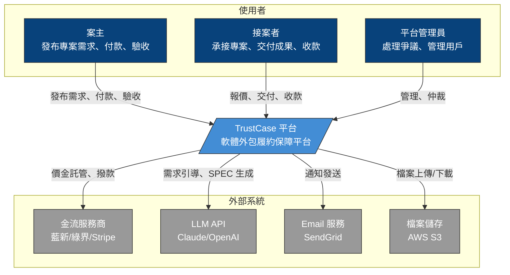
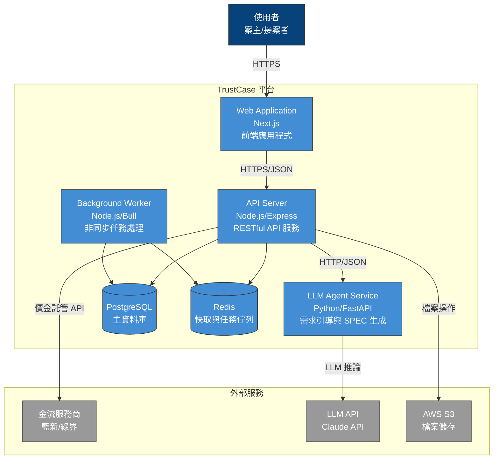
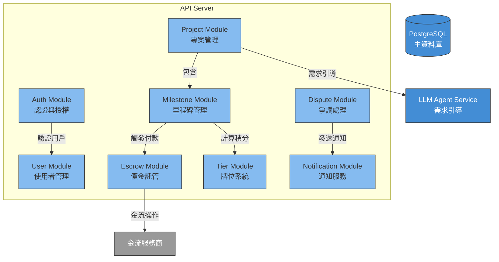
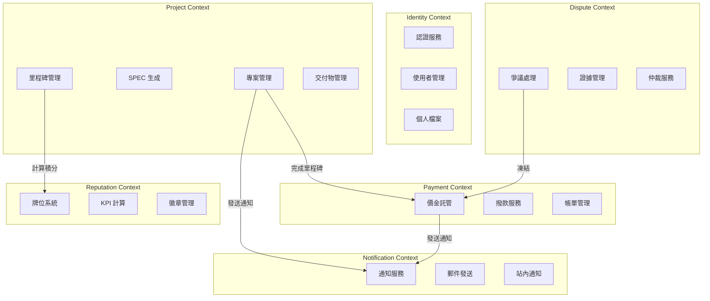
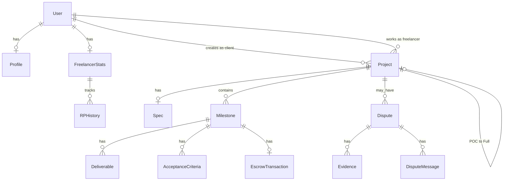
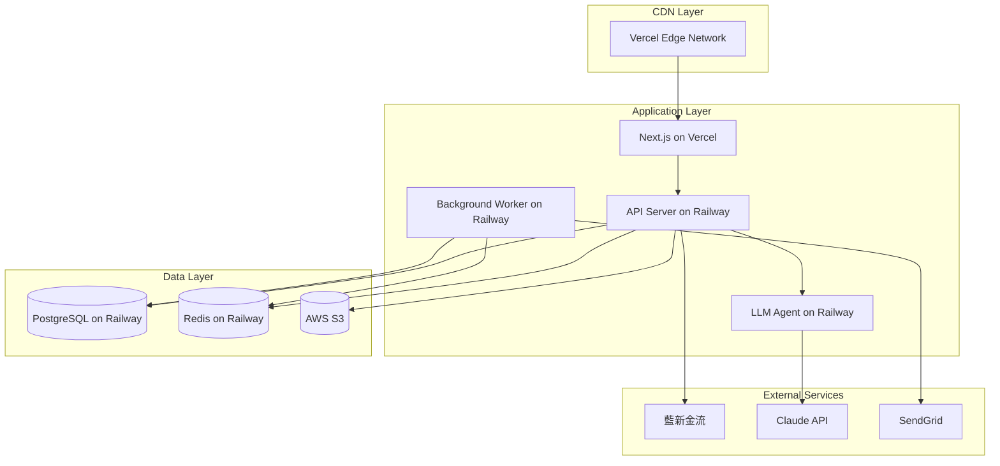
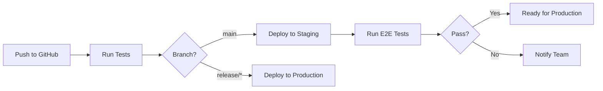

# 整合性架構與設計文件 (Unified Architecture & Design Document) - TrustCase

---

**文件版本 (Document Version):** `v1.0`
**最後更新 (Last Updated):** `2026-02-01`
**主要作者 (Lead Author):** `技術架構師`
**審核者 (Reviewers):** `架構委員會, 核心開發團隊`
**狀態 (Status):** `草稿 (Draft)`

---

## 目錄 (Table of Contents)

- [第 1 部分：架構總覽 (Architecture Overview)](#第-1-部分架構總覽-architecture-overview)
  - [1.1 C4 模型：視覺化架構](#11-c4-模型視覺化架構)
  - [1.2 DDD 戰略設計 (Strategic DDD)](#12-ddd-戰略設計-strategic-ddd)
  - [1.3 Clean Architecture 分層](#13-clean-architecture-分層)
  - [1.4 技術選型與決策](#14-技術選型與決策)
- [第 2 部分：詳細設計 (Detailed Design)](#第-2-部分詳細設計-detailed-design)
  - [2.1 MVP 與模組優先級](#21-mvp-與模組優先級)
  - [2.2 核心功能：模組設計](#22-核心功能模組設計)
  - [2.3 非功能性需求設計](#23-非功能性需求設計-nfrs-design)
- [第 3 部分：數據架構](#第-3-部分數據架構-data-architecture)
- [第 4 部分：部署與基礎設施](#第-4-部分部署與基礎設施)
- [第 5 部分：風險與演進路線圖](#第-5-部分風險與演進路線圖)
- [附錄](#附錄-appendix)

---

**目的**: 本文件旨在將 TrustCase 的業務需求轉化為一個完整、內聚的技術藍圖。它從高層次的系統架構開始，逐步深入到具體的模組級實現細節，確保系統的穩固性與可維護性。

---

## 第 1 部分：架構總覽 (Architecture Overview)

*此部分關注系統的宏觀結構與指導原則，回答「系統由什麼組成？」以及「它們之間如何互動？」。*

### 1.1 C4 模型：視覺化架構

#### L1 - 系統情境圖 (System Context Diagram)



#### L2 - 容器圖 (Container Diagram)



#### L3 - 元件圖 (Component Diagram) - API Server



---

### 1.2 DDD 戰略設計 (Strategic DDD)

#### 通用語言 (Ubiquitous Language)

| 術語 | 英文 | 定義 |
|:---|:---|:---|
| 案主 | Client | 發布專案需求並付款的使用者 |
| 接案者 | Freelancer | 承接專案並交付成果的使用者 |
| 專案 | Project | 一個完整的外包工作單位 |
| 里程碑 | Milestone | 專案中可獨立驗收與付款的階段 |
| 託管 | Escrow | 平台代管款項，待驗收通過後撥款 |
| 驗收 | Acceptance | 案主確認交付物符合標準的動作 |
| POC | Proof of Concept | 小規模概念驗證專案 |
| SPEC | Specification | 結構化需求規格書 |
| 牌位 | Tier | 接案者的能力等級（青銅→宗師） |
| 積分 | Rating Points (RP) | 決定牌位的數值 |
| 爭議 | Dispute | 雙方對交付或付款有異議的狀態 |
| 變更請求 | Change Request | 超出原始範圍的需求變更 |

#### 限界上下文 (Bounded Contexts)



#### 上下文映射 (Context Map)

| 上游 Context | 下游 Context | 關係類型 | 說明 |
|:---|:---|:---|:---|
| Identity | Project | Customer-Supplier | 專案需要用戶身份資訊 |
| Project | Payment | Customer-Supplier | 里程碑驅動付款流程 |
| Project | Reputation | Published Language | 專案完成事件觸發積分計算 |
| Payment | Dispute | Partnership | 爭議時凍結款項 |
| All Contexts | Notification | Conformist | 統一的通知介面 |

---

### 1.3 Clean Architecture 分層

```
┌─────────────────────────────────────────────────────────────────┐
│                        Presentation Layer                        │
│  ┌─────────────────────────────────────────────────────────────┐│
│  │ Next.js Pages │ React Components │ API Routes │ Middlewares ││
│  └─────────────────────────────────────────────────────────────┘│
├─────────────────────────────────────────────────────────────────┤
│                        Application Layer                         │
│  ┌─────────────────────────────────────────────────────────────┐│
│  │ Use Cases │ Application Services │ DTOs │ Event Handlers    ││
│  │                                                              ││
│  │ • CreateProjectUseCase      • SubmitDeliverableUseCase      ││
│  │ • AcceptMilestoneUseCase    • CalculateTierUseCase          ││
│  │ • InitiateDisputeUseCase    • ProcessPayoutUseCase          ││
│  └─────────────────────────────────────────────────────────────┘│
├─────────────────────────────────────────────────────────────────┤
│                         Domain Layer                             │
│  ┌─────────────────────────────────────────────────────────────┐│
│  │ Entities │ Aggregates │ Value Objects │ Domain Events       ││
│  │ Domain Services │ Repository Interfaces                     ││
│  │                                                              ││
│  │ Entities:        │ Value Objects:    │ Domain Events:       ││
│  │ • User           │ • Money           │ • MilestoneCompleted ││
│  │ • Project        │ • TierLevel       │ • PaymentReleased    ││
│  │ • Milestone      │ • AcceptStatus    │ • DisputeOpened      ││
│  │ • Escrow         │ • RatingPoints    │ • TierPromoted       ││
│  │ • Dispute        │ • EvidenceHash    │                      ││
│  └─────────────────────────────────────────────────────────────┘│
├─────────────────────────────────────────────────────────────────┤
│                      Infrastructure Layer                        │
│  ┌─────────────────────────────────────────────────────────────┐│
│  │ Repositories │ External APIs │ Database │ Message Queue     ││
│  │                                                              ││
│  │ • PrismaUserRepository       • NewebPayGateway              ││
│  │ • PrismaProjectRepository    • ClaudeAgentService           ││
│  │ • S3FileStorage              • SendGridEmailService         ││
│  │ • RedisCache                 • BullMQWorker                 ││
│  └─────────────────────────────────────────────────────────────┘│
└─────────────────────────────────────────────────────────────────┘
```

---

### 1.4 技術選型與決策

#### 技術選型原則

1. **優先選擇成熟穩定的技術**: 降低風險，確保 MVP 快速上線
2. **基於團隊現有技能**: 優先選擇團隊熟悉的技術棧
3. **考慮台灣市場特性**: 金流服務商需支援在地化
4. **可擴展性**: 架構需支援未來功能擴展

#### 技術棧詳情

| 分類 | 選用技術 | 選擇理由 | 備選方案 | 相關 ADR |
|:---|:---|:---|:---|:---|
| **前端框架** | Next.js 14 (App Router) | SSR/SSG 支援、React 生態、優秀的 DX | Nuxt.js, Remix | ADR-001 |
| **UI 框架** | Tailwind CSS + shadcn/ui | 快速開發、一致性設計、可客製化 | MUI, Chakra UI | - |
| **後端框架** | Node.js + Express | 團隊熟悉、豐富生態、與前端共用語言 | Fastify, NestJS | ADR-002 |
| **LLM Agent** | Python + FastAPI | Python LLM 生態最完整、高性能異步 | LangChain.js | ADR-003 |
| **資料庫** | PostgreSQL | 穩定可靠、豐富功能、Prisma 支援佳 | MySQL | ADR-004 |
| **ORM** | Prisma | 類型安全、優秀 DX、遷移管理 | TypeORM, Drizzle | - |
| **快取** | Redis | 高性能、多用途（快取+佇列） | Memcached | - |
| **任務佇列** | BullMQ | 基於 Redis、功能完整、監控介面 | Agenda, Bee-Queue | - |
| **檔案儲存** | AWS S3 | 業界標準、高可用、成本效益 | GCS, Azure Blob | - |
| **金流服務** | 藍新金流 (NewebPay) | 支援託管、在地化、API 完整 | 綠界, TapPay | **ADR-005** |
| **LLM API** | Claude API (Anthropic) | 高品質輸出、長上下文、成本合理 | OpenAI GPT-4 | ADR-006 |
| **Email** | SendGrid | 穩定可靠、價格合理、模板支援 | AWS SES, Mailgun | - |
| **部署平台** | Vercel + Railway | 簡單部署、自動擴展、成本可控 | AWS ECS, GCP Cloud Run | ADR-007 |

#### 關鍵架構決策記錄 (ADR)

##### ADR-005: 金流服務商選擇 - 藍新金流

**狀態**: 待驗證

**背景**:
TrustCase 的核心功能是「里程碑式價金託管」，需要金流服務商支援：
1. 資金託管 (Escrow)
2. 自動分潤
3. 延遲撥款

**決策**:
選擇藍新金流作為主要金流服務商。

**理由**:
- 支援「代收代付」模式，可實現類託管功能
- 提供「請款 API」可控制撥款時機
- 支援多種付款方式（信用卡、ATM、超商）
- 在台灣有良好的市場接受度

**風險**:
- 需確認「代收代付」模式是否完全符合法規要求
- 可能需要申請「電子支付機構」執照

**待驗證**:
- [ ] 與藍新技術團隊確認 API 細節
- [ ] 法律顧問確認合規性
- [ ] POC 測試完整流程

---

## 第 2 部分：詳細設計 (Detailed Design)

### 2.1 MVP 與模組優先級

#### MVP 範圍 (12 週)

| 優先級 | 模組 | Sprint | 說明 |
|:---|:---|:---|:---|
| **P0** | Auth Module | Sprint 1 | 註冊、登入、驗證 |
| **P0** | User Module | Sprint 1 | 個人檔案管理 |
| **P0** | LLM Agent | Sprint 1 | 需求引導、SPEC 生成 |
| **P0** | Escrow Module | Sprint 1 | 價金託管 API 整合 |
| **P0** | Project Module | Sprint 2 | 專案建立與管理 |
| **P0** | Milestone Module | Sprint 2 | 里程碑管理與驗收 |
| **P1** | Tier Module | Sprint 2 | 積分計算與牌位 |
| **P1** | POC Module | Sprint 3 | POC 模式流程 |
| **P1** | Dispute Module | Sprint 3 | 爭議處理 v1 |
| **P2** | Notification Module | Sprint 1-3 | 漸進式開發 |

#### 後續階段 (Post-MVP)

| 階段 | 模組 | 說明 |
|:---|:---|:---|
| Phase 2 | 即時聊天 | 站內即時通訊 |
| Phase 2 | 多類型支援 | UI/UX、平面設計、影音 |
| Phase 2 | AI 程式碼審查 | 程式碼品質檢測 |
| Phase 3 | 專案保險 | 履約保險產品 |
| Phase 3 | 多語系 | 英文、簡體中文 |

---

### 2.2 核心功能：模組設計

#### 模組: Auth Module

**對應 BDD**: `authentication.feature`

**職責**: 處理使用者註冊、登入、Token 管理、權限驗證

**資料模型**:

```prisma
model User {
  id              String    @id @default(cuid())
  email           String    @unique
  passwordHash    String
  role            UserRole  @default(BOTH)
  isVerified      Boolean   @default(false)
  verifyToken     String?
  verifyExpires   DateTime?
  createdAt       DateTime  @default(now())
  updatedAt       DateTime  @updatedAt

  profile         Profile?
  clientProjects  Project[] @relation("ClientProjects")
  freelancerProjects Project[] @relation("FreelancerProjects")
}

enum UserRole {
  CLIENT
  FREELANCER
  BOTH
  ADMIN
}
```

**API 設計**:

| Method | Endpoint | 說明 |
|:---|:---|:---|
| POST | `/api/auth/register` | 註冊新帳號 |
| POST | `/api/auth/login` | 登入取得 Token |
| POST | `/api/auth/verify` | 驗證 Email |
| POST | `/api/auth/refresh` | 刷新 Token |
| POST | `/api/auth/forgot-password` | 忘記密碼 |
| POST | `/api/auth/reset-password` | 重設密碼 |

---

#### 模組: Project Module

**對應 BDD**: `requirement-guidance.feature`, `milestone-management.feature`

**職責**: 專案生命週期管理、需求引導整合、里程碑協調

**資料模型**:

```prisma
model Project {
  id              String        @id @default(cuid())
  title           String
  description     String?
  type            ProjectType
  status          ProjectStatus @default(DRAFT)

  clientId        String
  client          User          @relation("ClientProjects", fields: [clientId], references: [id])

  freelancerId    String?
  freelancer      User?         @relation("FreelancerProjects", fields: [freelancerId], references: [id])

  spec            Spec?
  milestones      Milestone[]
  disputes        Dispute[]

  totalAmount     Decimal       @db.Decimal(12, 2)
  escrowedAmount  Decimal       @default(0) @db.Decimal(12, 2)
  releasedAmount  Decimal       @default(0) @db.Decimal(12, 2)

  isPOC           Boolean       @default(false)
  parentProjectId String?
  parentProject   Project?      @relation("POCToFull", fields: [parentProjectId], references: [id])
  pocProject      Project?      @relation("POCToFull")

  createdAt       DateTime      @default(now())
  updatedAt       DateTime      @updatedAt
}

enum ProjectType {
  WEB_DEVELOPMENT
  APP_DEVELOPMENT
  UI_UX_DESIGN
  GRAPHIC_DESIGN
  VIDEO_PRODUCTION
  AI_ML
}

enum ProjectStatus {
  DRAFT
  SPEC_READY
  PROPOSAL_SENT
  NEGOTIATING
  CONTRACTED
  IN_PROGRESS
  COMPLETED
  CANCELLED
  DISPUTED
}
```

---

#### 模組: Milestone Module

**對應 BDD**: `milestone-management.feature`, `escrow-payment.feature`

**職責**: 里程碑建立、進度追蹤、驗收流程、託管觸發

**資料模型**:

```prisma
model Milestone {
  id                String           @id @default(cuid())
  projectId         String
  project           Project          @relation(fields: [projectId], references: [id])

  name              String
  description       String?
  order             Int
  weight            Decimal          @db.Decimal(5, 2)  // 百分比

  amount            Decimal          @db.Decimal(12, 2)
  status            MilestoneStatus  @default(PENDING)

  dueDate           DateTime?
  submittedAt       DateTime?
  acceptedAt        DateTime?

  deliverables      Deliverable[]
  acceptanceCriteria AcceptanceCriteria[]
  revisionCount     Int              @default(0)
  maxRevisions      Int              @default(2)

  escrowTransaction EscrowTransaction?

  createdAt         DateTime         @default(now())
  updatedAt         DateTime         @updatedAt
}

enum MilestoneStatus {
  PENDING          // 待開始
  FUNDED           // 已託管
  IN_PROGRESS      // 進行中
  SUBMITTED        // 待驗收
  REVISION_NEEDED  // 需修改
  ACCEPTED         // 已驗收
  RELEASED         // 已撥款
  DISPUTED         // 爭議中
}

model Deliverable {
  id            String      @id @default(cuid())
  milestoneId   String
  milestone     Milestone   @relation(fields: [milestoneId], references: [id])

  type          DeliverableType
  name          String
  url           String?
  fileHash      String?     // SHA-256
  notes         String?

  submittedAt   DateTime    @default(now())
}

enum DeliverableType {
  FILE
  LINK
  DEMO
  SCREENSHOT
  DOCUMENT
}

model AcceptanceCriteria {
  id            String    @id @default(cuid())
  milestoneId   String
  milestone     Milestone @relation(fields: [milestoneId], references: [id])

  description   String
  isMet         Boolean   @default(false)
  verifiedAt    DateTime?
}
```

**關鍵流程 - 里程碑驗收**:

```
┌─────────────┐     ┌─────────────┐     ┌─────────────┐
│   FUNDED    │────▶│ IN_PROGRESS │────▶│  SUBMITTED  │
└─────────────┘     └─────────────┘     └──────┬──────┘
                                               │
                    ┌──────────────────────────┼──────────────────────────┐
                    │                          │                          │
                    ▼                          ▼                          ▼
            ┌─────────────┐           ┌─────────────┐            ┌─────────────┐
            │  ACCEPTED   │           │  REVISION   │            │  DISPUTED   │
            └──────┬──────┘           │   NEEDED    │            └─────────────┘
                   │                  └──────┬──────┘
                   ▼                         │
            ┌─────────────┐                  │
            │  RELEASED   │◀─────────────────┘
            └─────────────┘      (修改完成後重新提交)
```

---

#### 模組: Escrow Module

**對應 BDD**: `escrow-payment.feature`

**職責**: 價金託管、撥款處理、退款處理、金流整合

**資料模型**:

```prisma
model EscrowTransaction {
  id              String              @id @default(cuid())
  milestoneId     String              @unique
  milestone       Milestone           @relation(fields: [milestoneId], references: [id])

  amount          Decimal             @db.Decimal(12, 2)
  platformFee     Decimal             @db.Decimal(12, 2)
  freelancerPayout Decimal            @db.Decimal(12, 2)

  status          EscrowStatus        @default(PENDING)

  // 金流服務商資訊
  paymentProvider String              @default("newebpay")
  providerTxnId   String?
  providerData    Json?

  fundedAt        DateTime?
  releasedAt      DateTime?

  createdAt       DateTime            @default(now())
  updatedAt       DateTime            @updatedAt
}

enum EscrowStatus {
  PENDING         // 待付款
  FUNDED          // 已託管
  RELEASING       // 撥款中
  RELEASED        // 已撥款
  REFUNDING       // 退款中
  REFUNDED        // 已退款
  FROZEN          // 凍結（爭議中）
}
```

**服務費計算邏輯**:

```typescript
interface FeeCalculation {
  grossAmount: number;        // 原始金額
  clientFee: number;          // 案主服務費 (5%)
  freelancerFee: number;      // 接案者服務費 (10%)
  platformRevenue: number;    // 平台收入
  freelancerPayout: number;   // 接案者實收
}

function calculateFees(milestoneAmount: number): FeeCalculation {
  const CLIENT_FEE_RATE = 0.05;
  const FREELANCER_FEE_RATE = 0.10;

  const clientFee = milestoneAmount * CLIENT_FEE_RATE;
  const freelancerFee = milestoneAmount * FREELANCER_FEE_RATE;

  return {
    grossAmount: milestoneAmount,
    clientFee,
    freelancerFee,
    platformRevenue: clientFee + freelancerFee,
    freelancerPayout: milestoneAmount - freelancerFee,
  };
}
```

---

#### 模組: Tier Module

**對應 BDD**: `gamification-tier.feature`

**職責**: 積分計算、牌位管理、KPI 追蹤、晉升/降級處理

**資料模型**:

```prisma
model FreelancerStats {
  id              String    @id @default(cuid())
  userId          String    @unique
  user            User      @relation(fields: [userId], references: [id])

  // 積分與牌位
  ratingPoints    Int       @default(0)
  tier            Tier      @default(BRONZE_IV)

  // KPI 指標
  totalMilestones Int       @default(0)
  onTimeMilestones Int      @default(0)
  firstPassMilestones Int   @default(0)

  // 計算欄位 (可由 trigger 更新)
  onTimeRate      Decimal   @default(0) @db.Decimal(5, 2)
  firstPassRate   Decimal   @default(0) @db.Decimal(5, 2)

  // 連續完成
  currentStreak   Int       @default(0)
  bestStreak      Int       @default(0)

  // 定位賽
  isInPlacement   Boolean   @default(true)
  placementCount  Int       @default(0)

  updatedAt       DateTime  @updatedAt
}

enum Tier {
  BRONZE_IV
  BRONZE_III
  BRONZE_II
  BRONZE_I
  SILVER_IV
  SILVER_III
  SILVER_II
  SILVER_I
  GOLD_IV
  GOLD_III
  GOLD_II
  GOLD_I
  PLATINUM_IV
  PLATINUM_III
  PLATINUM_II
  PLATINUM_I
  DIAMOND_IV
  DIAMOND_III
  DIAMOND_II
  DIAMOND_I
  MASTER
  GRANDMASTER
}
```

**積分計算邏輯**:

```typescript
interface RPCalculation {
  baseRP: number;
  multipliers: { name: string; value: number }[];
  bonuses: { name: string; value: number }[];
  totalRP: number;
}

function calculateRP(milestone: Milestone, stats: FreelancerStats): RPCalculation {
  // 基礎分 (依金額)
  const baseRP = getBaseRP(milestone.amount);

  // 表現乘數
  const multipliers = [];
  let multiplierProduct = 1.0;

  if (isEarlyDelivery(milestone)) {
    multipliers.push({ name: '提前交付', value: 1.1 });
    multiplierProduct *= 1.1;
  }

  if (isFirstPassAccepted(milestone)) {
    multipliers.push({ name: '一次驗收通過', value: 1.2 });
    multiplierProduct *= 1.2;
  }

  // 乘數上限 1.5
  multiplierProduct = Math.min(multiplierProduct, 1.5);

  // 連續完成加成
  const bonuses = [];
  const streakBonus = getStreakBonus(stats.currentStreak + 1);
  if (streakBonus > 0) {
    bonuses.push({ name: `連續 ${stats.currentStreak + 1} 次`, value: streakBonus });
  }

  // 定位賽加成
  if (stats.isInPlacement) {
    const placementBonus = Math.floor(baseRP * multiplierProduct * 0.5);
    bonuses.push({ name: '定位賽加成', value: placementBonus });
  }

  const totalRP = Math.floor(baseRP * multiplierProduct) +
                  bonuses.reduce((sum, b) => sum + b.value, 0);

  return { baseRP, multipliers, bonuses, totalRP };
}

function getBaseRP(amount: number): number {
  if (amount < 10000) return 10;
  if (amount < 30000) return 20;
  if (amount < 100000) return 35;
  if (amount < 300000) return 50;
  return 70;
}

function getStreakBonus(streak: number): number {
  if (streak >= 20) return 50;
  if (streak >= 10) return 20;
  if (streak >= 5) return 10;
  if (streak >= 3) return 5;
  return 0;
}
```

---

#### 模組: LLM Agent Service

**對應 BDD**: `requirement-guidance.feature`

**職責**: 需求引導對話、專案類型識別、SPEC 文件生成

**技術架構**:

```
┌─────────────────────────────────────────────────────────────────┐
│                     LLM Agent Service (FastAPI)                 │
├─────────────────────────────────────────────────────────────────┤
│                                                                 │
│  ┌──────────────┐    ┌──────────────┐    ┌──────────────┐       │
│  │ Type Detector │    │ Conversation │    │ SPEC Generator│     │
│  │    Agent      │    │    Engine    │    │    Agent     │      │
│  └──────┬───────┘    └──────┬───────┘    └──────┬───────┘       │
│         │                   │                   │               │
│         └───────────────────┴───────────────────┘               │
│                             │                                   │
│                    ┌────────┴────────┐                          │
│                    │ Prompt Templates │                         │
│                    │    & Examples    │                         │
│                    └────────┬────────┘                          │
│                             │                                   │
│                    ┌────────┴────────┐                          │
│                    │   Claude API    │                          │
│                    └─────────────────┘                          │
│                                                                 │
└─────────────────────────────────────────────────────────────────┘
```

**API 設計**:

| Method | Endpoint | 說明 |
|:---|:---|:---|
| POST | `/api/agent/detect-type` | 識別專案類型 |
| POST | `/api/agent/conversation` | 引導對話 |
| POST | `/api/agent/generate-spec` | 生成 SPEC |
| GET | `/api/agent/templates/{type}` | 取得類型問題模板 |

**對話流程設計**:

```python
class ConversationState:
    project_type: Optional[ProjectType]
    current_layer: int  # 1-4
    collected_info: dict
    missing_fields: list
    conversation_history: list

class ConversationEngine:
    async def process_message(
        self,
        session_id: str,
        user_message: str
    ) -> AgentResponse:
        state = await self.get_state(session_id)

        if state.project_type is None:
            # 第一步：識別專案類型
            detected_type = await self.detect_project_type(user_message)
            state.project_type = detected_type
            questions = self.get_layer1_questions(detected_type)
            return AgentResponse(
                message=f"了解！您想做{detected_type.display_name}。",
                questions=questions,
                progress=0.1
            )

        # 收集資訊並推進對話
        state = await self.collect_and_advance(state, user_message)

        if state.is_complete():
            spec = await self.generate_spec(state)
            return AgentResponse(
                message="需求收集完成！",
                spec=spec,
                progress=1.0
            )

        next_questions = self.get_next_questions(state)
        return AgentResponse(
            message="了解，請繼續回答以下問題：",
            questions=next_questions,
            progress=state.get_progress()
        )
```

---

### 2.3 非功能性需求設計 (NFRs Design)

| NFR 分類 | 具體需求 | 設計方案 | 目標值 |
|:---|:---|:---|:---|
| **性能** | API 回應時間 | Redis 快取熱點資料、資料庫索引優化 | P95 < 500ms |
| **性能** | 頁面載入時間 | Next.js SSR/ISR、CDN 靜態資源 | < 3s |
| **安全性** | 密碼儲存 | bcrypt (cost factor 12) | - |
| **安全性** | API 認證 | JWT (RS256, 15min access / 7d refresh) | - |
| **安全性** | 資料傳輸 | HTTPS (TLS 1.3) | - |
| **安全性** | 檔案驗證 | SHA-256 雜湊、病毒掃描 | - |
| **可用性** | 系統可用性 | 多可用區部署、健康檢查 | 99.5% |
| **可用性** | 資料備份 | 每日自動備份、7 天保留 | RPO < 24h |
| **擴展性** | 水平擴展 | 無狀態 API、Redis Session | 支援 10x 用戶增長 |

---

## 第 3 部分：數據架構 (Data Architecture)

### 3.1 資料模型總覽 (ER Diagram)



### 3.2 資料分類與加密策略

| 資料類型 | 分類 | 儲存方式 | 加密 |
|:---|:---|:---|:---|
| 使用者密碼 | 機密 | bcrypt hash | 單向雜湊 |
| Email | PII | PostgreSQL | 傳輸中加密 |
| 銀行帳戶 | 敏感 | 加密儲存 | AES-256 |
| 專案內容 | 內部 | PostgreSQL | 傳輸中加密 |
| 交付物檔案 | 使用者資料 | S3 (加密) | SSE-S3 |
| 系統日誌 | 內部 | CloudWatch | - |

### 3.3 資料一致性策略

| 場景 | 一致性要求 | 實現方式 |
|:---|:---|:---|
| 里程碑驗收 + 積分計算 | 強一致性 | Database Transaction |
| 撥款 + 狀態更新 | 強一致性 | Two-Phase (DB + Payment API) |
| 通知發送 | 最終一致性 | Message Queue (BullMQ) |
| KPI 統計更新 | 最終一致性 | Background Job |

---

## 第 4 部分：部署與基礎設施

### 4.1 部署架構圖



### 4.2 環境策略

| 環境 | 用途 | 資料 | 部署方式 |
|:---|:---|:---|:---|
| Development | 本地開發 | 模擬資料 | Docker Compose |
| Staging | 整合測試 | 匿名化生產資料 | 自動部署 (PR merge) |
| Production | 正式環境 | 真實資料 | 手動觸發 + 審核 |

### 4.3 CI/CD 流程



### 4.4 成本估算 (MVP 階段)

| 項目 | 服務商 | 預估月費 (USD) |
|:---|:---|:---|
| 前端託管 | Vercel Pro | $20 |
| API Server | Railway | $50 |
| PostgreSQL | Railway | $25 |
| Redis | Railway | $10 |
| 檔案儲存 | AWS S3 | $10 |
| LLM API | Claude API | $100 |
| Email | SendGrid | $15 |
| **合計** | | **~$230/月** |

---

## 第 5 部分：風險與演進路線圖

### 5.1 技術風險矩陣

| 風險 | 可能性 | 影響 | 緩解策略 |
|:---|:---|:---|:---|
| 金流 API 不支援託管模式 | 中 | 高 | 優先驗證、準備備案（手動流程） |
| LLM 輸出品質不穩定 | 中 | 中 | 人工審核機制、Prompt 優化 |
| PostgreSQL 效能瓶頸 | 低 | 中 | 讀寫分離、Redis 快取 |
| 第三方服務中斷 | 低 | 高 | 斷路器模式、降級方案 |

### 5.2 架構演進路線圖

```
Phase 1: MVP (Month 1-3)
├── 模組化單體架構
├── 單一 PostgreSQL 實例
├── 基礎 Redis 快取
└── Vercel + Railway 部署

Phase 2: 擴展期 (Month 4-8)
├── 服務拆分 (Agent 獨立)
├── 讀寫分離
├── 完整的可觀測性
└── 多類型專案支援

Phase 3: 成熟期 (Month 9-12)
├── 微服務架構
├── 事件驅動 (Event Sourcing)
├── 多區域部署
└── 專案保險產品
```

---

## 附錄 (Appendix)

### A. API 端點清單

| 模組 | Method | Endpoint | 說明 |
|:---|:---|:---|:---|
| Auth | POST | `/api/auth/register` | 註冊 |
| Auth | POST | `/api/auth/login` | 登入 |
| Auth | POST | `/api/auth/verify` | 驗證 Email |
| User | GET | `/api/users/me` | 取得當前用戶 |
| User | PATCH | `/api/users/me` | 更新個人資料 |
| Project | POST | `/api/projects` | 建立專案 |
| Project | GET | `/api/projects` | 列出專案 |
| Project | GET | `/api/projects/:id` | 取得專案詳情 |
| Milestone | POST | `/api/projects/:id/milestones` | 建立里程碑 |
| Milestone | POST | `/api/milestones/:id/submit` | 提交交付物 |
| Milestone | POST | `/api/milestones/:id/accept` | 驗收通過 |
| Escrow | POST | `/api/escrow/fund` | 託管付款 |
| Escrow | GET | `/api/escrow/:id/status` | 查詢狀態 |
| Agent | POST | `/api/agent/conversation` | 對話引導 |
| Agent | POST | `/api/agent/generate-spec` | 生成 SPEC |

### B. 資料庫索引策略

```sql
-- 高頻查詢索引
CREATE INDEX idx_projects_client_id ON projects(client_id);
CREATE INDEX idx_projects_freelancer_id ON projects(freelancer_id);
CREATE INDEX idx_projects_status ON projects(status);
CREATE INDEX idx_milestones_project_id ON milestones(project_id);
CREATE INDEX idx_milestones_status ON milestones(status);
CREATE INDEX idx_escrow_status ON escrow_transactions(status);

-- 複合索引
CREATE INDEX idx_projects_client_status ON projects(client_id, status);
CREATE INDEX idx_milestones_project_order ON milestones(project_id, "order");
```

### C. 錯誤碼定義

| 錯誤碼 | HTTP Status | 說明 |
|:---|:---|:---|
| AUTH001 | 401 | 未授權存取 |
| AUTH002 | 401 | Token 過期 |
| AUTH003 | 403 | 權限不足 |
| USER001 | 404 | 使用者不存在 |
| USER002 | 409 | Email 已被註冊 |
| PROJ001 | 404 | 專案不存在 |
| PROJ002 | 400 | 專案狀態不允許此操作 |
| MILE001 | 404 | 里程碑不存在 |
| MILE002 | 400 | 里程碑狀態不允許此操作 |
| ESCR001 | 400 | 付款失敗 |
| ESCR002 | 400 | 餘額不足 |

---

**文件審核記錄 (Review History):**

| 日期 | 審核人 | 版本 | 變更摘要 |
|:---|:---|:---|:---|
| 2026-02-01 | Product Team | v1.0 | 初稿建立 |

---

**文件結束**
