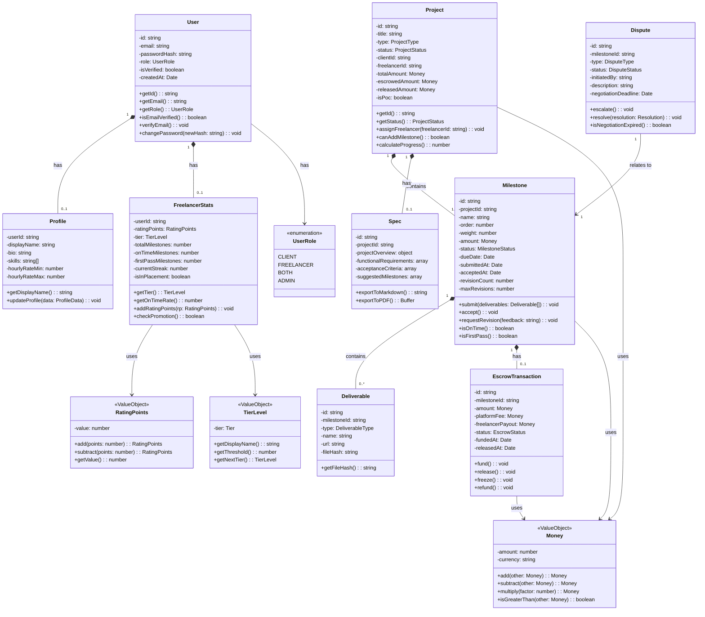
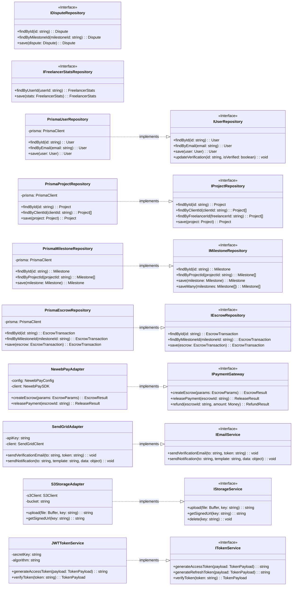
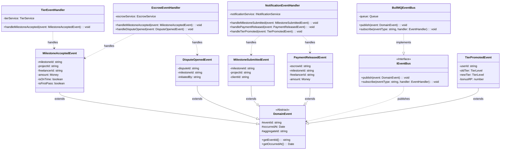
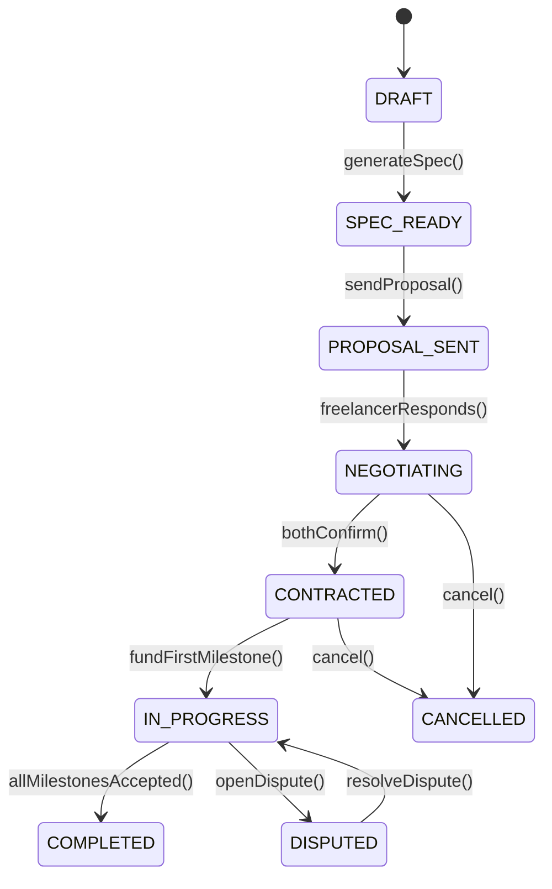
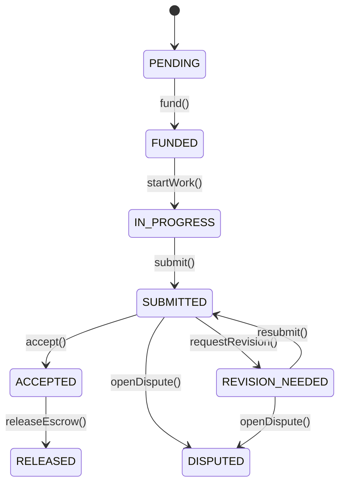
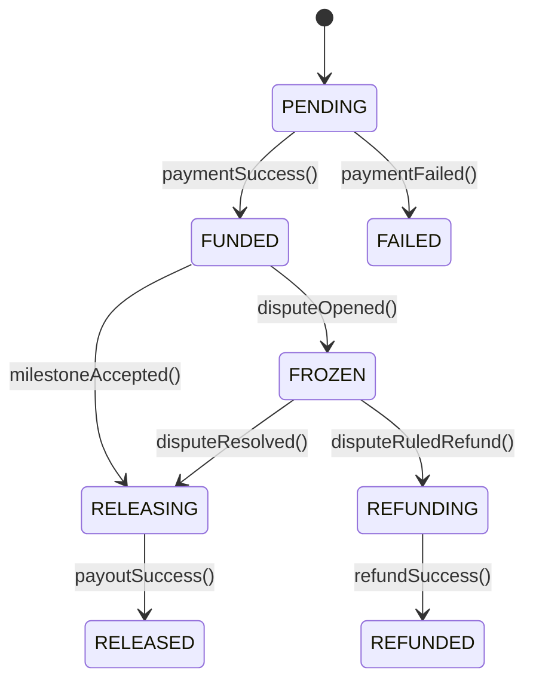

# 類別/組件關係文檔 (Class/Component Relationships Document) - TrustCase

---

**文件版本 (Document Version):** `v1.0`

**最後更新 (Last Updated):** `2026-02-01`

**主要作者 (Lead Author):** `技術負責人/架構團隊`

**審核者 (Reviewers):** `開發團隊, 架構委員會`

**狀態 (Status):** `草稿 (Draft)`

**相關設計文檔 (Related Design Documents):**
- 架構設計文檔: `TrustCase_Architecture.md`
- 模組規格文檔: `TrustCase_Module_Specification.md`
- 依賴關係文檔: `TrustCase_Dependencies.md`

---

## 目錄 (Table of Contents)

1. [概述 (Overview)](#1-概述-overview)
2. [核心類別圖 (Core Class Diagrams)](#2-核心類別圖-core-class-diagrams)
3. [主要類別/組件職責 (Key Class/Component Responsibilities)](#3-主要類別組件職責-key-classcomponent-responsibilities)
4. [關係詳解 (Relationship Details)](#4-關係詳解-relationship-details)
5. [設計模式應用 (Design Pattern Applications)](#5-設計模式應用-design-pattern-applications)
6. [SOLID 原則遵循情況 (SOLID Principles Adherence)](#6-solid-原則遵循情況-solid-principles-adherence)
7. [接口契約 (Interface Contracts)](#7-接口契約-interface-contracts)
8. [技術選型與依賴 (Technical Choices & Dependencies)](#8-技術選型與依賴-technical-choices--dependencies)
9. [附錄 (Appendix)](#9-附錄-appendix)

---

## 1. 概述 (Overview)

### 1.1 文檔目的 (Document Purpose)

- 本文檔旨在通過 UML 類別圖和詳細描述，清晰地呈現 **TrustCase 軟體外包履約平台** 中主要類別、組件和接口之間的靜態結構關係。
- 它作為開發團隊理解和維護代碼庫結構的關鍵參考，並確保設計遵循良好的物件導向原則與 Clean Architecture。

### 1.2 建模範圍 (Modeling Scope)

| 項目 | 說明 |
|:---|:---|
| **包含範圍** | Domain Entities、Value Objects、Use Cases、Repository Interfaces、DTOs、外部服務介面 |
| **排除範圍** | UI 組件、Controller 實現細節、第三方庫內部類別、測試類別 |
| **抽象層級** | 聚焦於公開屬性與方法，忽略實現細節 |

### 1.3 UML 符號說明 (UML Notation Conventions)

| 符號 | 關係類型 | 說明 |
|:---|:---|:---|
| `--|>` | 繼承 (Inheritance) | is-a 關係，子類別繼承父類別 |
| `..|>` | 實現 (Implementation) | implements 關係，類別實現介面 |
| `*--` | 組合 (Composition) | has-a 強關係，組件生命週期依賴容器 |
| `o--` | 聚合 (Aggregation) | has-a 弱關係，組件生命週期獨立 |
| `..>` | 依賴 (Dependency) | uses-a 關係，方法使用另一類別 |
| `-->` | 關聯 (Association) | 一般關係 |

---

## 2. 核心類別圖 (Core Class Diagrams)

### 2.1 Domain Layer - 核心實體類別圖



**圖表說明：**

此圖展示了 TrustCase 的核心 Domain 實體及其關係：
- **User** 是核心使用者實體，擁有 Profile（個人檔案）和 FreelancerStats（接案者統計）
- **Project** 包含多個 Milestone（里程碑），每個 Milestone 可有多個 Deliverable（交付物）
- **EscrowTransaction** 與 Milestone 一對一關聯，管理價金託管
- **Money**、**RatingPoints**、**TierLevel** 為不可變值物件

---

### 2.2 Application Layer - Use Cases 與服務類別圖

```mermaid
classDiagram
    direction TB

    %% ============ Auth Module ============
    class RegisterUseCase {
        -userRepository: IUserRepository
        -emailService: IEmailService
        -hashService: IHashService
        +execute(input: RegisterInput): RegisterResult
    }

    class LoginUseCase {
        -userRepository: IUserRepository
        -tokenService: ITokenService
        -hashService: IHashService
        +execute(input: LoginInput): LoginResult
    }

    class VerifyEmailUseCase {
        -userRepository: IUserRepository
        +execute(token: string): User
    }

    %% ============ Project Module ============
    class CreateProjectUseCase {
        -userRepository: IUserRepository
        -projectRepository: IProjectRepository
        +execute(userId: string, input: CreateProjectInput): Project
    }

    class AssignFreelancerUseCase {
        -projectRepository: IProjectRepository
        -userRepository: IUserRepository
        +execute(projectId: string, freelancerId: string): Project
    }

    %% ============ Milestone Module ============
    class CreateMilestonesUseCase {
        -projectRepository: IProjectRepository
        -milestoneRepository: IMilestoneRepository
        +execute(projectId: string, input: MilestoneInput[]): Milestone[]
    }

    class SubmitDeliverableUseCase {
        -milestoneRepository: IMilestoneRepository
        -storageService: IStorageService
        -eventBus: IEventBus
        +execute(milestoneId: string, deliverables: DeliverableInput[]): Milestone
    }

    class AcceptMilestoneUseCase {
        -milestoneRepository: IMilestoneRepository
        -eventBus: IEventBus
        +execute(milestoneId: string, clientId: string): AcceptanceResult
    }

    class RequestRevisionUseCase {
        -milestoneRepository: IMilestoneRepository
        -notificationService: INotificationService
        +execute(milestoneId: string, feedback: string): Milestone
    }

    %% ============ Escrow Module ============
    class FundMilestoneUseCase {
        -milestoneRepository: IMilestoneRepository
        -escrowRepository: IEscrowRepository
        -paymentGateway: IPaymentGateway
        +execute(milestoneId: string, paymentMethod: PaymentMethod): FundingResult
    }

    class ReleaseEscrowUseCase {
        -escrowRepository: IEscrowRepository
        -paymentGateway: IPaymentGateway
        -notificationService: INotificationService
        +execute(escrowId: string): EscrowTransaction
    }

    %% ============ Tier Module ============
    class CalculateRPUseCase {
        -freelancerStatsRepository: IFreelancerStatsRepository
        +execute(milestone: Milestone, stats: FreelancerStats): RPCalculation
    }

    class UpdateStatsUseCase {
        -freelancerStatsRepository: IFreelancerStatsRepository
        -eventBus: IEventBus
        +execute(freelancerId: string, rpChange: number): FreelancerStats
    }

    %% ============ Dispute Module ============
    class OpenDisputeUseCase {
        -disputeRepository: IDisputeRepository
        -milestoneRepository: IMilestoneRepository
        -escrowRepository: IEscrowRepository
        +execute(milestoneId: string, input: DisputeInput): Dispute
    }

    class ResolveDisputeUseCase {
        -disputeRepository: IDisputeRepository
        -escrowRepository: IEscrowRepository
        +execute(disputeId: string, resolution: Resolution): Dispute
    }

    %% ============ 關係 ============
    RegisterUseCase ..> IUserRepository : uses
    RegisterUseCase ..> IEmailService : uses
    LoginUseCase ..> IUserRepository : uses
    LoginUseCase ..> ITokenService : uses

    CreateProjectUseCase ..> IProjectRepository : uses
    CreateMilestonesUseCase ..> IMilestoneRepository : uses

    SubmitDeliverableUseCase ..> IMilestoneRepository : uses
    SubmitDeliverableUseCase ..> IStorageService : uses
    SubmitDeliverableUseCase ..> IEventBus : uses

    AcceptMilestoneUseCase ..> IMilestoneRepository : uses
    AcceptMilestoneUseCase ..> IEventBus : uses

    FundMilestoneUseCase ..> IEscrowRepository : uses
    FundMilestoneUseCase ..> IPaymentGateway : uses

    ReleaseEscrowUseCase ..> IEscrowRepository : uses
    ReleaseEscrowUseCase ..> IPaymentGateway : uses

    CalculateRPUseCase ..> IFreelancerStatsRepository : uses
    OpenDisputeUseCase ..> IDisputeRepository : uses
    OpenDisputeUseCase ..> IEscrowRepository : uses
```



**圖表說明：**

此圖展示了 Application Layer 的 Use Cases：
- 每個 Use Case 負責單一業務操作
- Use Cases 依賴 Repository 介面（非具體實現），遵循 DIP
- Use Cases 透過 EventBus 發布領域事件，實現跨模組解耦

---

### 2.3 Infrastructure Layer - Repository 實現與外部服務



**圖表說明：**

此圖展示了 Infrastructure Layer 的實現：
- 左側為 Domain Layer 定義的 Repository 介面
- 右側為具體實現（Prisma Repositories、外部服務 Adapters）
- 所有實現都遵循介面契約，實現依賴倒置

---

### 2.4 Event-Driven 架構類別圖



**圖表說明：**

此圖展示了事件驅動架構：
- **DomainEvent** 為所有領域事件的抽象基類
- **EventBus** 負責發布與訂閱事件
- **EventHandlers** 訂閱特定事件並執行對應業務邏輯
- 透過事件機制實現 Bounded Context 間的解耦

---

## 3. 主要類別/組件職責 (Key Class/Component Responsibilities)

### 3.1 Domain Layer 類別

| 類別/組件 | 核心職責 | 主要協作者 | 所屬模組 |
|:---|:---|:---|:---|
| `User` | 使用者身份管理、驗證狀態、角色控制 | `Profile`, `FreelancerStats` | Identity Context |
| `Profile` | 使用者個人檔案、技能、報價範圍 | `User` | Identity Context |
| `FreelancerStats` | 接案者績效統計、積分、牌位 | `RatingPoints`, `TierLevel` | Reputation Context |
| `Project` | 專案生命週期管理、狀態轉換 | `Milestone`, `Spec`, `Money` | Project Context |
| `Milestone` | 里程碑驗收流程、進度追蹤 | `Deliverable`, `EscrowTransaction` | Project Context |
| `Deliverable` | 交付物管理、檔案雜湊 | `Milestone` | Project Context |
| `Spec` | 結構化需求規格書 | `Project` | Project Context |
| `EscrowTransaction` | 價金託管狀態管理 | `Milestone`, `Money` | Payment Context |
| `Dispute` | 爭議流程管理 | `Milestone`, `EscrowTransaction` | Dispute Context |
| `Money` | 金額計算、幣別處理 (Value Object) | - | Shared |
| `RatingPoints` | 積分值封裝 (Value Object) | - | Shared |
| `TierLevel` | 牌位等級封裝 (Value Object) | - | Shared |

### 3.2 Application Layer 類別

| 類別/組件 | 核心職責 | 主要協作者 | 所屬模組 |
|:---|:---|:---|:---|
| `RegisterUseCase` | 處理使用者註冊流程 | `IUserRepository`, `IEmailService` | Auth |
| `LoginUseCase` | 處理使用者登入、Token 發放 | `IUserRepository`, `ITokenService` | Auth |
| `CreateProjectUseCase` | 建立新專案 | `IProjectRepository`, `IUserRepository` | Project |
| `CreateMilestonesUseCase` | 建立里程碑計畫 | `IMilestoneRepository` | Milestone |
| `SubmitDeliverableUseCase` | 接案者提交交付物 | `IMilestoneRepository`, `IStorageService` | Milestone |
| `AcceptMilestoneUseCase` | 案主驗收里程碑 | `IMilestoneRepository`, `IEventBus` | Milestone |
| `FundMilestoneUseCase` | 案主託管付款 | `IEscrowRepository`, `IPaymentGateway` | Escrow |
| `ReleaseEscrowUseCase` | 釋放託管款項 | `IEscrowRepository`, `IPaymentGateway` | Escrow |
| `CalculateRPUseCase` | 計算積分 | `IFreelancerStatsRepository` | Tier |
| `OpenDisputeUseCase` | 發起爭議 | `IDisputeRepository`, `IEscrowRepository` | Dispute |

### 3.3 Infrastructure Layer 類別

| 類別/組件 | 核心職責 | 主要協作者 | 所屬模組 |
|:---|:---|:---|:---|
| `PrismaUserRepository` | 使用者資料持久化 (PostgreSQL) | `PrismaClient`, `User` | Persistence |
| `PrismaProjectRepository` | 專案資料持久化 | `PrismaClient`, `Project` | Persistence |
| `PrismaMilestoneRepository` | 里程碑資料持久化 | `PrismaClient`, `Milestone` | Persistence |
| `NewebPayAdapter` | 藍新金流 API 整合 | `IPaymentGateway` | External |
| `SendGridAdapter` | SendGrid Email 整合 | `IEmailService` | External |
| `S3StorageAdapter` | AWS S3 檔案儲存 | `IStorageService` | External |
| `JWTTokenService` | JWT Token 生成與驗證 | `ITokenService` | External |
| `BullMQEventBus` | 事件發布與訂閱 (Redis) | `IEventBus` | Queue |

---

## 4. 關係詳解 (Relationship Details)

### 4.1 繼承/實現 (Inheritance/Implementation)

#### 4.1.1 Repository 介面實現

```typescript
// 依賴倒置：Use Case 依賴介面，Infrastructure 實現介面

// Domain Layer - 定義介面
interface IUserRepository {
  findById(id: string): Promise<User | null>;
  save(user: User): Promise<User>;
}

// Infrastructure Layer - 實現介面
class PrismaUserRepository implements IUserRepository {
  constructor(private prisma: PrismaClient) {}

  async findById(id: string): Promise<User | null> {
    const data = await this.prisma.user.findUnique({ where: { id } });
    return data ? UserMapper.toDomain(data) : null;
  }
}

// Application Layer - 依賴介面
class RegisterUseCase {
  constructor(private userRepository: IUserRepository) {} // 依賴抽象
}
```

**設計目的：** 策略模式 + 依賴倒置。Use Cases 不直接依賴 Prisma，未來可輕鬆替換為其他 ORM 或資料庫。

#### 4.1.2 Domain Event 繼承

```typescript
abstract class DomainEvent {
  readonly eventId: string;
  readonly occurredAt: Date;
  readonly aggregateId: string;
}

class MilestoneAcceptedEvent extends DomainEvent {
  readonly milestoneId: string;
  readonly freelancerId: string;
  readonly amount: Money;
  readonly isOnTime: boolean;
}
```

**設計目的：** 所有領域事件繼承共同基類，確保事件追蹤與審計的一致性。

### 4.2 組合/聚合 (Composition/Aggregation)

#### 4.2.1 Project - Milestone (組合)

```typescript
class Project {
  private milestones: Milestone[]; // Composition: Milestone 生命週期依賴 Project

  addMilestone(milestone: Milestone): void {
    if (!this.canAddMilestone()) {
      throw new BusinessError('Project status does not allow adding milestones');
    }
    this.milestones.push(milestone);
  }

  removeMilestone(milestoneId: string): void {
    // 當 Project 刪除時，所有 Milestone 也應被刪除
  }
}
```

**關係說明：** Milestone 的存在完全依賴於 Project。Project 是聚合根 (Aggregate Root)。

#### 4.2.2 Milestone - Deliverable (組合)

```typescript
class Milestone {
  private deliverables: Deliverable[]; // Composition

  submit(deliverables: Deliverable[]): void {
    this.deliverables = deliverables;
    this.status = MilestoneStatus.SUBMITTED;
    this.submittedAt = new Date();
  }
}
```

#### 4.2.3 User - Profile (組合)

```typescript
class User {
  private profile?: Profile; // Composition: 一對一

  updateProfile(data: ProfileData): void {
    if (!this.profile) {
      this.profile = new Profile(this.id, data);
    } else {
      this.profile.update(data);
    }
  }
}
```

### 4.3 依賴 (Dependency)

#### 4.3.1 Use Case 依賴多個服務

```typescript
class AcceptMilestoneUseCase {
  constructor(
    private milestoneRepository: IMilestoneRepository, // 資料存取
    private eventBus: IEventBus                        // 事件發布
  ) {}

  async execute(milestoneId: string, clientId: string): Promise<AcceptanceResult> {
    const milestone = await this.milestoneRepository.findById(milestoneId);
    milestone.accept();
    await this.milestoneRepository.save(milestone);

    // 發布領域事件，觸發後續流程
    await this.eventBus.publish(new MilestoneAcceptedEvent({
      milestoneId: milestone.id,
      freelancerId: milestone.project.freelancerId,
      amount: milestone.amount,
      isOnTime: milestone.isOnTime(),
      isFirstPass: milestone.isFirstPass(),
    }));

    return { milestone, /* ... */ };
  }
}
```

**關係說明：** Use Case 透過依賴注入取得所需服務，不擁有這些服務的生命週期。

---

## 5. 設計模式應用 (Design Pattern Applications)

| 設計模式 | 應用場景/涉及類別 | 設計目的/解決的問題 |
|:---|:---|:---|
| **Repository Pattern** | `IUserRepository`, `PrismaUserRepository` | 將資料存取邏輯抽象化，Domain Layer 不依賴具體資料庫技術 |
| **Adapter Pattern** | `NewebPayAdapter`, `SendGridAdapter`, `S3StorageAdapter` | 封裝外部服務 API，提供穩定的內部介面，隔離外部變更 |
| **Strategy Pattern** | `IPaymentGateway` 有多種實現 | 允許運行時切換不同金流服務商（藍新、綠界、Stripe） |
| **Observer Pattern** | `IEventBus`, `EventHandler` | 事件驅動架構，解耦事件發布者與訂閱者 |
| **Factory Pattern** | `UserFactory`, `ProjectFactory` (測試用) | 封裝複雜物件的創建邏輯，特別用於測試資料生成 |
| **Value Object Pattern** | `Money`, `RatingPoints`, `TierLevel` | 確保值的不可變性與業務規則封裝 |
| **Aggregate Pattern** | `Project` (Root), `Milestone`, `Deliverable` | 定義一致性邊界，確保業務規則的完整性 |
| **Dependency Injection** | 所有 Use Cases、Controllers | 降低耦合度，提高可測試性 |
| **Domain Event Pattern** | `MilestoneAcceptedEvent`, `PaymentReleasedEvent` | 實現限界上下文間的最終一致性 |
| **Unit of Work Pattern** | Prisma Transaction | 確保跨多個 Repository 操作的原子性 |

---

## 6. SOLID 原則遵循情況 (SOLID Principles Adherence)

### S - 單一職責原則 (Single Responsibility Principle)

- [x] **遵循情況：良好**
- **評估：** 每個 Use Case 只負責一個業務操作。例如：
  - `RegisterUseCase` 只處理註冊
  - `AcceptMilestoneUseCase` 只處理驗收
- **改進空間：** 確保 Entity 不包含過多業務邏輯，複雜邏輯應提取到 Domain Services。

### O - 開放/封閉原則 (Open/Closed Principle)

- [x] **遵循情況：良好**
- **評估：**
  - 新增金流服務商時，只需新增 `IPaymentGateway` 實現，無需修改 Use Cases
  - 新增專案類型時，只需擴展 `ProjectType` 枚舉和對應處理器
- **範例：**
  ```typescript
  // 擴展新的金流服務商
  class StripeAdapter implements IPaymentGateway { ... }
  // 無需修改 FundMilestoneUseCase
  ```

### L - 里氏替換原則 (Liskov Substitution Principle)

- [x] **遵循情況：良好**
- **評估：** 所有 Repository 實現都可互相替換而不影響行為。
- **範例：**
  ```typescript
  // 以下兩種實現可互換
  const userRepo: IUserRepository = new PrismaUserRepository(prisma);
  const userRepo: IUserRepository = new InMemoryUserRepository(); // 測試用
  ```

### I - 介面隔離原則 (Interface Segregation Principle)

- [x] **遵循情況：良好**
- **評估：** 介面設計專一，客戶端不依賴不需要的方法。
- **範例：**
  ```typescript
  // IPaymentGateway 只包含付款相關方法
  interface IPaymentGateway {
    createEscrow(params: EscrowParams): Promise<EscrowResult>;
    releasePayment(escrowId: string): Promise<ReleaseResult>;
    refund(escrowId: string, amount: Money): Promise<RefundResult>;
  }

  // 不包含不相關的方法如 sendEmail()
  ```

### D - 依賴反轉原則 (Dependency Inversion Principle)

- [x] **遵循情況：優秀**
- **評估：** 核心設計原則，所有層級都遵循。
- **實踐：**
  - Application Layer 依賴 Domain Layer 定義的 Repository 介面
  - Infrastructure Layer 實現這些介面
  - 透過 DI Container 在執行時注入具體實現

---

## 7. 接口契約 (Interface Contracts)

### 7.1 `IUserRepository`

**目的：** 定義使用者資料持久化操作。

| 方法 | 描述 | 前置條件 | 後置條件 |
|:---|:---|:---|:---|
| `findById(id: string)` | 根據 ID 查找使用者 | `id` 為有效的 `usr_` 格式 | 返回 `User` 或 `null` |
| `findByEmail(email: string)` | 根據 Email 查找使用者 | `email` 為有效格式 | 返回 `User` 或 `null` |
| `save(user: User)` | 儲存或更新使用者 | `user` 為有效實例 | 資料已持久化，返回更新後的 `User` |

### 7.2 `IMilestoneRepository`

**目的：** 定義里程碑資料持久化操作。

| 方法 | 描述 | 前置條件 | 後置條件 |
|:---|:---|:---|:---|
| `findById(id: string)` | 根據 ID 查找里程碑 | `id` 為有效的 `mst_` 格式 | 返回 `Milestone` 或 `null` |
| `findByProjectId(projectId: string)` | 查找專案的所有里程碑 | `projectId` 為有效格式 | 返回 `Milestone[]`，依 `order` 排序 |
| `save(milestone: Milestone)` | 儲存里程碑 | `milestone` 為有效實例 | 資料已持久化 |
| `saveMany(milestones: Milestone[])` | 批量儲存里程碑 | 所有里程碑屬於同一專案 | 原子性儲存 |

### 7.3 `IPaymentGateway`

**目的：** 定義金流服務商整合介面。

| 方法 | 描述 | 前置條件 | 後置條件 |
|:---|:---|:---|:---|
| `createEscrow(params: EscrowParams)` | 建立託管交易 | `params.amount > 0` | 返回包含 `paymentUrl` 的結果 |
| `releasePayment(escrowId: string)` | 釋放託管款項 | 託管狀態為 `FUNDED` | 款項已轉帳，返回交易結果 |
| `refund(escrowId: string, amount: Money)` | 退款 | `amount <= escrowedAmount` | 款項已退回，返回退款結果 |

**錯誤處理：**
- `PaymentFailedError`: 付款處理失敗
- `InsufficientFundsError`: 餘額不足
- `GatewayTimeoutError`: 金流服務商超時

### 7.4 `IEventBus`

**目的：** 定義事件發布與訂閱機制。

| 方法 | 描述 | 前置條件 | 後置條件 |
|:---|:---|:---|:---|
| `publish(event: DomainEvent)` | 發布領域事件 | `event` 為有效的事件實例 | 事件已加入佇列 |
| `subscribe(eventType: string, handler: EventHandler)` | 訂閱事件類型 | `handler` 為有效的處理函數 | 處理器已註冊 |

---

## 8. 技術選型與依賴 (Technical Choices & Dependencies)

### 8.1 類別技術對應

| 類別/組件 | 語言/框架 | 關鍵庫/工具 | 版本 | 選擇理由 | 關聯 ADR |
|:---|:---|:---|:---|:---|:---|
| Domain Entities | TypeScript | - | TS 5.x | 型別安全、業務規則封裝 | - |
| Use Cases | TypeScript | - | TS 5.x | 純業務邏輯，無框架依賴 | - |
| `PrismaXxxRepository` | TypeScript | `@prisma/client` | 5.x | 類型安全 ORM、遷移管理 | ADR-001 |
| `NewebPayAdapter` | TypeScript | 自訂封裝 | - | 藍新金流 API 整合 | ADR-005 |
| `SendGridAdapter` | TypeScript | `@sendgrid/mail` | 8.x | 官方 SDK、穩定性高 | - |
| `S3StorageAdapter` | TypeScript | `@aws-sdk/client-s3` | 3.x | AWS 官方 SDK | - |
| `JWTTokenService` | TypeScript | `jsonwebtoken` | 9.x | 業界標準、社群成熟 | - |
| `BullMQEventBus` | TypeScript | `bullmq` | 4.x | Redis-based、功能完整 | ADR-007 |
| Controllers | TypeScript | `express` | 4.x | 輕量、靈活、生態豐富 | ADR-002 |

### 8.2 外部依賴基礎設施

| 基礎設施 | 用途 | 關鍵配置 |
|:---|:---|:---|
| **PostgreSQL 15** | 主資料庫 | 連線池 (min: 5, max: 20) |
| **Redis 7** | 快取、任務佇列 | maxmemory-policy: allkeys-lru |
| **AWS S3** | 檔案儲存 | SSE-S3 加密、Presigned URL 30 分鐘 |
| **藍新金流** | 價金託管 | 代收代付模式 |
| **SendGrid** | Email 發送 | 動態模板 |
| **Claude API** | LLM 推論 | claude-3-sonnet, 4K context |

### 8.3 非功能性約束

| NFR | 要求 | 對應支持 |
|:---|:---|:---|
| **性能** | API P95 < 500ms | Redis 快取、DB 索引優化 |
| **可用性** | 99.5% uptime | 健康檢查、自動重啟 |
| **安全性** | OWASP Top 10 防護 | 參數驗證、SQL 注入防護 |
| **可觀測性** | 結構化日誌、追蹤 | Winston + X-Request-ID |

---

## 9. 附錄 (Appendix)

### 9.1 Entity 狀態機

#### Project Status



#### Milestone Status



#### Escrow Status



### 9.2 Tier 等級對照表

| 大段位 | 小段位 | RP 區間 | 說明 |
|:---|:---|:---|:---|
| Bronze | IV - I | 0 - 299 | 新手期 |
| Silver | IV - I | 300 - 599 | 初階 |
| Gold | IV - I | 600 - 999 | 中階 |
| Platinum | IV - I | 1000 - 1499 | 進階 |
| Diamond | IV - I | 1500 - 1999 | 高階 |
| Master | - | 2000 - 2499 | 大師 |
| Grandmaster | - | 2500+ | 宗師 |

### 9.3 服務費計算公式

```typescript
class FeeCalculator {
  static readonly CLIENT_FEE_RATE = 0.05;      // 案主 5%
  static readonly FREELANCER_FEE_RATE = 0.10;  // 接案者 10%

  static calculate(milestoneAmount: Money): FeeBreakdown {
    const clientFee = milestoneAmount.multiply(this.CLIENT_FEE_RATE);
    const freelancerFee = milestoneAmount.multiply(this.FREELANCER_FEE_RATE);

    return {
      grossAmount: milestoneAmount,
      clientFee,
      freelancerFee,
      platformRevenue: clientFee.add(freelancerFee),
      freelancerPayout: milestoneAmount.subtract(freelancerFee),
    };
  }
}
```

---

**文件審核記錄 (Review History):**

| 日期 | 審核人 | 版本 | 變更摘要/主要反饋 |
|:---|:---|:---|:---|
| 2026-02-01 | 架構團隊 | v1.0 | 初稿建立 |

---

**文件結束**
