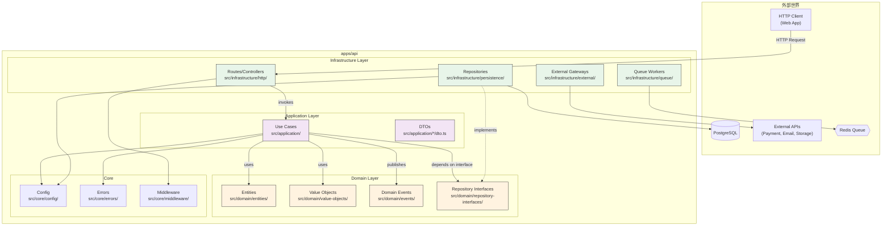
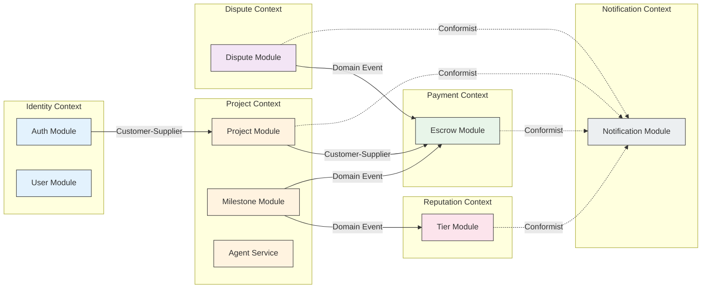
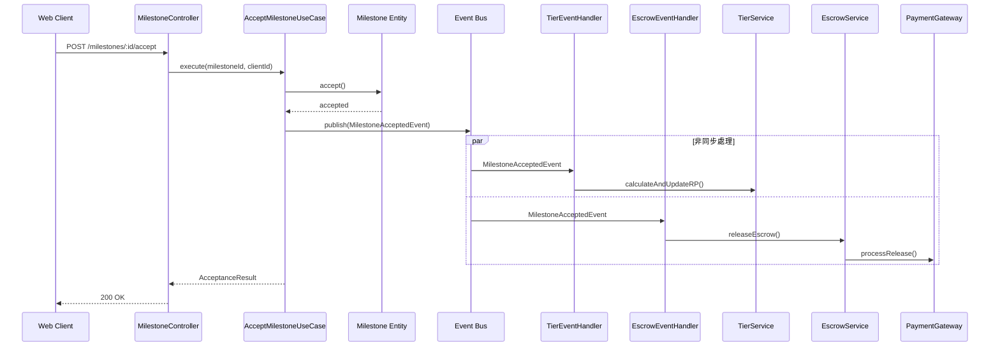

# 模組依賴關係分析 (Module Dependency Analysis) - TrustCase

---

**文件版本 (Document Version):** `v1.0`

**最後更新 (Last Updated):** `2026-02-01`

**主要作者 (Lead Author):** `技術負責人/架構團隊`

**審核者 (Reviewers):** `開發團隊, 架構委員會`

**狀態 (Status):** `草稿 (Draft)`

---

## 目錄 (Table of Contents)

1. [概述 (Overview)](#1-概述-overview)
2. [核心依賴原則 (Core Dependency Principles)](#2-核心依賴原則-core-dependency-principles)
3. [高層級服務依賴 (High-Level Service Dependencies)](#3-高層級服務依賴-high-level-service-dependencies)
4. [API Server 內部依賴 (API Server Internal Dependencies)](#4-api-server-內部依賴-api-server-internal-dependencies)
5. [限界上下文依賴 (Bounded Context Dependencies)](#5-限界上下文依賴-bounded-context-dependencies)
6. [關鍵依賴路徑分析 (Key Dependency Path Analysis)](#6-關鍵依賴路徑分析-key-dependency-path-analysis)
7. [依賴風險與管理 (Dependency Risks and Management)](#7-依賴風險與管理-dependency-risks-and-management)
8. [外部依賴管理 (External Dependency Management)](#8-外部依賴管理-external-dependency-management)
9. [依賴矩陣 (Dependency Matrix)](#9-依賴矩陣-dependency-matrix)

---

## 1. 概述 (Overview)

### 1.1 文檔目的 (Document Purpose)

- 本文檔旨在分析和定義 **TrustCase 軟體外包履約平台** 的內部模組與外部套件之間的依賴關係。
- 其目的不僅是記錄現狀，更是為了指導開發，確保專案遵循健康的依賴結構，以提升代碼的可維護性、可測試性和可擴展性。
- 本文檔是程式碼審查 (Code Review) 和架構決策的重要參考依據。

### 1.2 分析範圍 (Analysis Scope)

| 項目 | 說明 |
|:---|:---|
| **分析層級** | 服務級 (Service-level)、模組級 (Module-level)、套件級 (Package-level) |
| **包含範圍** | Monorepo 內部服務間依賴、Clean Architecture 層級依賴、DDD 上下文依賴、外部服務依賴 |
| **排除項目** | 開發工具 (ESLint, Prettier)、測試專用依賴 (Jest, Vitest)、標準庫 |

### 1.3 系統架構概覽

```plaintext
┌─────────────────────────────────────────────────────────────────────────────┐
│                              TrustCase Monorepo                              │
├─────────────────────────────────────────────────────────────────────────────┤
│                                                                             │
│  ┌─────────────┐   ┌─────────────┐   ┌─────────────┐                       │
│  │   apps/web  │   │  apps/api   │   │ apps/agent  │                       │
│  │  (Next.js)  │   │  (Express)  │   │  (FastAPI)  │                       │
│  └──────┬──────┘   └──────┬──────┘   └──────┬──────┘                       │
│         │                 │                 │                               │
│         └────────┬────────┴────────┬────────┘                               │
│                  │                 │                                        │
│         ┌────────┴────────┐ ┌──────┴──────┐                                │
│         │    packages/    │ │  packages/  │                                │
│         │  shared-types   │ │   prisma    │                                │
│         └─────────────────┘ └─────────────┘                                │
│                                                                             │
└─────────────────────────────────────────────────────────────────────────────┘
```

---

## 2. 核心依賴原則 (Core Dependency Principles)

本專案遵循以下核心原則來管理依賴關係，確保系統的長期健康。

### 2.1 依賴倒置原則 (Dependency Inversion Principle - DIP)

| 原則 | 說明 |
|:---|:---|
| **定義** | 高層模組不應依賴於低層模組，兩者都應依賴於抽象（介面或抽象類別）。 |
| **實踐** | Domain Layer 定義 Repository 介面，Infrastructure Layer 提供 Prisma 實現。Use Cases 依賴介面而非具體實現。 |

**範例：**

```typescript
// Domain Layer - 定義介面
// apps/api/src/domain/repository-interfaces/user.repository.ts
export interface IUserRepository {
  findById(id: string): Promise<User | null>;
  save(user: User): Promise<User>;
}

// Infrastructure Layer - 實現介面
// apps/api/src/infrastructure/persistence/repositories/prisma-user.repository.ts
export class PrismaUserRepository implements IUserRepository {
  constructor(private prisma: PrismaClient) {}

  async findById(id: string): Promise<User | null> {
    return this.prisma.user.findUnique({ where: { id } });
  }
}

// Application Layer - 依賴介面
// apps/api/src/application/auth/register.usecase.ts
export class RegisterUseCase {
  constructor(private userRepository: IUserRepository) {} // 依賴抽象
}
```

### 2.2 無循環依賴原則 (Acyclic Dependencies Principle - ADP)

| 原則 | 說明 |
|:---|:---|
| **定義** | 模組依賴關係圖必須是有向無環圖 (DAG)，禁止循環依賴。 |
| **實踐** | 嚴格禁止模組間的雙向 import。使用領域事件解耦跨上下文通訊。 |

**違規範例（禁止）：**

```typescript
// ❌ 錯誤：循環依賴
// milestone.service.ts
import { EscrowService } from './escrow.service';

// escrow.service.ts
import { MilestoneService } from './milestone.service'; // 循環！
```

**正確做法：**

```typescript
// ✅ 正確：使用領域事件解耦
// milestone.service.ts
this.eventBus.publish(new MilestoneAcceptedEvent(milestoneId));

// escrow.service.ts (訂閱事件)
@OnEvent('milestone.accepted')
async handleMilestoneAccepted(event: MilestoneAcceptedEvent) { ... }
```

### 2.3 穩定依賴原則 (Stable Dependencies Principle - SDP)

| 原則 | 說明 |
|:---|:---|
| **定義** | 依賴關係應朝著更穩定的方向進行。 |
| **實踐** | Domain Layer（最穩定）不依賴任何其他層。Infrastructure Layer（最不穩定）不被其他層直接依賴。 |

**穩定度排序（由高到低）：**

```
Domain Layer (Entities, Value Objects) - 最穩定
    ↓
Application Layer (Use Cases, DTOs)
    ↓
Infrastructure Layer (Controllers, Repositories) - 最不穩定
```

### 2.4 層級依賴規則總結

| 層級 | 可以依賴 | 不可以依賴 |
|:---|:---|:---|
| **Presentation (Controllers)** | Application, Domain | - |
| **Application (Use Cases)** | Domain | Presentation, Infrastructure (具體) |
| **Domain (Entities)** | 無（零依賴） | Application, Infrastructure, Presentation |
| **Infrastructure (Repositories)** | Domain (介面) | Application, Presentation |

---

## 3. 高層級服務依賴 (High-Level Service Dependencies)

### 3.1 Monorepo 服務間依賴圖

```mermaid
graph TB
    subgraph "Monorepo 服務"
        WEB["apps/web<br/>Next.js Frontend"]
        API["apps/api<br/>Express API Server"]
        AGENT["apps/agent<br/>FastAPI LLM Agent"]
    end

    subgraph "共享套件"
        TYPES["packages/shared-types<br/>TypeScript Types"]
        UTILS["packages/shared-utils<br/>Utility Functions"]
        PRISMA["packages/prisma<br/>Prisma Client & Schema"]
    end

    subgraph "外部服務"
        PG[("PostgreSQL")]
        REDIS[("Redis")]
        S3["AWS S3"]
        NEWEBPAY["藍新金流"]
        CLAUDE["Claude API"]
        SENDGRID["SendGrid"]
    end

    WEB -->|"HTTP/JSON"| API
    API -->|"HTTP/JSON"| AGENT

    WEB --> TYPES
    WEB --> UTILS
    API --> TYPES
    API --> UTILS
    API --> PRISMA

    API --> PG
    API --> REDIS
    API --> S3
    API --> NEWEBPAY
    API --> SENDGRID
    AGENT --> CLAUDE

    style WEB fill:#61DAFB,stroke:#333
    style API fill:#68A063,stroke:#333
    style AGENT fill:#3776AB,stroke:#333
    style TYPES fill:#3178C6,stroke:#333
    style UTILS fill:#3178C6,stroke:#333
    style PRISMA fill:#2D3748,stroke:#333
```



### 3.2 服務職責與依賴說明

| 服務 | 職責 | 依賴 | 被依賴 |
|:---|:---|:---|:---|
| **apps/web** | 前端 UI、使用者互動 | `shared-types`, `shared-utils`, `apps/api` | 無 |
| **apps/api** | 核心業務邏輯、資料持久化、外部整合 | `shared-types`, `shared-utils`, `prisma`, 外部服務 | `apps/web` |
| **apps/agent** | LLM 需求引導、SPEC 生成 | Claude API | `apps/api` |
| **packages/shared-types** | 跨服務共享的 TypeScript 類型 | 無 | `apps/web`, `apps/api` |
| **packages/shared-utils** | 共用工具函式（日期、金額格式化） | 無 | `apps/web`, `apps/api` |
| **packages/prisma** | 資料庫 Schema 與 Prisma Client | PostgreSQL | `apps/api` |

---

## 4. API Server 內部依賴 (API Server Internal Dependencies)

### 4.1 Clean Architecture 分層依賴圖



### 4.2 層級職責與路徑對應

| 層級 | 主要職責 | 程式碼路徑 | 可依賴 |
|:---|:---|:---|:---|
| **Infrastructure - HTTP** | 處理 HTTP 請求、路由定義、請求驗證 | `src/infrastructure/http/` | Application, Domain, Core |
| **Infrastructure - Persistence** | 實現資料庫存取、Repository 實作 | `src/infrastructure/persistence/` | Domain (介面), Core |
| **Infrastructure - External** | 外部服務整合（金流、Email、Storage） | `src/infrastructure/external/` | Domain (介面), Core |
| **Infrastructure - Queue** | 背景任務處理、Worker 實作 | `src/infrastructure/queue/` | Application, Domain, Core |
| **Application** | 編排業務流程、協調領域物件與基礎設施 | `src/application/` | Domain, Core |
| **Domain - Entities** | 核心業務實體、業務規則 | `src/domain/entities/` | Domain (VOs), 無外部依賴 |
| **Domain - Value Objects** | 不可變值物件 | `src/domain/value-objects/` | 無外部依賴 |
| **Domain - Events** | 領域事件定義 | `src/domain/events/` | 無外部依賴 |
| **Domain - Repository Interfaces** | 資料存取抽象介面 | `src/domain/repository-interfaces/` | Domain (Entities) |
| **Core** | 跨層共用配置、錯誤處理、中介軟體 | `src/core/` | 無 Application/Domain 依賴 |

### 4.3 模組間 Import 規則

```typescript
// ✅ 允許的 imports

// Controller → Use Case
import { RegisterUseCase } from '@/application/auth/register.usecase';

// Use Case → Entity
import { User } from '@/domain/entities/user.entity';

// Use Case → Repository Interface
import { IUserRepository } from '@/domain/repository-interfaces/user.repository';

// Repository Implementation → Entity
import { User } from '@/domain/entities/user.entity';

// Repository Implementation → Repository Interface
import { IUserRepository } from '@/domain/repository-interfaces/user.repository';
```

```typescript
// ❌ 禁止的 imports

// Entity → Use Case (Domain 不可依賴 Application)
import { RegisterUseCase } from '@/application/auth/register.usecase';

// Use Case → Concrete Repository (Application 不可依賴 Infrastructure 具體實現)
import { PrismaUserRepository } from '@/infrastructure/persistence/repositories/prisma-user.repository';

// Entity → Controller (Domain 不可依賴 Infrastructure)
import { AuthController } from '@/infrastructure/http/controllers/auth.controller';
```

---

## 5. 限界上下文依賴 (Bounded Context Dependencies)

### 5.1 上下文映射圖 (Context Map)



### 5.2 上下文關係類型說明

| 上游 Context | 下游 Context | 關係類型 | 通訊方式 | 說明 |
|:---|:---|:---|:---|:---|
| **Identity** | Project | Customer-Supplier | 同步 (API 呼叫) | 專案建立需要用戶身份驗證 |
| **Project** | Payment | Customer-Supplier | 同步 (API 呼叫) | 里程碑驅動付款流程 |
| **Milestone** | Tier | Published Language | 非同步 (Domain Event) | 里程碑完成事件觸發積分計算 |
| **Milestone** | Escrow | Published Language | 非同步 (Domain Event) | 里程碑驗收觸發撥款 |
| **Dispute** | Escrow | Partnership | 同步 + 非同步 | 爭議發起時凍結款項 |
| **All Contexts** | Notification | Conformist | 非同步 (Event Queue) | 統一的通知發送機制 |

### 5.3 跨上下文通訊模式

**模式 1：同步呼叫 (Customer-Supplier)**

```typescript
// Project Context 呼叫 Identity Context
class CreateProjectUseCase {
  constructor(
    private userRepository: IUserRepository, // Identity Context 介面
    private projectRepository: IProjectRepository
  ) {}

  async execute(userId: string, input: CreateProjectInput) {
    const user = await this.userRepository.findById(userId);
    if (!user || !user.isVerified) {
      throw new UnauthorizedError();
    }
    // ...
  }
}
```

**模式 2：領域事件 (Published Language)**

```typescript
// Milestone Context 發布事件
class AcceptMilestoneUseCase {
  async execute(milestoneId: string) {
    const milestone = await this.milestoneRepository.findById(milestoneId);
    milestone.accept();

    // 發布領域事件
    await this.eventBus.publish(new MilestoneAcceptedEvent({
      milestoneId: milestone.id,
      projectId: milestone.projectId,
      freelancerId: milestone.project.freelancerId,
      amount: milestone.amount,
      isOnTime: milestone.isOnTime(),
      isFirstPass: milestone.revisionCount === 0,
    }));
  }
}

// Tier Context 訂閱事件
class TierEventHandler {
  @OnEvent('milestone.accepted')
  async handleMilestoneAccepted(event: MilestoneAcceptedEvent) {
    await this.tierService.calculateAndUpdateRP(event);
  }
}

// Payment Context 訂閱事件
class EscrowEventHandler {
  @OnEvent('milestone.accepted')
  async handleMilestoneAccepted(event: MilestoneAcceptedEvent) {
    await this.escrowService.releaseEscrow(event.milestoneId);
  }
}
```

---

## 6. 關鍵依賴路徑分析 (Key Dependency Path Analysis)

### 6.1 場景：案主驗收里程碑觸發撥款與積分計算



**依賴路徑分析：**

| 步驟 | 來源層 | 目標層 | 依賴類型 | 合規性 |
|:---|:---|:---|:---|:---|
| 1 | Presentation | Application | 同步呼叫 | ✅ 符合 |
| 2 | Application | Domain | 同步呼叫 | ✅ 符合 |
| 3 | Application | Infrastructure (Event) | 非同步發布 | ✅ 符合 |
| 4 | Event Handler | Application | 同步呼叫 | ✅ 符合 |
| 5 | Application | Infrastructure (Gateway) | 透過介面 | ✅ 符合 DIP |

**結論：** 該路徑符合單向依賴、依賴倒置和無循環依賴原則。使用領域事件解耦了 Milestone、Tier、Escrow 三個上下文。

---

### 6.2 場景：接案者提交交付物

**依賴呼叫鏈：**

```
1. Controller (Presentation)
   └── SubmitDeliverableUseCase (Application)
       ├── MilestoneRepository.findById() (via Interface)
       │   └── PrismaMilestoneRepository (Infrastructure)
       ├── Milestone.submit() (Domain)
       ├── FileStorageService.upload() (via Interface)
       │   └── S3StorageService (Infrastructure)
       ├── DeliverableRepository.save() (via Interface)
       │   └── PrismaDeliverableRepository (Infrastructure)
       └── EventBus.publish(DeliverableSubmittedEvent)
           └── NotificationHandler (Infrastructure)
               └── SendGridService (Infrastructure)
```

**依賴合規性檢查：**

| 檢查項目 | 狀態 | 說明 |
|:---|:---|:---|
| Use Case 依賴 Domain Entity | ✅ | `Milestone.submit()` |
| Use Case 依賴 Repository 介面 | ✅ | 不直接依賴 Prisma 實現 |
| Use Case 依賴 Storage 介面 | ✅ | 不直接依賴 S3 實現 |
| 無循環依賴 | ✅ | 單向依賴鏈 |
| 跨 Context 使用事件 | ✅ | 通知透過事件解耦 |

---

## 7. 依賴風險與管理 (Dependency Risks and Management)

### 7.1 循環依賴檢測與解決

**檢測工具：**

| 工具 | 語言 | 用途 |
|:---|:---|:---|
| `madge` | TypeScript/JavaScript | 視覺化模組依賴圖、檢測循環 |
| `dpdm` | TypeScript | 快速循環依賴檢測 |
| `eslint-plugin-import` | TypeScript | 靜態分析 import 規則 |
| `pydeps` | Python | Python 模組依賴分析 |

**ESLint 配置範例：**

```javascript
// .eslintrc.js
module.exports = {
  plugins: ['import'],
  rules: {
    'import/no-cycle': 'error',
    'import/no-restricted-paths': ['error', {
      zones: [
        // Domain 不可 import Application
        {
          target: './src/domain',
          from: './src/application',
          message: 'Domain layer cannot depend on Application layer'
        },
        // Domain 不可 import Infrastructure
        {
          target: './src/domain',
          from: './src/infrastructure',
          message: 'Domain layer cannot depend on Infrastructure layer'
        },
        // Application 不可 import Infrastructure (除介面外)
        {
          target: './src/application',
          from: './src/infrastructure',
          except: ['./src/infrastructure/interfaces'],
          message: 'Application layer cannot depend on Infrastructure implementations'
        }
      ]
    }]
  }
};
```

**解決策略：**

| 問題 | 解決方案 | 範例 |
|:---|:---|:---|
| 模組 A ↔ 模組 B 雙向依賴 | 提取共用邏輯到新模組 C | 提取共用 DTO 到 `shared-types` |
| Service A ↔ Service B 互相呼叫 | 使用領域事件解耦 | `MilestoneAcceptedEvent` |
| 層級間違規依賴 | 引入介面層 | Repository Interface |

### 7.2 不穩定依賴隔離

**高風險外部依賴識別：**

| 依賴 | 風險等級 | 原因 | 隔離策略 |
|:---|:---|:---|:---|
| 藍新金流 SDK | 高 | API 可能變更、台灣特定 | Adapter Pattern |
| Claude API | 中 | 模型版本更新、Rate Limit | Adapter + Retry |
| SendGrid | 低 | 成熟穩定 | 輕量 Adapter |
| AWS S3 SDK | 低 | 業界標準 | 輕量 Adapter |

**Adapter 模式實作範例：**

```typescript
// 1. 定義穩定介面 (Domain Layer)
// src/domain/interfaces/payment-gateway.interface.ts
export interface IPaymentGateway {
  createEscrow(params: CreateEscrowParams): Promise<EscrowResult>;
  releasePayment(escrowId: string): Promise<ReleaseResult>;
  refund(escrowId: string, amount: number): Promise<RefundResult>;
}

// 2. 實作 Adapter (Infrastructure Layer)
// src/infrastructure/external/payment/newebpay.adapter.ts
export class NewebPayAdapter implements IPaymentGateway {
  private client: NewebPaySDK;

  constructor(config: NewebPayConfig) {
    this.client = new NewebPaySDK(config);
  }

  async createEscrow(params: CreateEscrowParams): Promise<EscrowResult> {
    // 將內部格式轉換為藍新格式
    const newebPayParams = this.toNewebPayFormat(params);
    const response = await this.client.createOrder(newebPayParams);
    // 將藍新回應轉換為內部格式
    return this.toInternalFormat(response);
  }
}

// 3. Use Case 依賴介面
// src/application/escrow/fund-milestone.usecase.ts
export class FundMilestoneUseCase {
  constructor(
    private paymentGateway: IPaymentGateway // 依賴抽象
  ) {}
}
```

### 7.3 依賴健康度指標

| 指標 | 目標值 | 檢測方式 | 頻率 |
|:---|:---|:---|:---|
| 循環依賴數量 | 0 | `madge --circular` | 每次 CI |
| Domain Layer 外部依賴數 | 0 | ESLint 規則 | 每次 CI |
| 外部套件安全漏洞 | 0 Critical/High | `pnpm audit` | 每日 |
| 過期依賴比例 | < 10% | Dependabot | 每週 |

---

## 8. 外部依賴管理 (External Dependency Management)

### 8.1 外部依賴清單 - API Server (Node.js)

| 依賴 | 版本 | 用途 | 風險評估 | 替代方案 |
|:---|:---|:---|:---|:---|
| `express` | `^4.18.2` | Web 框架 | 低 (成熟穩定) | Fastify |
| `@prisma/client` | `^5.8.0` | ORM | 低 (活躍維護) | TypeORM |
| `bullmq` | `^4.15.0` | 任務佇列 | 低 (活躍) | Agenda |
| `jsonwebtoken` | `^9.0.2` | JWT 處理 | 低 (標準) | jose |
| `bcrypt` | `^5.1.1` | 密碼雜湊 | 低 (標準) | argon2 |
| `zod` | `^3.22.4` | Schema 驗證 | 低 (活躍) | yup |
| `ioredis` | `^5.3.2` | Redis 客戶端 | 低 (成熟) | redis |
| `@aws-sdk/client-s3` | `^3.485.0` | S3 整合 | 低 (官方) | - |
| `@sendgrid/mail` | `^8.1.0` | Email 發送 | 低 (官方) | nodemailer |

### 8.2 外部依賴清單 - Web (Next.js)

| 依賴 | 版本 | 用途 | 風險評估 |
|:---|:---|:---|:---|
| `next` | `^14.1.0` | React 框架 | 低 (Vercel 官方) |
| `react` | `^18.2.0` | UI Library | 低 (Meta 官方) |
| `tailwindcss` | `^3.4.1` | CSS 框架 | 低 (成熟穩定) |
| `zustand` | `^4.5.0` | 狀態管理 | 低 (輕量活躍) |
| `react-hook-form` | `^7.49.3` | 表單管理 | 低 (成熟) |
| `@tanstack/react-query` | `^5.17.0` | 資料獲取 | 低 (活躍) |

### 8.3 外部依賴清單 - Agent (Python)

| 依賴 | 版本 | 用途 | 風險評估 |
|:---|:---|:---|:---|
| `fastapi` | `^0.109.0` | Web 框架 | 低 (活躍) |
| `uvicorn` | `^0.27.0` | ASGI 伺服器 | 低 (標準) |
| `anthropic` | `^0.18.0` | Claude API SDK | 中 (更新頻繁) |
| `pydantic` | `^2.6.0` | 資料驗證 | 低 (成熟) |
| `httpx` | `^0.26.0` | HTTP 客戶端 | 低 (成熟) |

### 8.4 依賴更新策略

| 策略 | 說明 |
|:---|:---|
| **自動掃描** | 使用 Dependabot 每週掃描安全漏洞與過期依賴 |
| **分類處理** | 安全性更新：立即處理；Minor/Patch：每週批次；Major：規劃評估 |
| **測試門檻** | 所有依賴更新必須通過完整 CI 測試套件 |
| **鎖定版本** | 使用 `pnpm-lock.yaml` / `poetry.lock` 確保一致性 |
| **審核流程** | Major 版本更新需 Tech Lead 審核 |

---

## 9. 依賴矩陣 (Dependency Matrix)

### 9.1 模組間依賴矩陣

**圖例：** ✅ = 允許依賴 | ❌ = 禁止依賴 | ⚡ = 透過事件/介面

| 來源 ↓ / 目標 → | Domain Entities | Domain VOs | Domain Events | Domain Repo I/F | Application Use Cases | Application DTOs | Infra Controllers | Infra Repositories | Infra External | Core |
|:---|:---:|:---:|:---:|:---:|:---:|:---:|:---:|:---:|:---:|:---:|
| **Domain Entities** | ✅ | ✅ | ✅ | ❌ | ❌ | ❌ | ❌ | ❌ | ❌ | ❌ |
| **Domain VOs** | ❌ | ✅ | ❌ | ❌ | ❌ | ❌ | ❌ | ❌ | ❌ | ❌ |
| **Domain Events** | ✅ | ✅ | ✅ | ❌ | ❌ | ❌ | ❌ | ❌ | ❌ | ❌ |
| **Domain Repo I/F** | ✅ | ✅ | ❌ | ✅ | ❌ | ❌ | ❌ | ❌ | ❌ | ❌ |
| **Application Use Cases** | ✅ | ✅ | ✅ | ✅ | ✅ | ✅ | ❌ | ⚡ | ⚡ | ✅ |
| **Application DTOs** | ❌ | ✅ | ❌ | ❌ | ❌ | ✅ | ❌ | ❌ | ❌ | ✅ |
| **Infra Controllers** | ❌ | ✅ | ❌ | ❌ | ✅ | ✅ | ✅ | ❌ | ❌ | ✅ |
| **Infra Repositories** | ✅ | ✅ | ❌ | ✅ | ❌ | ❌ | ❌ | ✅ | ❌ | ✅ |
| **Infra External** | ❌ | ✅ | ❌ | ⚡ | ❌ | ❌ | ❌ | ❌ | ✅ | ✅ |
| **Core** | ❌ | ❌ | ❌ | ❌ | ❌ | ❌ | ❌ | ❌ | ❌ | ✅ |

### 9.2 限界上下文依賴矩陣

| 來源 ↓ / 目標 → | Identity | Project | Payment | Reputation | Dispute | Notification |
|:---|:---:|:---:|:---:|:---:|:---:|:---:|
| **Identity** | - | ❌ | ❌ | ❌ | ❌ | ⚡ |
| **Project** | ✅ | - | ✅ | ⚡ | ❌ | ⚡ |
| **Payment** | ✅ | ✅ | - | ❌ | ⚡ | ⚡ |
| **Reputation** | ✅ | ⚡ | ❌ | - | ❌ | ⚡ |
| **Dispute** | ✅ | ✅ | ⚡ | ❌ | - | ⚡ |
| **Notification** | ⚡ | ⚡ | ⚡ | ⚡ | ⚡ | - |

**圖例：** ✅ = 同步依賴 | ⚡ = 非同步事件 | ❌ = 無依賴

---

## 附錄 A: 依賴視覺化指令

```bash
# 生成 API Server 模組依賴圖
npx madge --image dependency-graph.svg apps/api/src

# 檢測循環依賴
npx madge --circular apps/api/src

# 生成特定模組的依賴樹
npx madge --json apps/api/src/application/milestone > milestone-deps.json

# Python Agent 依賴圖
pydeps apps/agent/src/agent --max-bacon=2 -o agent-deps.svg
```

---

## 附錄 B: 依賴審查檢查清單

在進行程式碼審查時，請確認：

- [ ] 新增的 import 符合層級依賴規則
- [ ] Domain Layer 無任何 Infrastructure 依賴
- [ ] 跨 Context 通訊使用事件而非直接呼叫
- [ ] 外部服務整合使用 Adapter 模式
- [ ] 無新增循環依賴
- [ ] 新增外部依賴已評估風險並記錄

---

**文件審核記錄 (Review History):**

| 日期 | 審核人 | 版本 | 變更摘要 |
|:---|:---|:---|:---|
| 2026-02-01 | 架構團隊 | v1.0 | 初稿建立 |

---

**文件結束**
