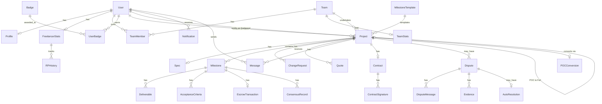
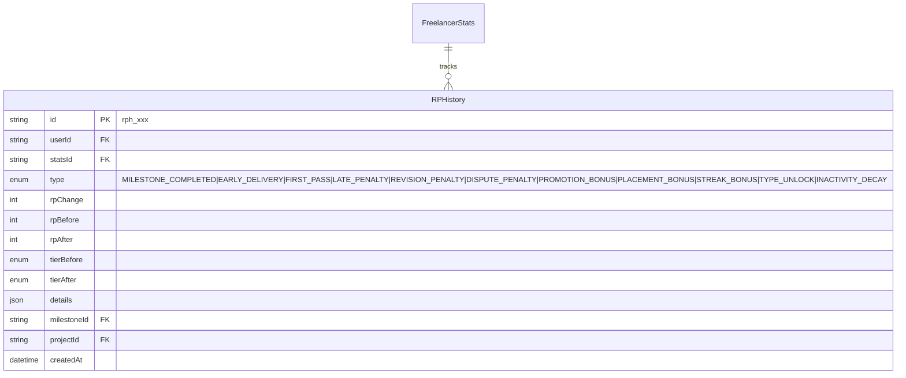
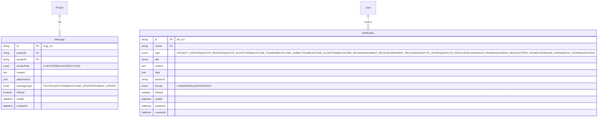

# 實體關係圖 (Entity Relationship Diagram) - TrustCase

---

**文件版本 (Document Version):** `v2.0`

**最後更新 (Last Updated):** `2026-02-01`

**主要作者 (Lead Author):** `技術負責人/架構團隊`

**審核者 (Reviewers):** `資料庫管理員, 開發團隊`

**狀態 (Status):** `草稿 (Draft)`

**相關文檔:**
- 架構設計: `TrustCase_Architecture.md`
- 類別關係: `TrustCase_Class_Relationships.md`
- 核心功能規格: `sunny_版本/核心功能/`

---

## 目錄 (Table of Contents)

1. [概述 (Overview)](#1-概述-overview)
2. [完整 ERD 圖 (Complete ERD)](#2-完整-erd-圖-complete-erd)
3. [限界上下文 ERD (Bounded Context ERDs)](#3-限界上下文-erd-bounded-context-erds)
4. [實體詳細規格 (Entity Specifications)](#4-實體詳細規格-entity-specifications)
5. [關係說明 (Relationship Descriptions)](#5-關係說明-relationship-descriptions)
6. [索引策略 (Indexing Strategy)](#6-索引策略-indexing-strategy)
7. [資料完整性約束 (Data Integrity Constraints)](#7-資料完整性約束-data-integrity-constraints)
8. [Prisma Schema (完整定義)](#8-prisma-schema-完整定義)

---

## 1. 概述 (Overview)

### 1.1 文檔目的

本文檔定義 TrustCase 軟體外包履約平台的資料庫實體關係模型，涵蓋五大核心功能：
- **LLM Agent 輔助系統**：需求引導與 SPEC 生成
- **動態里程碑與專案管理**：模板化流程與 KPI 追蹤
- **POC 概念驗證模式**：小額試水溫機制
- **遊戲化機制**：牌位系統與積分
- **風險控管機制**：三層防禦架構

### 1.2 資料庫技術

| 項目 | 選用技術 |
|:---|:---|
| **資料庫系統** | PostgreSQL 15 |
| **ORM** | Prisma 5.x |
| **ID 策略** | 前綴 + CUID (e.g., `usr_clv2abc123`) |
| **時間戳** | UTC, ISO 8601 格式 |
| **金額處理** | Decimal(12,2) |

### 1.3 限界上下文對應

| 限界上下文 | 涵蓋實體 |
|:---|:---|
| **Identity Context** | User, Profile, FreelancerStats, Team, TeamMember, Badge, UserBadge |
| **Project Context** | Project, Spec, Milestone, MilestoneTemplate, Deliverable, AcceptanceCriteria, ChangeRequest, Quote |
| **Payment Context** | EscrowTransaction, POCConversion |
| **Reputation Context** | FreelancerStats, TeamStats, RPHistory |
| **Dispute Context** | Dispute, DisputeMessage, Evidence, ConsensusRecord, AutoResolution |
| **Contract Context** | Contract, ContractSignature |
| **Communication Context** | Message, Notification |

### 1.4 實體總覽 (27 個實體)

```
Identity (7)        Project (8)         Payment (2)
├─ User             ├─ Project          ├─ EscrowTransaction
├─ Profile          ├─ Spec             └─ POCConversion
├─ FreelancerStats  ├─ Milestone
├─ Team             ├─ MilestoneTemplate
├─ TeamMember       ├─ Deliverable
├─ Badge            ├─ AcceptanceCriteria
└─ UserBadge        ├─ ChangeRequest
                    └─ Quote

Reputation (2)      Dispute (5)         Contract (2)        Communication (2)
├─ RPHistory        ├─ Dispute          ├─ Contract         ├─ Message
└─ TeamStats        ├─ DisputeMessage   └─ ContractSignature└─ Notification
                    ├─ Evidence
                    ├─ ConsensusRecord
                    └─ AutoResolution
```

---

## 2. 完整 ERD 圖 (Complete ERD)

### 2.1 核心實體關係



### 2.2 核心實體定義

```mermaid
erDiagram
    User {
        string id PK "usr_xxx"
        string email UK
        string passwordHash
        enum role "CLIENT|FREELANCER|BOTH|ADMIN"
        boolean isVerified
        datetime createdAt
        datetime updatedAt
    }

    Profile {
        string id PK
        string userId FK UK
        string displayName
        string avatarUrl
        string bio
        string[] skills
        json portfolioItems
        datetime createdAt
    }

    FreelancerStats {
        string id PK
        string userId FK UK
        int ratingPoints
        enum tier "BRONZE_IV...GRANDMASTER"
        decimal onTimeRate
        decimal firstPassRate
        decimal reworkRate
        int currentStreak
        boolean isInPlacement
    }

    Team {
        string id PK "team_xxx"
        string name
        string description
        string ownerId FK
        boolean isCertified
        datetime createdAt
    }

    TeamMember {
        string id PK
        string teamId FK
        string userId FK
        enum role "OWNER|ADMIN|MEMBER"
        datetime joinedAt
    }

    TeamStats {
        string id PK
        string teamId FK UK
        int teamRatingPoints
        enum teamTier
        int projectsCompleted
        decimal teamOnTimeRate
    }

    Project {
        string id PK "prj_xxx"
        string title
        enum type "WEB|APP|UI_UX|GRAPHIC|VIDEO|AI"
        enum status "DRAFT|PUBLISHED|..."
        string clientId FK
        string freelancerId FK
        string teamId FK
        decimal totalAmount
        boolean isPoc
        string pocParentId FK
        datetime createdAt
    }

    Milestone {
        string id PK "mst_xxx"
        string projectId FK
        string name
        int order
        decimal weight
        decimal amount
        enum status "PENDING|FUNDED|..."
        datetime dueDate
        int revisionCount
        int maxRevisions
    }

    EscrowTransaction {
        string id PK "esc_xxx"
        string milestoneId FK UK
        decimal amount
        decimal platformFee
        decimal freelancerPayout
        enum status "PENDING|FUNDED|RELEASED|..."
        string paymentProvider
        datetime fundedAt
        datetime releasedAt
    }

    Dispute {
        string id PK "dsp_xxx"
        string milestoneId FK
        enum type "QUALITY|LATE|PAYMENT|SCOPE"
        enum status "NEGOTIATING|REVIEW|ARBITRATION|RESOLVED"
        string initiatedBy FK
        datetime negotiationDeadline
        enum resolutionType
    }

    Contract {
        string id PK "ctr_xxx"
        string projectId FK UK
        string version
        json terms
        enum status "DRAFT|PENDING|ACTIVE|COMPLETED"
        string contractHash
        datetime effectiveAt
    }
```

---

## 3. 限界上下文 ERD (Bounded Context ERDs)

### 3.1 Identity Context (身份上下文)

```mermaid
erDiagram
    User ||--o| Profile : has
    User ||--o| FreelancerStats : has
    User ||--o{ TeamMember : joins
    User ||--o{ UserBadge : earns
    Team ||--o{ TeamMember : has
    Team ||--o| TeamStats : has
    Badge ||--o{ UserBadge : awarded_to

    User {
        string id PK "usr_xxx"
        string email UK
        string passwordHash
        enum role "CLIENT|FREELANCER|BOTH|ADMIN"
        boolean isVerified
        string verifyToken
        datetime verifyExpires
        datetime lastActiveAt
        datetime createdAt
        datetime updatedAt
    }

    Profile {
        string id PK
        string userId FK UK
        string displayName
        string avatarUrl
        string bio
        text introduction
        string[] skills
        string[] projectTypes
        decimal hourlyRateMin
        decimal hourlyRateMax
        json portfolioItems
        string location
        string timezone
        json socialLinks
        datetime createdAt
        datetime updatedAt
    }

    FreelancerStats {
        string id PK
        string userId FK UK
        int ratingPoints
        enum tier "BRONZE_IV...GRANDMASTER"
        int totalMilestones
        int onTimeMilestones
        int firstPassMilestones
        int reworkMilestones
        decimal onTimeRate
        decimal firstPassRate
        decimal reworkRate
        decimal defectDensity
        int currentStreak
        int bestStreak
        int responseTimeAvg
        boolean isInPlacement
        int placementCount
        datetime tierUpdatedAt
        datetime updatedAt
    }

    Team {
        string id PK "team_xxx"
        string name UK
        string displayName
        string description
        string avatarUrl
        string ownerId FK
        int memberCount
        boolean isCertified
        datetime certifiedAt
        datetime createdAt
        datetime updatedAt
    }

    TeamMember {
        string id PK
        string teamId FK
        string userId FK
        enum role "OWNER|ADMIN|MEMBER"
        string position
        datetime joinedAt
        datetime leftAt
        boolean isActive
    }

    TeamStats {
        string id PK
        string teamId FK UK
        int teamRatingPoints
        enum teamTier
        int projectsCompleted
        int totalMembers
        decimal teamOnTimeRate
        decimal teamFirstPassRate
        int collaborationBonus
        datetime updatedAt
    }

    Badge {
        string id PK "bdg_xxx"
        string code UK
        string name
        string description
        string iconUrl
        enum category "PERFORMANCE|MILESTONE|SPECIAL"
        json criteria
        boolean isActive
        datetime createdAt
    }

    UserBadge {
        string id PK
        string userId FK
        string badgeId FK
        datetime earnedAt
        json metadata
    }
```

### 3.2 Project Context (專案上下文)

```mermaid
erDiagram
    Project ||--o| Spec : has
    Project ||--o{ Milestone : contains
    Project ||--o{ ChangeRequest : has
    Project ||--o{ Quote : receives
    Project }o--o| MilestoneTemplate : "uses"

    Milestone ||--o{ Deliverable : has
    Milestone ||--o{ AcceptanceCriteria : has

    Project {
        string id PK "prj_xxx"
        string title
        string description
        enum type "WEB|APP|UI_UX|GRAPHIC|VIDEO|AI"
        string subType
        enum status "DRAFT|PUBLISHED|PROPOSAL_SENT|NEGOTIATING|CONTRACTED|IN_PROGRESS|COMPLETED|CANCELLED|DISPUTED"
        string clientId FK
        string freelancerId FK
        string teamId FK
        string templateId FK
        decimal totalAmount
        decimal escrowedAmount
        decimal releasedAmount
        decimal budgetMin
        decimal budgetMax
        boolean isPoc
        string pocParentId FK
        int pocDiscountPercent
        datetime pocConvertDeadline
        json requirements
        json references
        datetime deadline
        enum urgency "URGENT|NORMAL|FLEXIBLE"
        int completionScore
        string[] missingFields
        datetime publishedAt
        datetime contractedAt
        datetime completedAt
        datetime createdAt
        datetime updatedAt
    }

    Spec {
        string id PK "spc_xxx"
        string projectId FK UK
        string version
        json projectOverview
        json businessObjectives
        json targetUsers
        json functionalRequirements
        json technicalSpecs
        json acceptanceCriteria
        json suggestedMilestones
        json riskWarnings
        string[] ambiguousTerms
        enum status "DRAFT|GENERATED|CONFIRMED"
        string generatedBy
        datetime generatedAt
        datetime confirmedAt
        datetime updatedAt
    }

    MilestoneTemplate {
        string id PK "tpl_xxx"
        string templateId UK
        string name
        string[] category
        string typicalDuration
        string typicalBudget
        json milestones
        json rules
        boolean isActive
        int usageCount
        datetime createdAt
        datetime updatedAt
    }

    Milestone {
        string id PK "mst_xxx"
        string projectId FK
        string name
        string description
        int order
        decimal weight
        decimal amount
        enum status "PENDING|FUNDED|IN_PROGRESS|SUBMITTED|REVISION_NEEDED|ACCEPTED|RELEASED|DISPUTED|CANCELLED"
        datetime dueDate
        datetime startedAt
        datetime submittedAt
        datetime acceptedAt
        int revisionCount
        int maxRevisions
        int timeoutDays
        json evidenceRequired
        json deliverableSpecs
        datetime createdAt
        datetime updatedAt
    }

    Deliverable {
        string id PK "dlv_xxx"
        string milestoneId FK
        enum type "FILE|LINK|DEMO|SCREENSHOT|DOCUMENT|CODE|DESIGN"
        string name
        string description
        string url
        string fileHash
        int fileSize
        string mimeType
        string notes
        boolean isVerified
        datetime submittedAt
    }

    AcceptanceCriteria {
        string id PK "ac_xxx"
        string milestoneId FK
        string description
        enum category "FUNCTIONAL|PERFORMANCE|COMPATIBILITY|QUALITY"
        boolean isObjective
        string objectiveMetric
        string objectiveThreshold
        boolean isMet
        string verificationNote
        datetime verifiedAt
        datetime createdAt
    }

    ChangeRequest {
        string id PK "cr_xxx"
        string projectId FK
        string milestoneId FK
        string requesterId FK
        enum requesterRole "CLIENT|FREELANCER"
        enum changeType "SCOPE_ADJUSTMENT|MINOR|MEDIUM|MAJOR|DIRECTION"
        text originalRequirement
        text requestedChange
        text changeReason
        enum estimatedImpact "NONE|LOW|MEDIUM|HIGH"
        decimal estimatedAdditionalCost
        int estimatedAdditionalDays
        enum status "PENDING|APPROVED|REJECTED|WITHDRAWN"
        enum resolutionType "ABSORBED|NEW_MILESTONE|REJECTED"
        text resolutionNote
        datetime clientConfirmedAt
        datetime freelancerConfirmedAt
        datetime createdAt
        datetime updatedAt
    }

    Quote {
        string id PK "qt_xxx"
        string projectId FK
        string freelancerId FK
        string teamId FK
        decimal pocAmount
        int pocDurationDays
        json pocDeliverables
        int pocRevisions
        decimal fullProjectAmount
        decimal fullProjectAmountMax
        int fullProjectDurationDays
        json proposedMilestones
        text coverLetter
        json highlights
        enum status "DRAFT|SUBMITTED|VIEWED|SHORTLISTED|ACCEPTED|REJECTED|WITHDRAWN"
        datetime submittedAt
        datetime viewedAt
        datetime respondedAt
        datetime createdAt
        datetime updatedAt
    }
```

### 3.3 Payment Context (支付上下文)

```mermaid
erDiagram
    Milestone ||--o| EscrowTransaction : has
    Project ||--o| POCConversion : "converts via"

    EscrowTransaction {
        string id PK "esc_xxx"
        string milestoneId FK UK
        decimal amount
        decimal platformFeeClient
        decimal platformFeeFreelancer
        decimal totalPlatformFee
        decimal freelancerPayout
        enum status "PENDING|FUNDED|RELEASING|RELEASED|REFUNDING|REFUNDED|FROZEN|PARTIAL_REFUND"
        string paymentProvider
        string providerTxnId
        string providerPaymentId
        json providerData
        string clientPaymentMethod
        string freelancerPayoutMethod
        string freelancerBankAccount
        datetime fundedAt
        datetime releasedAt
        datetime refundedAt
        string refundReason
        decimal refundAmount
        datetime createdAt
        datetime updatedAt
    }

    POCConversion {
        string id PK "poc_xxx"
        string pocProjectId FK UK
        string fullProjectId FK UK
        decimal pocAmount
        decimal discountPercent
        decimal discountAmount
        decimal fullProjectAmount
        decimal netPayable
        int daysToConvert
        enum status "PENDING|CONVERTED|EXPIRED|CANCELLED"
        datetime convertedAt
        datetime expiredAt
        datetime createdAt
    }
```

### 3.4 Contract Context (合約上下文)

```mermaid
erDiagram
    Project ||--o| Contract : has
    Contract ||--o{ ContractSignature : has

    Contract {
        string id PK "ctr_xxx"
        string projectId FK UK
        string version
        enum contractType "POC|FULL_PROJECT"
        json parties
        json projectScope
        json deliverables
        json paymentTerms
        json acceptanceRules
        json changeManagement
        json intellectualProperty
        json confidentiality
        json disputeResolution
        json otherTerms
        text fullText
        string contractHash
        enum status "DRAFT|PENDING_SIGNATURE|ACTIVE|COMPLETED|TERMINATED"
        datetime effectiveAt
        datetime expiresAt
        datetime terminatedAt
        string terminationReason
        datetime createdAt
        datetime updatedAt
    }

    ContractSignature {
        string id PK
        string contractId FK
        string userId FK
        enum role "CLIENT|FREELANCER"
        string ipAddress
        string userAgent
        string signatureHash
        datetime signedAt
    }
```

### 3.5 Dispute Context (爭議上下文)

```mermaid
erDiagram
    Dispute ||--o{ DisputeMessage : has
    Dispute ||--o{ Evidence : has
    Dispute ||--o| AutoResolution : may_have
    Milestone ||--o{ ConsensusRecord : has

    Dispute {
        string id PK "dsp_xxx"
        string projectId FK
        string milestoneId FK
        enum type "DELIVERY_QUALITY|LATE_DELIVERY|PAYMENT|SCOPE_CREEP|COMMUNICATION|UNRESPONSIVE|OTHER"
        enum status "NEGOTIATING|PLATFORM_REVIEW|ARBITRATION|RESOLVED|CLOSED"
        string initiatedBy FK
        text description
        decimal disputedAmount
        datetime negotiationDeadline
        datetime platformReviewDeadline
        string assignedReviewer
        enum resolutionType "MUTUAL_AGREEMENT|AUTO_RULING|PLATFORM_RULING|ARBITRATION|EXPIRED"
        text resolutionDescription
        decimal clientRefundAmount
        decimal freelancerPayoutAmount
        string arbitrationRef
        datetime resolvedAt
        datetime createdAt
        datetime updatedAt
    }

    DisputeMessage {
        string id PK
        string disputeId FK
        string senderId FK
        enum senderRole "CLIENT|FREELANCER|PLATFORM|ARBITRATOR"
        text content
        json attachments
        boolean isInternal
        datetime createdAt
    }

    Evidence {
        string id PK "evd_xxx"
        string disputeId FK
        string uploadedBy FK
        enum type "SCREENSHOT|DOCUMENT|COMMUNICATION_LOG|FILE|DEMO_RECORDING|CONSENSUS_RECORD|OTHER"
        string title
        string url
        string fileHash
        text description
        boolean isVerified
        datetime uploadedAt
    }

    ConsensusRecord {
        string id PK "csr_xxx"
        string projectId FK
        string milestoneId FK
        string initiatorId FK
        enum communicationChannel "LINE|PHONE|EMAIL|MEETING|OTHER"
        date communicationDate
        text summary
        json attachments
        string confirmerId FK
        datetime confirmerConfirmedAt
        enum status "PENDING|CONFIRMED|DISPUTED|EXPIRED"
        datetime expiresAt
        string recordHash
        datetime lockedAt
        datetime createdAt
        datetime updatedAt
    }

    AutoResolution {
        string id PK "ar_xxx"
        string disputeId FK UK
        string milestoneId FK
        enum triggerType "CLIENT_TIMEOUT|FREELANCER_TIMEOUT|CLIENT_UNRESPONSIVE|FREELANCER_UNRESPONSIVE|REPEATED_REJECTION"
        json triggerConditions
        enum action "RELEASE_PAYMENT|REFUND_CLIENT|PARTIAL_REFUND|ESCALATE"
        decimal amount
        text reason
        datetime executedAt
        boolean isOverridden
        string overriddenBy
        text overrideReason
        datetime createdAt
    }
```

### 3.6 Reputation Context (聲譽上下文)



### 3.7 Communication Context (溝通上下文)



---

## 4. 實體詳細規格 (Entity Specifications)

### 4.1 User (使用者)

| 欄位 | 類型 | 約束 | 說明 |
|:---|:---|:---|:---|
| `id` | `String` | PK, cuid | 格式: `usr_xxx` |
| `email` | `String` | Unique, Not Null | 使用者 Email |
| `passwordHash` | `String` | Not Null | bcrypt 雜湊 (cost 12) |
| `role` | `Enum` | Not Null, Default: BOTH | CLIENT, FREELANCER, BOTH, ADMIN |
| `isVerified` | `Boolean` | Default: false | Email 是否已驗證 |
| `verifyToken` | `String?` | Nullable | 驗證 Token |
| `verifyExpires` | `DateTime?` | Nullable | Token 過期時間 |
| `lastActiveAt` | `DateTime?` | Nullable | 最後活躍時間 |
| `createdAt` | `DateTime` | Default: now() | 建立時間 |
| `updatedAt` | `DateTime` | Auto | 更新時間 |

### 4.2 Profile (個人檔案)

| 欄位 | 類型 | 約束 | 說明 |
|:---|:---|:---|:---|
| `id` | `String` | PK, cuid | - |
| `userId` | `String` | FK, Unique | 關聯 User |
| `displayName` | `String` | Not Null | 顯示名稱 |
| `avatarUrl` | `String?` | Nullable | 頭像 URL |
| `bio` | `String?` | Nullable | 簡短自介 (140 字) |
| `introduction` | `Text?` | Nullable | 詳細自我介紹 |
| `skills` | `String[]` | Array | 技能標籤 |
| `projectTypes` | `String[]` | Array | 擅長專案類型 |
| `hourlyRateMin` | `Decimal?` | Nullable | 最低時薪 |
| `hourlyRateMax` | `Decimal?` | Nullable | 最高時薪 |
| `portfolioItems` | `Json?` | Nullable | 作品集 |
| `location` | `String?` | Nullable | 所在地 |
| `timezone` | `String?` | Nullable | 時區 |
| `socialLinks` | `Json?` | Nullable | 社群連結 |
| `createdAt` | `DateTime` | Default: now() | - |
| `updatedAt` | `DateTime` | Auto | - |

### 4.3 FreelancerStats (接案者統計)

| 欄位 | 類型 | 約束 | 說明 |
|:---|:---|:---|:---|
| `id` | `String` | PK, cuid | - |
| `userId` | `String` | FK, Unique | 關聯 User |
| `ratingPoints` | `Int` | Default: 0 | 積分 (RP) |
| `tier` | `Enum` | Default: BRONZE_IV | 牌位 |
| `totalMilestones` | `Int` | Default: 0 | 總完成里程碑數 |
| `onTimeMilestones` | `Int` | Default: 0 | 準時完成數 |
| `firstPassMilestones` | `Int` | Default: 0 | 一次驗收通過數 |
| `reworkMilestones` | `Int` | Default: 0 | 返工次數 |
| `onTimeRate` | `Decimal(5,4)` | Default: 0 | 準時率 (0-1) |
| `firstPassRate` | `Decimal(5,4)` | Default: 0 | 一次驗收率 (0-1) |
| `reworkRate` | `Decimal(5,4)` | Default: 0 | 返工率 |
| `defectDensity` | `Decimal(5,2)?` | Nullable | 缺陷密度 (軟體專案) |
| `currentStreak` | `Int` | Default: 0 | 當前連續完成數 |
| `bestStreak` | `Int` | Default: 0 | 最佳連續完成數 |
| `responseTimeAvg` | `Int?` | Nullable | 平均回應時間 (分鐘) |
| `isInPlacement` | `Boolean` | Default: true | 是否在定位賽 |
| `placementCount` | `Int` | Default: 0 | 定位賽完成數 |
| `tierUpdatedAt` | `DateTime?` | Nullable | 牌位更新時間 |
| `updatedAt` | `DateTime` | Auto | - |

### 4.4 Team (團隊)

| 欄位 | 類型 | 約束 | 說明 |
|:---|:---|:---|:---|
| `id` | `String` | PK, cuid | 格式: `team_xxx` |
| `name` | `String` | Unique | 團隊唯一識別名 |
| `displayName` | `String` | Not Null | 顯示名稱 |
| `description` | `Text?` | Nullable | 團隊簡介 |
| `avatarUrl` | `String?` | Nullable | 團隊頭像 |
| `ownerId` | `String` | FK, Not Null | 團隊擁有者 |
| `memberCount` | `Int` | Default: 1 | 成員數 (2-10) |
| `isCertified` | `Boolean` | Default: false | 是否通過認證 |
| `certifiedAt` | `DateTime?` | Nullable | 認證時間 |
| `createdAt` | `DateTime` | Default: now() | - |
| `updatedAt` | `DateTime` | Auto | - |

### 4.5 Project (專案)

| 欄位 | 類型 | 約束 | 說明 |
|:---|:---|:---|:---|
| `id` | `String` | PK, cuid | 格式: `prj_xxx` |
| `title` | `String` | Not Null | 專案標題 |
| `description` | `Text?` | Nullable | 專案描述 |
| `type` | `Enum` | Not Null | 專案類型 |
| `subType` | `String?` | Nullable | 子類型 |
| `status` | `Enum` | Default: DRAFT | 專案狀態 |
| `clientId` | `String` | FK, Not Null | 案主 |
| `freelancerId` | `String?` | FK, Nullable | 接案者 |
| `teamId` | `String?` | FK, Nullable | 承接團隊 |
| `templateId` | `String?` | FK, Nullable | 使用的里程碑模板 |
| `totalAmount` | `Decimal(12,2)` | Not Null | 總金額 |
| `escrowedAmount` | `Decimal(12,2)` | Default: 0 | 已託管金額 |
| `releasedAmount` | `Decimal(12,2)` | Default: 0 | 已撥款金額 |
| `budgetMin` | `Decimal(12,2)?` | Nullable | 預算下限 |
| `budgetMax` | `Decimal(12,2)?` | Nullable | 預算上限 |
| `isPoc` | `Boolean` | Default: false | 是否為 POC |
| `pocParentId` | `String?` | FK, Nullable | POC 來源專案 |
| `pocDiscountPercent` | `Int?` | Nullable | POC 轉正式案抵扣比例 |
| `pocConvertDeadline` | `DateTime?` | Nullable | POC 轉正式案期限 |
| `requirements` | `Json?` | Nullable | 需求摘要 |
| `references` | `Json?` | Nullable | 參考資料 |
| `deadline` | `DateTime?` | Nullable | 期望完成日期 |
| `urgency` | `Enum` | Default: NORMAL | 緊急程度 |
| `completionScore` | `Int` | Default: 0 | 需求完整度 (0-100) |
| `missingFields` | `String[]` | Array | 缺少的欄位 |
| `publishedAt` | `DateTime?` | Nullable | 發布時間 |
| `contractedAt` | `DateTime?` | Nullable | 簽約時間 |
| `completedAt` | `DateTime?` | Nullable | 完成時間 |
| `createdAt` | `DateTime` | Default: now() | - |
| `updatedAt` | `DateTime` | Auto | - |

### 4.6 Milestone (里程碑)

| 欄位 | 類型 | 約束 | 說明 |
|:---|:---|:---|:---|
| `id` | `String` | PK, cuid | 格式: `mst_xxx` |
| `projectId` | `String` | FK, Not Null | 所屬專案 |
| `name` | `String` | Not Null | 里程碑名稱 |
| `description` | `Text?` | Nullable | 描述 |
| `order` | `Int` | Not Null | 順序 |
| `weight` | `Decimal(5,2)` | Not Null | 權重百分比 |
| `amount` | `Decimal(12,2)` | Not Null | 金額 |
| `status` | `Enum` | Default: PENDING | 狀態 |
| `dueDate` | `DateTime?` | Nullable | 截止日期 |
| `startedAt` | `DateTime?` | Nullable | 開始時間 |
| `submittedAt` | `DateTime?` | Nullable | 提交時間 |
| `acceptedAt` | `DateTime?` | Nullable | 驗收時間 |
| `revisionCount` | `Int` | Default: 0 | 修改次數 |
| `maxRevisions` | `Int` | Default: 2 | 最大修改次數 |
| `timeoutDays` | `Int` | Default: 7 | 驗收超時天數 |
| `evidenceRequired` | `Json?` | Nullable | 需要的證據類型 |
| `deliverableSpecs` | `Json?` | Nullable | 交付物規格 |
| `createdAt` | `DateTime` | Default: now() | - |
| `updatedAt` | `DateTime` | Auto | - |

### 4.7 EscrowTransaction (價金託管交易)

| 欄位 | 類型 | 約束 | 說明 |
|:---|:---|:---|:---|
| `id` | `String` | PK, cuid | 格式: `esc_xxx` |
| `milestoneId` | `String` | FK, Unique | 關聯里程碑 |
| `amount` | `Decimal(12,2)` | Not Null | 託管金額 |
| `platformFeeClient` | `Decimal(12,2)` | Not Null | 案主服務費 (5%) |
| `platformFeeFreelancer` | `Decimal(12,2)` | Not Null | 接案者服務費 (10%) |
| `totalPlatformFee` | `Decimal(12,2)` | Not Null | 總服務費 |
| `freelancerPayout` | `Decimal(12,2)` | Not Null | 接案者實收 |
| `status` | `Enum` | Default: PENDING | 託管狀態 |
| `paymentProvider` | `String` | Default: newebpay | 金流服務商 |
| `providerTxnId` | `String?` | Nullable | 服務商交易 ID |
| `providerPaymentId` | `String?` | Nullable | 服務商付款 ID |
| `providerData` | `Json?` | Nullable | 服務商回傳資料 |
| `clientPaymentMethod` | `String?` | Nullable | 案主付款方式 |
| `freelancerPayoutMethod` | `String?` | Nullable | 撥款方式 |
| `freelancerBankAccount` | `String?` | Nullable | 接案者銀行帳號 (加密) |
| `fundedAt` | `DateTime?` | Nullable | 託管完成時間 |
| `releasedAt` | `DateTime?` | Nullable | 撥款完成時間 |
| `refundedAt` | `DateTime?` | Nullable | 退款時間 |
| `refundReason` | `String?` | Nullable | 退款原因 |
| `refundAmount` | `Decimal(12,2)?` | Nullable | 退款金額 |
| `createdAt` | `DateTime` | Default: now() | - |
| `updatedAt` | `DateTime` | Auto | - |

### 4.8 Contract (合約)

| 欄位 | 類型 | 約束 | 說明 |
|:---|:---|:---|:---|
| `id` | `String` | PK, cuid | 格式: `ctr_xxx` |
| `projectId` | `String` | FK, Unique | 關聯專案 |
| `version` | `String` | Not Null | 合約版本 |
| `contractType` | `Enum` | Not Null | POC 或 FULL_PROJECT |
| `parties` | `Json` | Not Null | 當事人資訊 |
| `projectScope` | `Json` | Not Null | 專案範圍 |
| `deliverables` | `Json` | Not Null | 交付物清單 |
| `paymentTerms` | `Json` | Not Null | 付款條件 |
| `acceptanceRules` | `Json` | Not Null | 驗收規則 |
| `changeManagement` | `Json` | Not Null | 變更管理 |
| `intellectualProperty` | `Json` | Not Null | 智財權條款 |
| `confidentiality` | `Json` | Not Null | 保密條款 |
| `disputeResolution` | `Json` | Not Null | 爭議處理 |
| `otherTerms` | `Json?` | Nullable | 其他條款 |
| `fullText` | `Text` | Not Null | 完整合約文字 |
| `contractHash` | `String` | Not Null | 合約內容 SHA-256 |
| `status` | `Enum` | Default: DRAFT | 合約狀態 |
| `effectiveAt` | `DateTime?` | Nullable | 生效時間 |
| `expiresAt` | `DateTime?` | Nullable | 到期時間 |
| `terminatedAt` | `DateTime?` | Nullable | 終止時間 |
| `terminationReason` | `String?` | Nullable | 終止原因 |
| `createdAt` | `DateTime` | Default: now() | - |
| `updatedAt` | `DateTime` | Auto | - |

### 4.9 Dispute (爭議)

| 欄位 | 類型 | 約束 | 說明 |
|:---|:---|:---|:---|
| `id` | `String` | PK, cuid | 格式: `dsp_xxx` |
| `projectId` | `String` | FK, Not Null | 關聯專案 |
| `milestoneId` | `String` | FK, Not Null | 關聯里程碑 |
| `type` | `Enum` | Not Null | 爭議類型 |
| `status` | `Enum` | Default: NEGOTIATING | 爭議狀態 |
| `initiatedBy` | `String` | FK, Not Null | 發起人 |
| `description` | `Text` | Not Null | 爭議描述 |
| `disputedAmount` | `Decimal(12,2)` | Not Null | 爭議金額 |
| `negotiationDeadline` | `DateTime` | Not Null | 協商期限 (3 天) |
| `platformReviewDeadline` | `DateTime?` | Nullable | 平台審查期限 |
| `assignedReviewer` | `String?` | FK, Nullable | 指派審查員 |
| `resolutionType` | `Enum?` | Nullable | 解決方式 |
| `resolutionDescription` | `Text?` | Nullable | 解決說明 |
| `clientRefundAmount` | `Decimal(12,2)?` | Nullable | 退款給案主金額 |
| `freelancerPayoutAmount` | `Decimal(12,2)?` | Nullable | 撥款給接案者金額 |
| `arbitrationRef` | `String?` | Nullable | 仲裁參考號 |
| `resolvedAt` | `DateTime?` | Nullable | 解決時間 |
| `createdAt` | `DateTime` | Default: now() | - |
| `updatedAt` | `DateTime` | Auto | - |

### 4.10 ConsensusRecord (關鍵共識記錄)

| 欄位 | 類型 | 約束 | 說明 |
|:---|:---|:---|:---|
| `id` | `String` | PK, cuid | 格式: `csr_xxx` |
| `projectId` | `String` | FK, Not Null | 關聯專案 |
| `milestoneId` | `String?` | FK, Nullable | 關聯里程碑 |
| `initiatorId` | `String` | FK, Not Null | 發起人 |
| `communicationChannel` | `Enum` | Not Null | 溝通管道 |
| `communicationDate` | `Date` | Not Null | 溝通日期 |
| `summary` | `Text` | Not Null | 共識摘要 |
| `attachments` | `Json?` | Nullable | 附件 (截圖等) |
| `confirmerId` | `String` | FK, Not Null | 確認人 |
| `confirmerConfirmedAt` | `DateTime?` | Nullable | 確認時間 |
| `status` | `Enum` | Default: PENDING | 狀態 |
| `expiresAt` | `DateTime` | Not Null | 確認期限 (48 小時) |
| `recordHash` | `String?` | Nullable | 記錄雜湊 |
| `lockedAt` | `DateTime?` | Nullable | 鎖定時間 |
| `createdAt` | `DateTime` | Default: now() | - |
| `updatedAt` | `DateTime` | Auto | - |

---

## 5. 關係說明 (Relationship Descriptions)

### 5.1 一對一關係 (One-to-One)

| 關係 | 說明 | 外鍵位置 |
|:---|:---|:---|
| User ↔ Profile | 每個使用者有一個個人檔案 | Profile.userId |
| User ↔ FreelancerStats | 每個接案者有一份統計資料 | FreelancerStats.userId |
| Team ↔ TeamStats | 每個團隊有一份統計資料 | TeamStats.teamId |
| Project ↔ Spec | 每個專案有一份 SPEC | Spec.projectId |
| Project ↔ Contract | 每個專案有一份合約 | Contract.projectId |
| Milestone ↔ EscrowTransaction | 每個里程碑有一筆託管交易 | EscrowTransaction.milestoneId |
| Dispute ↔ AutoResolution | 每個爭議最多有一個自動裁決 | AutoResolution.disputeId |
| Project (POC) ↔ POCConversion | POC 專案有一筆轉換記錄 | POCConversion.pocProjectId |

### 5.2 一對多關係 (One-to-Many)

| 關係 | 說明 |
|:---|:---|
| User → Project (client) | 案主可發布多個專案 |
| User → Project (freelancer) | 接案者可承接多個專案 |
| Team → Project | 團隊可承接多個專案 |
| Team → TeamMember | 團隊有多個成員 |
| User → TeamMember | 使用者可加入多個團隊 |
| Project → Milestone | 專案包含多個里程碑 |
| Project → Quote | 專案可收到多個報價 |
| Project → ChangeRequest | 專案可有多個變更請求 |
| Project → Message | 專案有多條訊息 |
| Milestone → Deliverable | 里程碑包含多個交付物 |
| Milestone → AcceptanceCriteria | 里程碑有多個驗收標準 |
| Milestone → ConsensusRecord | 里程碑可有多個共識記錄 |
| Project → Dispute | 專案可能有多個爭議 |
| Dispute → DisputeMessage | 爭議包含多條訊息 |
| Dispute → Evidence | 爭議包含多份證據 |
| Contract → ContractSignature | 合約有多個簽署記錄 |
| User → Notification | 使用者有多個通知 |
| FreelancerStats → RPHistory | 統計有多筆積分歷史 |
| Badge → UserBadge | 徽章可授予多個使用者 |
| User → UserBadge | 使用者可獲得多個徽章 |

### 5.3 自關聯關係 (Self-Reference)

| 關係 | 說明 |
|:---|:---|
| Project → Project (pocParentId) | POC 轉正式案時，POC 專案指向正式專案 |

---

## 6. 索引策略 (Indexing Strategy)

### 6.1 唯一索引

```sql
-- User
CREATE UNIQUE INDEX idx_users_email ON users(email);

-- Profile
CREATE UNIQUE INDEX idx_profiles_user_id ON profiles(user_id);

-- FreelancerStats
CREATE UNIQUE INDEX idx_freelancer_stats_user_id ON freelancer_stats(user_id);

-- Team
CREATE UNIQUE INDEX idx_teams_name ON teams(name);

-- TeamStats
CREATE UNIQUE INDEX idx_team_stats_team_id ON team_stats(team_id);

-- Spec
CREATE UNIQUE INDEX idx_specs_project_id ON specs(project_id);

-- Contract
CREATE UNIQUE INDEX idx_contracts_project_id ON contracts(project_id);

-- EscrowTransaction
CREATE UNIQUE INDEX idx_escrow_milestone_id ON escrow_transactions(milestone_id);

-- AutoResolution
CREATE UNIQUE INDEX idx_auto_resolution_dispute_id ON auto_resolutions(dispute_id);

-- POCConversion
CREATE UNIQUE INDEX idx_poc_conversion_poc_project ON poc_conversions(poc_project_id);
CREATE UNIQUE INDEX idx_poc_conversion_full_project ON poc_conversions(full_project_id);

-- Badge
CREATE UNIQUE INDEX idx_badges_code ON badges(code);

-- MilestoneTemplate
CREATE UNIQUE INDEX idx_milestone_templates_template_id ON milestone_templates(template_id);
```

### 6.2 查詢優化索引

```sql
-- 專案查詢
CREATE INDEX idx_projects_client_id ON projects(client_id);
CREATE INDEX idx_projects_freelancer_id ON projects(freelancer_id);
CREATE INDEX idx_projects_team_id ON projects(team_id);
CREATE INDEX idx_projects_status ON projects(status);
CREATE INDEX idx_projects_type ON projects(type);
CREATE INDEX idx_projects_client_status ON projects(client_id, status);
CREATE INDEX idx_projects_is_poc ON projects(is_poc) WHERE is_poc = true;
CREATE INDEX idx_projects_published_at ON projects(published_at DESC) WHERE published_at IS NOT NULL;

-- 里程碑查詢
CREATE INDEX idx_milestones_project_id ON milestones(project_id);
CREATE INDEX idx_milestones_status ON milestones(status);
CREATE INDEX idx_milestones_project_order ON milestones(project_id, "order");
CREATE INDEX idx_milestones_due_date ON milestones(due_date) WHERE due_date IS NOT NULL;

-- 團隊查詢
CREATE INDEX idx_team_members_team_id ON team_members(team_id);
CREATE INDEX idx_team_members_user_id ON team_members(user_id);
CREATE INDEX idx_team_members_active ON team_members(team_id, is_active) WHERE is_active = true;

-- 報價查詢
CREATE INDEX idx_quotes_project_id ON quotes(project_id);
CREATE INDEX idx_quotes_freelancer_id ON quotes(freelancer_id);
CREATE INDEX idx_quotes_status ON quotes(status);

-- 託管交易查詢
CREATE INDEX idx_escrow_status ON escrow_transactions(status);
CREATE INDEX idx_escrow_funded_at ON escrow_transactions(funded_at) WHERE funded_at IS NOT NULL;

-- 爭議查詢
CREATE INDEX idx_disputes_project_id ON disputes(project_id);
CREATE INDEX idx_disputes_milestone_id ON disputes(milestone_id);
CREATE INDEX idx_disputes_status ON disputes(status);
CREATE INDEX idx_disputes_initiated_by ON disputes(initiated_by);

-- 共識記錄查詢
CREATE INDEX idx_consensus_records_project_id ON consensus_records(project_id);
CREATE INDEX idx_consensus_records_status ON consensus_records(status);

-- 訊息查詢
CREATE INDEX idx_messages_project_id ON messages(project_id);
CREATE INDEX idx_messages_created_at ON messages(project_id, created_at DESC);

-- 通知查詢
CREATE INDEX idx_notifications_user_id ON notifications(user_id);
CREATE INDEX idx_notifications_user_unread ON notifications(user_id, is_read) WHERE is_read = false;
CREATE INDEX idx_notifications_created_at ON notifications(created_at DESC);

-- 積分歷史查詢
CREATE INDEX idx_rp_history_user_id ON rp_history(user_id);
CREATE INDEX idx_rp_history_created_at ON rp_history(user_id, created_at DESC);

-- 徽章查詢
CREATE INDEX idx_user_badges_user_id ON user_badges(user_id);
CREATE INDEX idx_user_badges_badge_id ON user_badges(badge_id);

-- 變更請求查詢
CREATE INDEX idx_change_requests_project_id ON change_requests(project_id);
CREATE INDEX idx_change_requests_status ON change_requests(status);
```

---

## 7. 資料完整性約束 (Data Integrity Constraints)

### 7.1 外鍵約束

```sql
-- Project
ALTER TABLE projects
  ADD CONSTRAINT fk_projects_client FOREIGN KEY (client_id) REFERENCES users(id) ON DELETE RESTRICT,
  ADD CONSTRAINT fk_projects_freelancer FOREIGN KEY (freelancer_id) REFERENCES users(id) ON DELETE SET NULL,
  ADD CONSTRAINT fk_projects_team FOREIGN KEY (team_id) REFERENCES teams(id) ON DELETE SET NULL,
  ADD CONSTRAINT fk_projects_poc_parent FOREIGN KEY (poc_parent_id) REFERENCES projects(id) ON DELETE SET NULL,
  ADD CONSTRAINT fk_projects_template FOREIGN KEY (template_id) REFERENCES milestone_templates(id) ON DELETE SET NULL;

-- Team
ALTER TABLE teams
  ADD CONSTRAINT fk_teams_owner FOREIGN KEY (owner_id) REFERENCES users(id) ON DELETE RESTRICT;

-- TeamMember
ALTER TABLE team_members
  ADD CONSTRAINT fk_team_members_team FOREIGN KEY (team_id) REFERENCES teams(id) ON DELETE CASCADE,
  ADD CONSTRAINT fk_team_members_user FOREIGN KEY (user_id) REFERENCES users(id) ON DELETE CASCADE;

-- Milestone
ALTER TABLE milestones
  ADD CONSTRAINT fk_milestones_project FOREIGN KEY (project_id) REFERENCES projects(id) ON DELETE CASCADE;

-- Contract
ALTER TABLE contracts
  ADD CONSTRAINT fk_contracts_project FOREIGN KEY (project_id) REFERENCES projects(id) ON DELETE RESTRICT;

-- ContractSignature
ALTER TABLE contract_signatures
  ADD CONSTRAINT fk_contract_signatures_contract FOREIGN KEY (contract_id) REFERENCES contracts(id) ON DELETE CASCADE,
  ADD CONSTRAINT fk_contract_signatures_user FOREIGN KEY (user_id) REFERENCES users(id) ON DELETE RESTRICT;

-- EscrowTransaction
ALTER TABLE escrow_transactions
  ADD CONSTRAINT fk_escrow_milestone FOREIGN KEY (milestone_id) REFERENCES milestones(id) ON DELETE RESTRICT;

-- Dispute
ALTER TABLE disputes
  ADD CONSTRAINT fk_disputes_project FOREIGN KEY (project_id) REFERENCES projects(id) ON DELETE RESTRICT,
  ADD CONSTRAINT fk_disputes_milestone FOREIGN KEY (milestone_id) REFERENCES milestones(id) ON DELETE RESTRICT,
  ADD CONSTRAINT fk_disputes_initiator FOREIGN KEY (initiated_by) REFERENCES users(id) ON DELETE RESTRICT;

-- ConsensusRecord
ALTER TABLE consensus_records
  ADD CONSTRAINT fk_consensus_project FOREIGN KEY (project_id) REFERENCES projects(id) ON DELETE CASCADE,
  ADD CONSTRAINT fk_consensus_milestone FOREIGN KEY (milestone_id) REFERENCES milestones(id) ON DELETE SET NULL,
  ADD CONSTRAINT fk_consensus_initiator FOREIGN KEY (initiator_id) REFERENCES users(id) ON DELETE RESTRICT,
  ADD CONSTRAINT fk_consensus_confirmer FOREIGN KEY (confirmer_id) REFERENCES users(id) ON DELETE RESTRICT;
```

### 7.2 檢查約束 (Check Constraints)

```sql
-- 金額必須為正數
ALTER TABLE projects ADD CONSTRAINT chk_total_amount_positive CHECK (total_amount >= 0);
ALTER TABLE projects ADD CONSTRAINT chk_escrowed_lte_total CHECK (escrowed_amount <= total_amount);
ALTER TABLE projects ADD CONSTRAINT chk_released_lte_escrowed CHECK (released_amount <= escrowed_amount);
ALTER TABLE projects ADD CONSTRAINT chk_completion_score_range CHECK (completion_score >= 0 AND completion_score <= 100);

ALTER TABLE milestones ADD CONSTRAINT chk_amount_positive CHECK (amount >= 0);
ALTER TABLE milestones ADD CONSTRAINT chk_weight_range CHECK (weight >= 0 AND weight <= 100);
ALTER TABLE milestones ADD CONSTRAINT chk_revision_count CHECK (revision_count >= 0);
ALTER TABLE milestones ADD CONSTRAINT chk_max_revisions CHECK (max_revisions >= 0);
ALTER TABLE milestones ADD CONSTRAINT chk_timeout_days CHECK (timeout_days > 0);

ALTER TABLE escrow_transactions ADD CONSTRAINT chk_escrow_amount_positive CHECK (amount >= 0);
ALTER TABLE escrow_transactions ADD CONSTRAINT chk_fee_positive CHECK (total_platform_fee >= 0);
ALTER TABLE escrow_transactions ADD CONSTRAINT chk_payout_positive CHECK (freelancer_payout >= 0);

-- 積分與牌位
ALTER TABLE freelancer_stats ADD CONSTRAINT chk_rp_non_negative CHECK (rating_points >= 0);
ALTER TABLE freelancer_stats ADD CONSTRAINT chk_on_time_rate_range CHECK (on_time_rate >= 0 AND on_time_rate <= 1);
ALTER TABLE freelancer_stats ADD CONSTRAINT chk_first_pass_rate_range CHECK (first_pass_rate >= 0 AND first_pass_rate <= 1);
ALTER TABLE freelancer_stats ADD CONSTRAINT chk_rework_rate_range CHECK (rework_rate >= 0);
ALTER TABLE freelancer_stats ADD CONSTRAINT chk_placement_count CHECK (placement_count >= 0 AND placement_count <= 5);

-- 團隊
ALTER TABLE teams ADD CONSTRAINT chk_member_count CHECK (member_count >= 1 AND member_count <= 10);

-- POC 轉換
ALTER TABLE poc_conversions ADD CONSTRAINT chk_discount_percent CHECK (discount_percent >= 0 AND discount_percent <= 100);
ALTER TABLE poc_conversions ADD CONSTRAINT chk_days_to_convert CHECK (days_to_convert >= 0);
```

### 7.3 業務規則約束 (Triggers)

```sql
-- 確保里程碑權重總和為 100
CREATE OR REPLACE FUNCTION check_milestone_weights()
RETURNS TRIGGER AS $$
BEGIN
  IF (SELECT SUM(weight) FROM milestones WHERE project_id = NEW.project_id) > 100 THEN
    RAISE EXCEPTION 'Total milestone weight cannot exceed 100%%';
  END IF;
  RETURN NEW;
END;
$$ LANGUAGE plpgsql;

CREATE TRIGGER trg_check_milestone_weights
AFTER INSERT OR UPDATE ON milestones
FOR EACH ROW EXECUTE FUNCTION check_milestone_weights();

-- 自動計算 KPI 比率
CREATE OR REPLACE FUNCTION update_freelancer_kpi()
RETURNS TRIGGER AS $$
BEGIN
  IF NEW.total_milestones > 0 THEN
    NEW.on_time_rate := NEW.on_time_milestones::decimal / NEW.total_milestones;
    NEW.first_pass_rate := NEW.first_pass_milestones::decimal / NEW.total_milestones;
    NEW.rework_rate := NEW.rework_milestones::decimal / NEW.total_milestones;
  END IF;
  RETURN NEW;
END;
$$ LANGUAGE plpgsql;

CREATE TRIGGER trg_update_freelancer_kpi
BEFORE UPDATE ON freelancer_stats
FOR EACH ROW EXECUTE FUNCTION update_freelancer_kpi();

-- 自動更新團隊成員數
CREATE OR REPLACE FUNCTION update_team_member_count()
RETURNS TRIGGER AS $$
BEGIN
  IF TG_OP = 'INSERT' OR TG_OP = 'UPDATE' THEN
    UPDATE teams SET member_count = (
      SELECT COUNT(*) FROM team_members WHERE team_id = NEW.team_id AND is_active = true
    ) WHERE id = NEW.team_id;
  ELSIF TG_OP = 'DELETE' THEN
    UPDATE teams SET member_count = (
      SELECT COUNT(*) FROM team_members WHERE team_id = OLD.team_id AND is_active = true
    ) WHERE id = OLD.team_id;
  END IF;
  RETURN NULL;
END;
$$ LANGUAGE plpgsql;

CREATE TRIGGER trg_update_team_member_count
AFTER INSERT OR UPDATE OR DELETE ON team_members
FOR EACH ROW EXECUTE FUNCTION update_team_member_count();

-- 自動計算 POC 抵扣金額
CREATE OR REPLACE FUNCTION calculate_poc_discount()
RETURNS TRIGGER AS $$
DECLARE
  v_days_since_poc INT;
BEGIN
  v_days_since_poc := NEW.days_to_convert;

  IF v_days_since_poc <= 7 THEN
    NEW.discount_percent := 100;
  ELSIF v_days_since_poc <= 30 THEN
    NEW.discount_percent := 80;
  ELSIF v_days_since_poc <= 90 THEN
    NEW.discount_percent := 50;
  ELSE
    NEW.discount_percent := 0;
  END IF;

  NEW.discount_amount := NEW.poc_amount * NEW.discount_percent / 100;
  NEW.net_payable := NEW.full_project_amount - NEW.discount_amount;

  RETURN NEW;
END;
$$ LANGUAGE plpgsql;

CREATE TRIGGER trg_calculate_poc_discount
BEFORE INSERT OR UPDATE ON poc_conversions
FOR EACH ROW EXECUTE FUNCTION calculate_poc_discount();
```

---

## 8. Prisma Schema (完整定義)

由於 Prisma Schema 較長，請參見獨立檔案：`packages/prisma/schema.prisma`

以下為核心 Model 定義摘要：

```prisma
// ============ Enums ============

enum UserRole {
  CLIENT
  FREELANCER
  BOTH
  ADMIN
}

enum ProjectType {
  WEB_DEVELOPMENT
  APP_DEVELOPMENT
  UI_UX_DESIGN
  GRAPHIC_DESIGN
  VIDEO_PRODUCTION
  AI_ML
}

enum ProjectStatus {
  DRAFT
  PUBLISHED
  PROPOSAL_SENT
  NEGOTIATING
  CONTRACTED
  IN_PROGRESS
  COMPLETED
  CANCELLED
  DISPUTED
}

enum MilestoneStatus {
  PENDING
  FUNDED
  IN_PROGRESS
  SUBMITTED
  REVISION_NEEDED
  ACCEPTED
  RELEASED
  DISPUTED
  CANCELLED
}

enum EscrowStatus {
  PENDING
  FUNDED
  RELEASING
  RELEASED
  REFUNDING
  REFUNDED
  FROZEN
  PARTIAL_REFUND
}

enum Tier {
  BRONZE_IV
  BRONZE_III
  BRONZE_II
  BRONZE_I
  SILVER_IV
  SILVER_III
  SILVER_II
  SILVER_I
  GOLD_IV
  GOLD_III
  GOLD_II
  GOLD_I
  PLATINUM_IV
  PLATINUM_III
  PLATINUM_II
  PLATINUM_I
  DIAMOND_IV
  DIAMOND_III
  DIAMOND_II
  DIAMOND_I
  MASTER
  GRANDMASTER
}

enum DisputeType {
  DELIVERY_QUALITY
  LATE_DELIVERY
  PAYMENT
  SCOPE_CREEP
  COMMUNICATION
  UNRESPONSIVE
  OTHER
}

enum DisputeStatus {
  NEGOTIATING
  PLATFORM_REVIEW
  ARBITRATION
  RESOLVED
  CLOSED
}

enum ResolutionType {
  MUTUAL_AGREEMENT
  AUTO_RULING
  PLATFORM_RULING
  ARBITRATION
  EXPIRED
}

enum ContractStatus {
  DRAFT
  PENDING_SIGNATURE
  ACTIVE
  COMPLETED
  TERMINATED
}

enum ConsensusStatus {
  PENDING
  CONFIRMED
  DISPUTED
  EXPIRED
}

enum ChangeRequestStatus {
  PENDING
  APPROVED
  REJECTED
  WITHDRAWN
}

enum QuoteStatus {
  DRAFT
  SUBMITTED
  VIEWED
  SHORTLISTED
  ACCEPTED
  REJECTED
  WITHDRAWN
}

enum POCConversionStatus {
  PENDING
  CONVERTED
  EXPIRED
  CANCELLED
}

// ============ Core Models (摘要) ============

model User {
  id            String    @id @default(cuid())
  email         String    @unique
  passwordHash  String
  role          UserRole  @default(BOTH)
  isVerified    Boolean   @default(false)
  // ... relations
  @@map("users")
}

model Project {
  id              String        @id @default(cuid())
  title           String
  type            ProjectType
  status          ProjectStatus @default(DRAFT)
  clientId        String
  freelancerId    String?
  teamId          String?
  totalAmount     Decimal       @db.Decimal(12, 2)
  isPoc           Boolean       @default(false)
  pocParentId     String?
  // ... relations
  @@map("projects")
}

model Milestone {
  id            String          @id @default(cuid())
  projectId     String
  name          String
  order         Int
  weight        Decimal         @db.Decimal(5, 2)
  amount        Decimal         @db.Decimal(12, 2)
  status        MilestoneStatus @default(PENDING)
  revisionCount Int             @default(0)
  maxRevisions  Int             @default(2)
  timeoutDays   Int             @default(7)
  // ... relations
  @@map("milestones")
}

model EscrowTransaction {
  id                     String       @id @default(cuid())
  milestoneId            String       @unique
  amount                 Decimal      @db.Decimal(12, 2)
  platformFeeClient      Decimal      @db.Decimal(12, 2)
  platformFeeFreelancer  Decimal      @db.Decimal(12, 2)
  totalPlatformFee       Decimal      @db.Decimal(12, 2)
  freelancerPayout       Decimal      @db.Decimal(12, 2)
  status                 EscrowStatus @default(PENDING)
  paymentProvider        String       @default("newebpay")
  // ... relations
  @@map("escrow_transactions")
}

model Team {
  id          String    @id @default(cuid())
  name        String    @unique
  displayName String
  ownerId     String
  memberCount Int       @default(1)
  isCertified Boolean   @default(false)
  // ... relations
  @@map("teams")
}

model Contract {
  id             String         @id @default(cuid())
  projectId      String         @unique
  version        String
  contractHash   String
  status         ContractStatus @default(DRAFT)
  // ... relations
  @@map("contracts")
}

model Dispute {
  id                  String        @id @default(cuid())
  projectId           String
  milestoneId         String
  type                DisputeType
  status              DisputeStatus @default(NEGOTIATING)
  initiatedBy         String
  disputedAmount      Decimal       @db.Decimal(12, 2)
  negotiationDeadline DateTime
  // ... relations
  @@map("disputes")
}

model ConsensusRecord {
  id                   String          @id @default(cuid())
  projectId            String
  milestoneId          String?
  initiatorId          String
  summary              String
  confirmerId          String
  status               ConsensusStatus @default(PENDING)
  // ... relations
  @@map("consensus_records")
}
```

---

## 附錄 A: ID 格式對照表

| 實體 | ID 前綴 | 範例 |
|:---|:---|:---|
| User | `usr_` | `usr_clv2abc123` |
| Project | `prj_` | `prj_clv2def456` |
| Milestone | `mst_` | `mst_clv2ghi789` |
| Escrow | `esc_` | `esc_clv2jkl012` |
| Dispute | `dsp_` | `dsp_clv2mno345` |
| Deliverable | `dlv_` | `dlv_clv2pqr678` |
| Spec | `spc_` | `spc_clv2stu901` |
| Team | `team_` | `team_clv2vwx234` |
| Contract | `ctr_` | `ctr_clv2yza567` |
| Quote | `qt_` | `qt_clv2bcd890` |
| Badge | `bdg_` | `bdg_clv2efg123` |
| ConsensusRecord | `csr_` | `csr_clv2hij456` |
| ChangeRequest | `cr_` | `cr_clv2klm789` |
| Evidence | `evd_` | `evd_clv2nop012` |
| AutoResolution | `ar_` | `ar_clv2qrs345` |
| POCConversion | `poc_` | `poc_clv2tuv678` |
| MilestoneTemplate | `tpl_` | `tpl_clv2wxy901` |
| Message | `msg_` | `msg_clv2zab234` |
| Notification | `ntf_` | `ntf_clv2cde567` |
| RPHistory | `rph_` | `rph_clv2fgh890` |
| AcceptanceCriteria | `ac_` | `ac_clv2ijk123` |

---

## 附錄 B: 資料庫遷移指令

```bash
# 建立新遷移
pnpm prisma migrate dev --name <migration_name>

# 執行遷移 (生產環境)
pnpm prisma migrate deploy

# 生成 Prisma Client
pnpm prisma generate

# 查看資料庫狀態
pnpm prisma migrate status

# 重置資料庫 (開發環境)
pnpm prisma migrate reset
```

---

## 附錄 C: 實體數量統計

| 限界上下文 | 實體數 | 主要實體 |
|:---|:---|:---|
| Identity | 7 | User, Profile, FreelancerStats, Team, TeamMember, Badge, UserBadge |
| Project | 8 | Project, Spec, Milestone, MilestoneTemplate, Deliverable, AcceptanceCriteria, ChangeRequest, Quote |
| Payment | 2 | EscrowTransaction, POCConversion |
| Contract | 2 | Contract, ContractSignature |
| Dispute | 5 | Dispute, DisputeMessage, Evidence, ConsensusRecord, AutoResolution |
| Reputation | 2 | RPHistory, TeamStats |
| Communication | 2 | Message, Notification |
| **總計** | **28** | - |

---

**文件審核記錄 (Review History):**

| 日期 | 審核人 | 版本 | 變更摘要 |
|:---|:---|:---|:---|
| 2026-02-01 | 架構團隊 | v1.0 | 初稿建立 |
| 2026-02-01 | 架構團隊 | v2.0 | 完整版本 - 新增 Team, POC, Contract, ConsensusRecord, ChangeRequest, Quote, Badge, AutoResolution 等實體 |

---

**文件結束**
