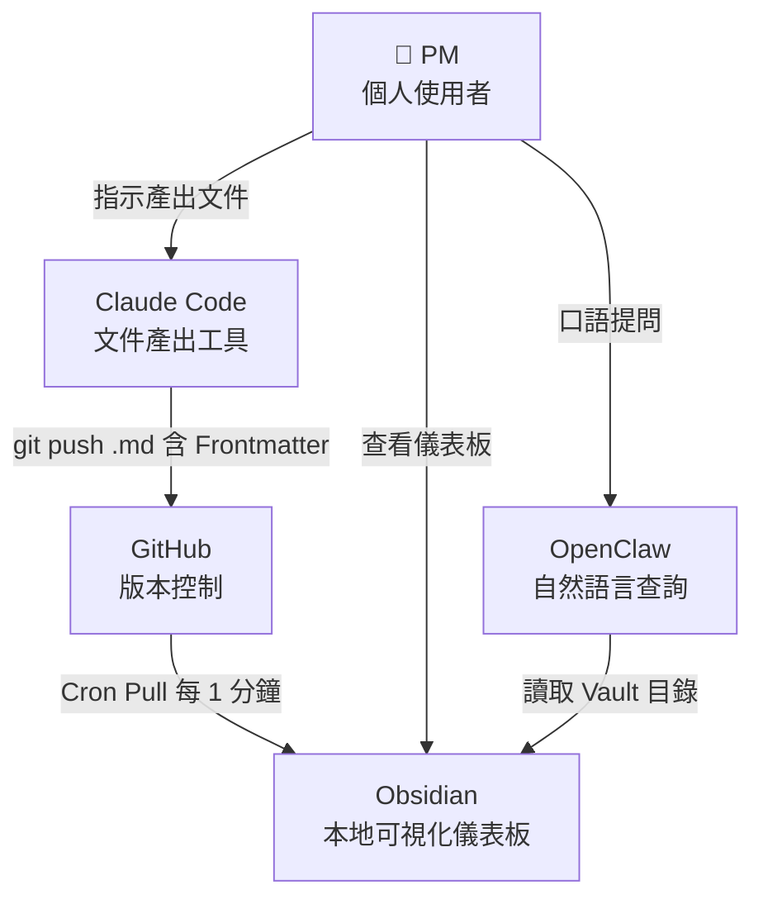
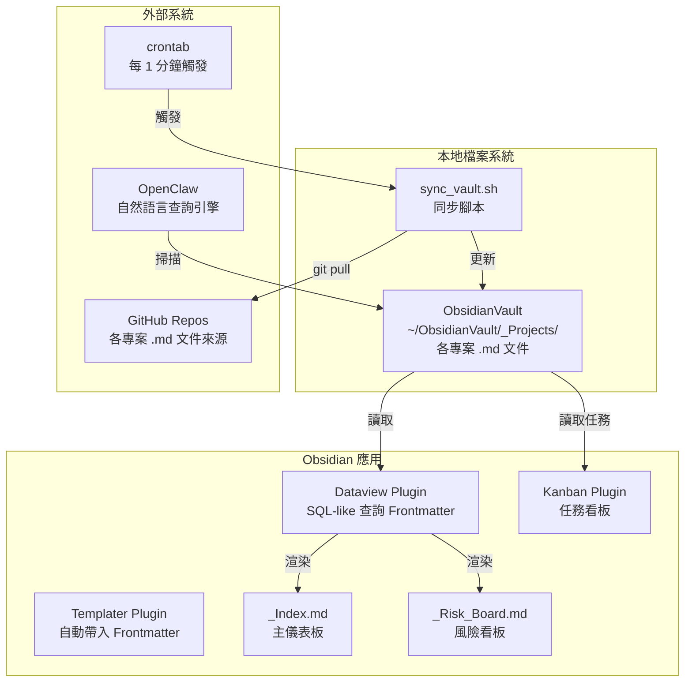
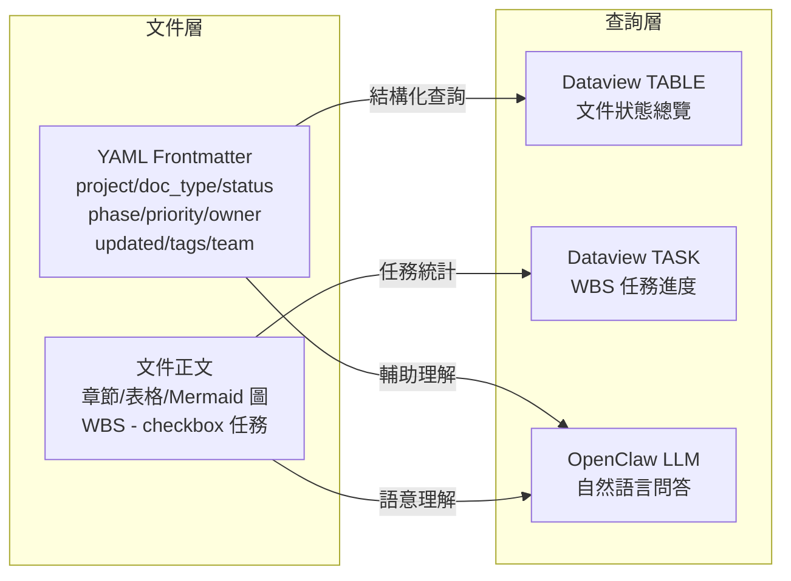
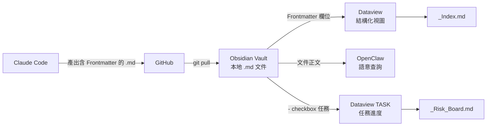

# 整合性架構與設計文件 (Unified Architecture & Design Document) - 本地端個人 PM 系統

---

**文件版本 (Document Version):** `v1.0`
**最後更新 (Last Updated):** `2026-04-25`
**主要作者 (Lead Author):** `PM`
**審核者 (Reviewers):** `技術負責人`
**狀態 (Status):** `草稿 (Draft)`

---

## 目錄 (Table of Contents)

- [第 1 部分：架構總覽](#第-1-部分架構總覽-architecture-overview)
  - [1.1 C4 模型：視覺化架構](#11-c4-模型視覺化架構)
  - [1.2 通用語言與核心概念](#12-通用語言與核心概念)
  - [1.3 架構分層](#13-架構分層)
  - [1.4 技術選型與決策記錄 (ADR)](#14-技術選型與決策記錄-adr)
- [第 2 部分：需求摘要](#第-2-部分需求摘要-requirements-summary)
- [第 3 部分：高層次架構設計](#第-3-部分高層次架構設計)
- [第 4 部分：技術選型詳述](#第-4-部分技術選型詳述)
- [第 5 部分：資料架構](#第-5-部分資料架構)
- [第 6 部分：部署與基礎設施](#第-6-部分部署與基礎設施)
- [第 7 部分：跨領域考量](#第-7-部分跨領域考量)
- [第 8 部分：風險與緩解策略](#第-8-部分風險與緩解策略)
- [第 9 部分：架構演進路線圖](#第-9-部分架構演進路線圖)

---

**目的**：本文件將「本地端個人 PM 系統」的業務需求轉化為完整技術藍圖，涵蓋系統各層次架構設計，作為五個功能模組（Frontmatter 規範、GitHub 同步、Obsidian 儀表板、OpenClaw 查詢層、WBS 進度控管）的實作依據。

---

## 第 1 部分：架構總覽 (Architecture Overview)

### 1.1 C4 模型：視覺化架構

#### L1 - 系統情境圖 (System Context Diagram)



> PM 是唯一使用者。Claude Code 負責產出，GitHub 負責版控，Obsidian 負責本地渲染，OpenClaw 負責自然語言查詢。四個工具之間沒有直接雙向通信，資料流為單向。

#### L2 - 容器圖 (Container Diagram)



#### L3 - 元件圖（資料流向）



---

### 1.2 通用語言與核心概念

| 術語 | 定義 |
| :--- | :--- |
| **Vault** | Obsidian 管理的本地目錄（`~/ObsidianVault/`），包含所有專案 `.md` 文件 |
| **Frontmatter** | `.md` 文件頂部的 YAML 區塊，記錄文件的機器可讀 metadata |
| **doc_type** | 文件類型分類（`PRD / ERD / Architecture / WBS / API`） |
| **phase** | 專案執行階段（`planning / dev / testing / done / blocked`） |
| **WBS 任務** | WBS.md 中以 `- [ ]` / `- [x]` 格式記錄的子任務 |
| **Dataview 查詢** | 在 `.md` 文件中使用 Dataview Plugin 的 DQL 語法動態渲染視圖 |
| **Cron Pull** | 本地定時腳本，每 1 分鐘執行 `git pull`，將 GitHub 最新文件同步到 Vault |
| **Single Source of Truth** | 本系統中指本地 `.md` 文件，所有視圖均由此派生，不允許在視圖工具內直接輸入資料 |

---

### 1.3 架構分層

本系統採用**三層本地優先架構**，取代傳統的後端/前端分離模式：

| 層次 | 對應元件 | 職責 |
| :--- | :--- | :--- |
| **資料層** | `.md` 文件 + YAML Frontmatter | 唯一資料源，同時服務人類閱讀與機器查詢 |
| **同步層** | `sync_vault.sh` + crontab | 確保資料層與 GitHub 保持一致，延遲 ≤ 1 分鐘 |
| **渲染/查詢層** | Obsidian（Dataview/Kanban）+ OpenClaw | 從資料層派生視圖與回答，不儲存任何狀態 |

設計原則：**渲染/查詢層對資料層只讀**，所有寫入均透過 Claude Code → git push 進行。

---

### 1.4 技術選型與決策記錄 (ADR)

#### ADR-001：Obsidian 作為儀表板層

**狀態**：已決定

| 面向 | 說明 |
| :--- | :--- |
| **問題** | 需要一個能讀取本地 `.md`、渲染 Mermaid、支援動態查詢的可視化工具 |
| **決策** | 選用 Obsidian + Dataview Plugin |
| **理由** | 原生支援 `.md`；Dataview 支援 SQL-like 查詢 frontmatter；Mermaid 零額外設定；本地儲存無訂閱費 |
| **取捨** | 不支援多人即時協作（個人使用場景，不需要） |

#### ADR-002：OpenClaw 作為自然語言查詢層

**狀態**：已決定

| 面向 | 說明 |
| :--- | :--- |
| **問題** | 需要能讀取本地目錄 `.md`、透過通訊頻道回答問題的 AI 助手 |
| **決策** | 選用 OpenClaw，連接本地 Vault 目錄作為知識庫 |
| **理由** | 支援多通訊頻道（Telegram/Slack）；本地運行不上傳文件；支援自訂 System Prompt |
| **待驗證** | 中文 `.md` 解析品質；大量文件時的查詢延遲 |

#### ADR-003：YAML Frontmatter 欄位設計

**狀態**：已決定

| 面向 | 說明 |
| :--- | :--- |
| **問題** | 決定 frontmatter 欄位組成，平衡查詢彈性與維護成本 |
| **決策** | 7 個核心欄位 + `tags`（選填）+ WBS 專用欄位（`total_tasks` / `module_count` / `team`） |
| **排除** | `deadline`（放正文，由 OpenClaw 讀取）；`milestone`（粒度太細，屬 WBS 內容） |

#### ADR-004：Cron Pull 優先於 GitHub Webhook

**狀態**：已決定

| 面向 | 說明 |
| :--- | :--- |
| **問題** | 選擇 GitHub → Obsidian 的同步觸發機制 |
| **決策** | 本地 Cron Pull，每 1 分鐘執行 `git pull` |
| **理由** | 實作簡單；本地端主控；不需設定 ngrok 或本地 HTTP server |
| **取捨** | 最大延遲 1 分鐘（可接受）；Cron 靜默失敗需 log 監控 |

---

## 第 2 部分：需求摘要 (Requirements Summary)

### 2.1 功能性需求摘要

| 需求 ID | 功能描述 | 對應使用者故事 |
| :--- | :--- | :--- |
| **FR-1** | YAML Frontmatter 規範：所有 `.md` 自動帶入 8 個核心欄位 | US-002 |
| **FR-2** | GitHub → Obsidian 自動同步，延遲 ≤ 1 分鐘 | US-001 |
| **FR-3** | `_Index.md` 主儀表板：多專案文件狀態、Critical 事項、最近更新 | US-003 |
| **FR-4** | `_Risk_Board.md`：Critical 文件、Overdue WBS 任務、各專案完成率 | US-004 |
| **FR-5** | Kanban 看板：WBS 子任務拖拉管理 | US-005 |
| **FR-6** | OpenClaw 文件層查詢：phase、status、風險 | US-006 |
| **FR-7** | OpenClaw WBS 任務層查詢：未完成數量、負責人、deadline | US-007 |

### 2.2 非功能性需求 (NFRs)

| NFR 分類 | 具體需求描述 | 衡量指標/目標值 |
| :--- | :--- | :--- |
| **同步延遲** | git push 後 Obsidian 反映最新文件 | ≤ 1 分鐘 |
| **查詢準確率** | OpenClaw 回答標準測試集 | ≥ 90%（10 題中答對 9 題） |
| **Dataview 渲染正確率** | 所有預設查詢正確渲染無錯誤 | 100% |
| **本地優先** | 所有資料存於本地，不依賴雲端訂閱服務特定功能 | 離線可用 |
| **零重複輸入** | 文件為唯一資料源，視圖由渲染產生 | 工具切換次數 ≤ 2 |
| **Frontmatter 覆蓋率** | 所有 Claude Code 產出的 `.md` 帶有正確 frontmatter | 100% |

---

## 第 3 部分：高層次架構設計

### 3.1 架構模式

**模式**：本地優先單向資料流（Local-First Unidirectional Data Flow）

```
寫入方向（單向）：
Claude Code → git push → GitHub → Cron Pull → Obsidian Vault

讀取方向（多路）：
Obsidian Vault → Dataview（結構化）
Obsidian Vault → OpenClaw（語意化）
```

**選擇理由**：本系統的核心約束是「零重複輸入」。單向資料流確保唯一寫入路徑（Claude Code），消除在多工具間手動同步的需求。渲染/查詢層只讀不寫，徹底避免資料不一致問題。

### 3.2 主要元件職責

| 元件 | 核心職責 | 主要技術 | 依賴 |
| :--- | :--- | :--- | :--- |
| **YAML Frontmatter** | 提供機器可讀的文件 metadata，是整個系統的資料地基 | YAML | Claude Code（產出時帶入） |
| **sync_vault.sh** | 定時將 GitHub 最新文件同步到本地 Vault | Bash + git | crontab、GitHub |
| **Obsidian Dataview** | 從 frontmatter 動態渲染表格/清單視圖 | DQL（Dataview Query Language） | Vault 文件、Frontmatter |
| **Obsidian Kanban** | 提供 WBS 任務的拖拉式操作介面 | Kanban Plugin | WBS.md 任務清單 |
| **OpenClaw** | 理解自然語言問題，從 Vault 文件回答 | LLM + 本地文件索引 | Vault 目錄、System Prompt |

### 3.3 關鍵使用者旅程

#### 旅程 1：工程師更新文件後，PM 查看最新進度

1. 工程師修改 `.md` 文件並 `git push` 到 GitHub
2. 本地 crontab 每 1 分鐘觸發 `sync_vault.sh`
3. 腳本對 `~/ObsidianVault/_Projects/` 下所有 `.git` 目錄執行 `git pull`
4. Obsidian 自動偵測文件變更，Dataview 查詢重新渲染
5. PM 打開 `_Index.md`，看到最新文件狀態（延遲 ≤ 1 分鐘）

#### 旅程 2：PM 接到利害關係人臨時詢問

1. 利害關係人詢問：「金流模組現在進度怎麼樣？」
2. PM 在 Telegram/Slack 向 OpenClaw 輸入：「金流模組還剩幾個任務，誰負責？」
3. OpenClaw 掃描 Vault 中的 WBS.md，找到金流相關的 `- [ ]` 任務行
4. OpenClaw 回傳：未完成任務數量、任務描述、負責人（`@BE:張後端`）、deadline
5. PM 在 30 秒內回答，不需打開任何其他工具

#### 旅程 3：PM 每日檢視全局風險

1. 早上打開 Obsidian → `_Risk_Board.md`
2. Dataview 渲染：`priority = critical` 的文件（按最後更新升冪，最久未更新排前）
3. Dataview TASK 渲染：`deadline < today` 且未完成的 WBS 任務
4. PM 識別最高風險事項，決定當日處理優先順序

---

## 第 4 部分：技術選型詳述

### 4.1 技術選型原則

- **本地優先**：優先選擇本地運行方案，不引入需要雲端訂閱的服務
- **最小工具數**：整個系統只新增 Obsidian + OpenClaw，不引入新的資料庫或後端
- **基於現有技能**：依賴 PM 已熟悉的 git、Markdown 工作流，降低學習成本
- **不過度設計**：選擇「剛好滿足需求」的工具，避免引入比需求複雜度高的技術

### 4.2 技術棧詳情

| 分類 | 選用技術 | 選擇理由 | 備選方案 | 相關 ADR |
| :--- | :--- | :--- | :--- | :--- |
| **可視化儀表板** | Obsidian + Dataview Plugin | 原生 `.md`；Dataview SQL-like 查詢 frontmatter；Mermaid 原生渲染；本地免費 | Notion（需手動輸入）、GitHub Projects（非 PM 全局視角） | ADR-001 |
| **任務看板** | Obsidian Kanban Plugin | 與 Obsidian 同生態，直接讀取 `.md` 中的 `- [ ]` | Trello（需另外登入）、Linear（與 `.md` 不整合） | ADR-001 |
| **自然語言查詢** | OpenClaw | 本地運行；多通訊頻道支援；可自訂 System Prompt | ChatGPT（文件需手動貼入）、Notion AI（資料需在 Notion 內） | ADR-002 |
| **文件同步** | Bash + crontab | 零依賴、本地主控、無需額外服務 | GitHub Actions Webhook（需本地 HTTP server）、手動 pull（不自動化） | ADR-004 |
| **Frontmatter 模板** | Obsidian Templater Plugin | 新文件自動帶入 YAML frontmatter，減少人工遺漏 | 手動複製貼上（易遺漏欄位） | ADR-003 |
| **文件格式** | Markdown + YAML | 純文字、跨工具相容、git 版控友善 | JSON/CSV（可讀性差）、Notion Database（資料鎖定） | ADR-003 |

---

## 第 5 部分：資料架構

### 5.1 資料模型

系統的資料分為兩層，存於同一份 `.md` 文件中：

#### Layer 1：Frontmatter（機器讀）

```yaml
---
project: "ProjectName"       # 跨文件分組的唯一依據
doc_type: WBS                # PRD / ERD / Architecture / WBS / API
status: in-review            # draft / in-review / approved / deprecated
phase: dev                   # planning / dev / testing / done / blocked
priority: high               # low / medium / high / critical
owner: PM                    # PM / TL / BE / FE
updated: 2026-04-25
tags: [wbs]
# WBS 專用
total_tasks: 24
module_count: 5
team:
  PM: 王小明
  TL: 李技術
  BE: 張後端
  FE: 陳前端
---
```

#### Layer 2：文件正文（人讀 + 機器讀）

- **章節結構**（`##`/`###`）：供 OpenClaw 語意理解使用
- **Mermaid 圖表**：Obsidian 原生渲染，零額外設定
- **WBS 任務**（`- [ ]` / `- [x]`）：供 Dataview TASK 查詢與 Kanban 使用

WBS 任務格式：
```
- [ ] M3.1.3 實作付款 API 串接 @BE:張後端 #2026-05-10
```

### 5.2 資料流向圖



### 5.3 資料一致性策略

| 場景 | 策略 |
| :--- | :--- |
| **GitHub 與 Vault 一致性** | Cron Pull 每 1 分鐘同步，最終一致；失敗時 log 記錄，人工介入 |
| **WBS.md 與 Kanban.md 一致性** | WBS.md 為唯一資料源，Kanban 由人工同步；兩者不一致時以 WBS.md 為準 |
| **Frontmatter 格式一致性** | Templater Plugin 自動帶入，CLAUDE.md 固定格式規範；Claude Code 產出時驗證 |

### 5.4 資料生命週期

| 資料類型 | 儲存位置 | 保留策略 |
| :--- | :--- | :--- |
| 所有 `.md` 文件 | 本地 Vault + GitHub | 永久保留，git 版控提供歷史 |
| sync_vault.sh 執行 log | 本地 `~/logs/sync_vault.log` | 保留最近 30 天，超過自動清除 |
| OpenClaw 查詢記錄 | OpenClaw 本地儲存 | 依 OpenClaw 預設設定 |

---

## 第 6 部分：部署與基礎設施

### 6.1 部署視圖

本系統為純本地部署，無雲端服務依賴：

```
本地機器（macOS / Linux）
├── ~/ObsidianVault/
│   ├── _Index.md
│   ├── _Risk_Board.md
│   └── _Projects/
│       ├── ProjectA/    ← git clone from GitHub
│       ├── ProjectB/
│       └── ProjectC/
├── ~/scripts/
│   └── sync_vault.sh
├── ~/logs/
│   └── sync_vault.log
└── crontab
    └── */1 * * * * ~/scripts/sync_vault.sh >> ~/logs/sync_vault.log 2>&1

應用程式：
├── Obsidian（桌面應用）
│   ├── Dataview Plugin
│   ├── Kanban Plugin
│   └── Templater Plugin
└── OpenClaw（本地服務）
    └── 讀取 ~/ObsidianVault/_Projects/
```

### 6.2 同步腳本設計（`sync_vault.sh`）

```bash
#!/bin/bash
VAULT_ROOT="$HOME/ObsidianVault/_Projects"
LOG_TIME=$(date '+%Y-%m-%d %H:%M:%S')

for repo_dir in "$VAULT_ROOT"/*/; do
    if [ -d "$repo_dir/.git" ]; then
        project=$(basename "$repo_dir")
        result=$(git -C "$repo_dir" pull 2>&1)
        echo "[$LOG_TIME] $project: $result"
    fi
done
```

### 6.3 環境設定清單

| 項目 | 指令/設定 | 備註 |
| :--- | :--- | :--- |
| 建立 Vault 目錄 | `mkdir -p ~/ObsidianVault/_Projects` | Phase 1 |
| Clone 現有 repos | `git clone <repo_url> ~/ObsidianVault/_Projects/<name>` | 每個專案執行一次 |
| 設定 crontab | `crontab -e` → 加入同步指令 | Phase 1 |
| 安裝 Obsidian Plugins | Dataview、Kanban、Templater | Phase 2 |
| 設定 OpenClaw 知識庫路徑 | 指向 `~/ObsidianVault/_Projects/` | Phase 3 |

---

## 第 7 部分：跨領域考量

### 7.1 可觀測性

| 面向 | 設計 |
| :--- | :--- |
| **同步監控** | `sync_vault.sh` 每次執行寫入 `~/logs/sync_vault.log`，記錄時間戳與 git pull 結果 |
| **Frontmatter 覆蓋率** | 定期執行 `grep -rL "^project:" ~/ObsidianVault/_Projects/` 找出缺少 frontmatter 的文件 |
| **OpenClaw 準確率** | 維護 10 題標準測試集，每週手動驗證一次 |

### 7.2 安全性

| 面向 | 設計 |
| :--- | :--- |
| **資料主權** | 所有文件存於本地，OpenClaw 本地運行，不將文件內容上傳第三方雲端 |
| **GitHub 存取** | 使用 SSH Key 進行 git pull，不在腳本中儲存明文密碼 |
| **OpenClaw 通訊** | 透過 Telegram/Slack 官方加密頻道，查詢結果不儲存於雲端 |

---

## 第 8 部分：風險與緩解策略

| 風險 ID | 類別 | 描述 | 可能性 | 影響 | 緩解策略 |
| :--- | :--- | :--- | :--- | :--- | :--- |
| **R-01** | 規範 | Frontmatter 欄位名稱不一致，Dataview 查詢回傳空結果或報錯 | 高 | 高 | 在 CLAUDE.md 固定格式；使用 Templater 自動套入；Phase 0 驗證 3 份文件後再繼續 |
| **R-02** | 同步 | Cron 腳本靜默失敗（網路中斷、git 衝突），PM 看到過期資料 | 中 | 中 | sync.sh 寫入 log；每週確認 log 無異常；若 30 分鐘內無新 log 則告警 |
| **R-03** | 查詢 | OpenClaw 對中文 `.md` 解析品質不穩定，回答出現幻覺或遺漏 | 中 | 中 | Phase 3 以 10 題測試集驗收；定期重新測試；不穩定時降級為直接查 Obsidian |
| **R-04** | 規範 | WBS `@角色:姓名` 格式與 frontmatter `team` 欄位不一致，導致人員資訊矛盾 | 中 | 低 | WBS 文件更新時需同步確認兩處一致；`team` 欄位為唯一定義來源 |
| **R-05** | 效能 | 專案數量增多，Dataview 全局查詢渲染變慢 | 低 | 低 | 超過 5 個專案後，改為 per-project 儀表板；避免在單一查詢掃描全部 Vault |

---

## 第 9 部分：架構演進路線圖

### Phase 0（Day 1）：資料地基
- 建立 YAML Frontmatter 規範，更新 CLAUDE.md
- 驗收：3 份含正確 frontmatter 的 `.md` 文件

### Phase 1（Day 1-2）：同步建立
- 建立 Obsidian Vault 目錄結構，clone 現有 repos
- 建立 `sync_vault.sh` 並設定 crontab
- 驗收：git push 後 1 分鐘內 Vault 自動更新

### Phase 2（Day 3）：儀表板
- 安裝 Dataview、Kanban、Templater Plugins
- 建立 `_Index.md` 與 `_Risk_Board.md`，加入 WBS 任務進度區塊
- 驗收：Dataview 所有查詢正確渲染

### Phase 3（Day 4-5）：自然語言查詢
- 設定 OpenClaw 連接 Vault 目錄
- 套入 PM 專用 System Prompt（含 WBS 任務格式說明）
- 驗收：10 題標準測試集答對 9 題以上

### Phase 4（Day 6-7）：微調
- 根據實際使用調整 Dataview 查詢與 OpenClaw System Prompt
- 補全現有專案的 WBS.md
- 驗收：PM 能流暢使用系統一整天，工具切換次數 ≤ 2

### 未來演進（Post-MVP）
- 若專案數超過 5 個，建立 per-project 個別儀表板
- 若 OpenClaw 不穩定，評估替換為其他本地 RAG 方案（如 Obsidian Local GPT Plugin）
- 若需要 deadline 彙整視圖，可在 frontmatter 加入 `module_deadlines` 欄位（待 Q-001 決策後）

---

**文件版本**：v1.0
**最後更新**：2026-04-25
**狀態**：草稿（Draft）

---

**文件審核記錄：**

| 日期 | 審核人 | 版本 | 變更摘要 |
| :--- | :--- | :--- | :--- |
| 2026-04-25 | PM | v1.0 | 初稿提交 |
