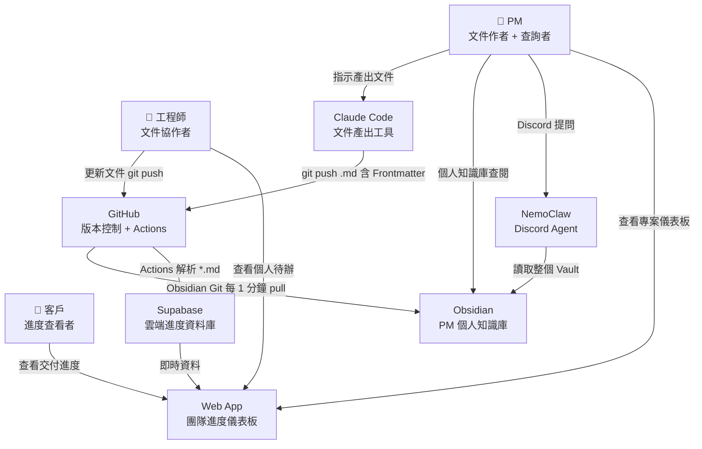
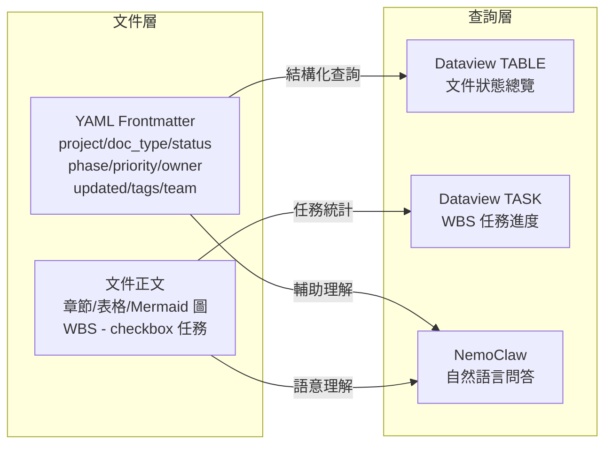

# 整合性架構與設計文件 (Unified Architecture & Design Document) - 本地端個人 PM 系統

---

**文件版本 (Document Version):** `v1.1`
**最後更新 (Last Updated):** `2026-05-06`
**主要作者 (Lead Author):** `PM`
**審核者 (Reviewers):** `技術負責人`
**狀態 (Status):** `草稿 (Draft)`

---

## 目錄 (Table of Contents)

- [第 1 部分：架構總覽](#第-1-部分架構總覽-architecture-overview)
  - [1.1 C4 模型：視覺化架構](#11-c4-模型視覺化架構)
  - [1.2 通用語言與核心概念](#12-通用語言與核心概念)
  - [1.3 架構分層](#13-架構分層)
  - [1.4 技術選型與決策記錄 (ADR)](#14-技術選型與決策記錄-adr)
- [第 2 部分：需求摘要](#第-2-部分需求摘要-requirements-summary)
- [第 3 部分：高層次架構設計](#第-3-部分高層次架構設計)
- [第 4 部分：技術選型詳述](#第-4-部分技術選型詳述)
- [第 5 部分：資料架構](#第-5-部分資料架構)
- [第 6 部分：部署與基礎設施](#第-6-部分部署與基礎設施)
- [第 7 部分：跨領域考量](#第-7-部分跨領域考量)
- [第 8 部分：風險與緩解策略](#第-8-部分風險與緩解策略)
- [第 9 部分：架構演進路線圖](#第-9-部分架構演進路線圖)

---

**目的**：本文件將「本地端個人 PM 系統」的業務需求轉化為完整技術藍圖，涵蓋系統各層次架構設計，作為七個功能模組（Frontmatter 規範、GitHub 同步、Obsidian 知識庫、NemoClaw 查詢層、WBS 進度控管、GitHub Actions 資料管道、Web App 團隊儀表板）的實作依據。

---

## 第 1 部分：架構總覽 (Architecture Overview)

### 1.1 C4 模型：視覺化架構

#### L1 - 系統情境圖 (System Context Diagram)



> PM 透過 Claude Code 產出文件；GitHub 同時服務兩條路：(1) 同步到本地 Obsidian 供 PM 個人閱讀，(2) 觸發 Actions 將進度寫入 Supabase 供 Web App 呈現給三種角色。

#### L2 - 容器圖 (Container Diagram)

```mermaid
graph TB
    subgraph 本地端（PM 機器）
        VAULT[ObsidianVault\n~/ObsidianVault/\nProjectA/ ProjectB/ + 知識文件]
    end

    subgraph Obsidian 應用
        DV[Dataview Plugin\n結構化查詢 Frontmatter]
        KB[Kanban Plugin\n任務看板]
        TPL[Templater Plugin\n自動帶入 Frontmatter]
        GIT[Obsidian Git Plugin\n每 1 分鐘 auto pull]
    end

    subgraph GitHub
        REPO[GitHub Repos\n*.md 文件]
        GA[GitHub Actions\nsync_to_supabase.yml]
        SCRIPT[Python Script\nsync_to_supabase.py]
    end

    subgraph 雲端
        SB[Supabase\nprojects / tasks_sync\nmilestones / project_access]
        WEB[Web App React\nVercel 部署]
    end

    NC[NemoClaw\nDiscord Agent]

    GIT -->|git pull| REPO
    GIT -->|更新| VAULT
    VAULT -->|讀取| DV
    VAULT -->|讀取任務| KB
    NC -->|掃描整個 Vault| VAULT
    REPO -->|push 觸發| GA
    GA -->|執行| SCRIPT
    SCRIPT -->|解析 YAML + WBS + 里程碑| SCRIPT
    SCRIPT -->|service_role upsert| SB
    SB -->|anon key + RLS| WEB
```

#### L3 - 元件圖（資料流向）



---

### 1.2 通用語言與核心概念

| 術語 | 定義 |
| :--- | :--- |
| **Vault** | Obsidian 管理的本地目錄（`~/ObsidianVault/`），包含所有專案 `.md` 文件與知識文件 |
| **Frontmatter** | `.md` 文件頂部的 YAML 區塊，記錄文件的機器可讀 metadata |
| **doc_type** | 文件類型分類（`PRD / ERD / Architecture / WBS / API`） |
| **phase** | WBS 文件中代表**整個專案的宏觀階段**（`planning / dev / testing / done / blocked`） |
| **WBS 任務** | WBS.md 中以 `- [ ]` / `- [x]` 格式記錄的子任務，owner 以 `[owner:: BE:張後端]` 格式標記 |
| **Dataview 查詢** | 在 `.md` 文件中使用 Dataview Plugin 的 DQL 語法動態渲染視圖 |
| **Obsidian Git Plugin** | Obsidian 社群外掛，設定 auto pull interval 為 1 分鐘，全體成員無需 Terminal 即可同步 |
| **GitHub Actions** | 偵測 `**/*.md` 變更後觸發 Python 腳本解析並寫入 Supabase 的自動化管道 |
| **Supabase** | 雲端 PostgreSQL 服務，作為結構化進度資料庫，啟用 RLS 控制存取權限 |
| **RBAC** | 基於角色的存取控制（Admin/Developer/Viewer），透過 Supabase `project_access` 表實現 |
| **tasks_sync** | Supabase 中儲存 WBS 任務的同步表，由 GitHub Actions 寫入，Web App 只讀 |
| **Single Source of Truth** | 本系統中指本地 `.md` 文件，所有衍生視圖（Obsidian、Supabase、Web App）均由此派生 |

---

### 1.3 架構分層

本系統採用**四層混合架構**：本地文件為唯一寫入源，派生出本地知識庫（Obsidian）與雲端進度資料庫（Supabase）兩條獨立路徑：

| 層次 | 對應元件 | 職責 |
| :--- | :--- | :--- |
| **資料層** | `.md` 文件 + YAML Frontmatter | 唯一寫入源，同時服務人類閱讀與機器解析 |
| **本地同步層** | Obsidian Git Plugin（auto pull 1分鐘） | 將 GitHub 最新文件同步到本地 Vault |
| **雲端資料層** | GitHub Actions + Supabase | 解析 WBS 任務/里程碑寫入雲端結構化資料庫 |
| **呈現層** | Obsidian（個人）+ NemoClaw（查詢）+ Web App（團隊） | 從資料層派生視圖，各層對資料層只讀 |

設計原則：**所有寫入均透過 Claude Code → git push 進行**；Supabase 和 Obsidian 都是衍生資料，`.md` 文件永遠是最終依據。

---

### 1.4 技術選型與決策記錄 (ADR)

#### ADR-001：Obsidian 作為個人知識庫層

**狀態**：已決定

| 面向 | 說明 |
| :--- | :--- |
| **問題** | 需要一個能讀取本地 `.md`、渲染 Mermaid、支援動態查詢的可視化工具 |
| **決策** | 選用 Obsidian + Dataview Plugin |
| **理由** | 原生支援 `.md`；Dataview 支援 SQL-like 查詢 frontmatter；Mermaid 零額外設定；本地儲存無訂閱費 |
| **取捨** | 不支援多人即時協作（個人使用場景，不需要） |

#### ADR-002：NemoClaw + Discord Agent 作為自然語言查詢層

**狀態**：已決定

| 面向 | 說明 |
| :--- | :--- |
| **問題** | 需要能讀取本地目錄 `.md`、透過通訊頻道回答問題的 AI 助手 |
| **決策** | 採用 NemoClaw（Docker 沙盒）+ Discord Bot，PM 在 Discord 頻道提問 |
| **理由** | Discord 為工程師慣用頻道；Docker 隔離環境；本地運行不上傳文件；支援自訂 System Prompt |
| **待驗證** | 中文 `.md` 解析品質；大量文件時的查詢延遲 |

#### ADR-003：YAML Frontmatter 欄位設計

**狀態**：已決定

| 面向 | 說明 |
| :--- | :--- |
| **問題** | 決定 frontmatter 欄位組成，平衡查詢彈性與維護成本 |
| **決策** | 8 個核心欄位（`project / doc_type / status / phase / priority / owner / updated / tags`）+ WBS 專用欄位（`total_tasks` / `module_count` / `team`） |
| **排除** | `deadline`（放正文，由 NemoClaw 讀取）；`milestone`（粒度太細，屬 WBS 內容） |

#### ADR-004：Obsidian Git 外掛作為同步機制

**狀態**：已決定

| 面向 | 說明 |
| :--- | :--- |
| **問題** | 選擇 GitHub → Obsidian 的同步觸發機制，且需支援全體團隊成員 |
| **決策** | 採用 Obsidian Git 外掛，設定 Auto pull interval 為 1 分鐘 |
| **理由** | 無需 Terminal 或額外腳本；跨平台（Mac/Windows/Linux）；適合非技術成員；push 前自動 merge 降低衝突風險 |
| **取捨** | Obsidian 需保持開啟才能自動同步；開啟時會立即補齊離線期間的更新 |

#### ADR-005：Supabase 作為雲端進度資料庫

**狀態**：已決定

| 面向 | 說明 |
| :--- | :--- |
| **問題** | 需要一個能讓 Web App 讀取結構化進度資料的後端，且要支援 RBAC 與即時更新 |
| **決策** | 採用 Supabase（managed PostgreSQL），啟用 Row Level Security |
| **理由** | 零維護後端；內建 Auth + RLS；Supabase Realtime 支援 Web App 即時更新；`service_role` key 可讓 Actions 繞過 RLS 寫入 |
| **取捨** | 引入雲端依賴；免費方案有 500MB 限制（對純文件 metadata 的資料量而言足夠） |

#### ADR-006：React Web App 作為團隊儀表板

**狀態**：已決定

| 面向 | 說明 |
| :--- | :--- |
| **問題** | 需要一個多角色共用的進度儀表板，讓 PM、工程師、客戶各自查看所需視圖 |
| **決策** | 建立 React Web App，部署至 Vercel，讀取 Supabase 資料 |
| **理由** | 彈性最高的前端方案；Recharts 可繪製 S-Curve/CFD；Vercel 零配置部署；三角色視圖清晰分離（PM/工程師 L1/L2/L3 鑽取式；客戶 L1/L2 摘要） |
| **取捨** | 需要前端開發工作（Phase 5）；Vercel 免費方案適用個人/小團隊 |

#### ADR-007：GitHub Actions 作為資料同步管道

**狀態**：已決定

| 面向 | 說明 |
| :--- | :--- |
| **問題** | 需要在不引入額外基礎設施的情況下，將 `.md` 文件的結構化資料自動寫入 Supabase |
| **決策** | 在 GitHub Repo 設定 Actions Workflow，偵測 `**/*.md` 變更後執行 Python 腳本 |
| **理由** | 零額外基礎設施；與現有 git push 流程無縫整合；Python 腳本易維護；免費 Actions 分鐘數對低頻 push 場景足夠 |
| **取捨** | 強依賴 GitHub；解析複雜 Markdown 格式的 regex 需謹慎維護 |

---

## 第 2 部分：需求摘要 (Requirements Summary)

### 2.1 功能性需求摘要

| 需求 ID | 功能描述 | 對應使用者故事 |
| :--- | :--- | :--- |
| **FR-1** | YAML Frontmatter 規範：所有 `.md` 自動帶入 8 個核心欄位 | US-002 |
| **FR-2** | GitHub → Obsidian 自動同步（Obsidian Git Plugin），延遲 ≤ 1 分鐘 | US-001 |
| **FR-3** | Obsidian 個人知識庫：Mermaid 渲染、Graph View、各專案 _Dashboard.md 查閱 | — |
| **FR-4** | Kanban 看板：WBS 子任務拖拉管理 | US-005 |
| **FR-5** | NemoClaw 文件層查詢：phase、status、風險（索引整個 Vault） | US-006 |
| **FR-6** | NemoClaw WBS 任務層查詢：未完成數量、負責人 `[owner::]`、deadline | US-007 |
| **FR-7** | GitHub Actions 管道：push 後 ≤ 2 分鐘解析 WBS 任務並寫入 Supabase | US-008 |
| **FR-8** | Supabase RBAC：Admin/Developer/Viewer 三角色，RLS 控制資料存取範圍 | US-009 |
| **FR-9** | Web App PM 視圖：L1 專案組合總覽 / L2 診斷中心 / L3 任務明細 | US-003、US-004 |
| **FR-10** | Web App 工程師視圖：今日待辦 / Kanban / 任務詳情 | US-010 |
| **FR-11** | Web App 客戶視圖：交付摘要 / Roadmap | US-011 |
| **FR-12** | Supabase Realtime：Web App 即時反映最新任務狀態，無需手動重新整理 | US-010 |

### 2.2 非功能性需求 (NFRs)

| NFR 分類 | 具體需求描述 | 衡量指標/目標值 |
| :--- | :--- | :--- |
| **本地同步延遲** | git push 後 Obsidian Vault 反映最新文件 | ≤ 1 分鐘 |
| **雲端同步延遲** | git push 後 Supabase 任務資料更新 | ≤ 2 分鐘 |
| **查詢準確率** | NemoClaw 回答標準測試集 | ≥ 90%（10 題中答對 9 題） |
| **Dataview 渲染正確率** | 所有預設查詢正確渲染無錯誤 | 100% |
| **零重複輸入** | `.md` 文件為唯一寫入源，所有視圖均由系統自動產生 | 工具切換次數 ≤ 2 |
| **Frontmatter 覆蓋率** | 所有 Claude Code 產出的 `.md` 帶有正確 frontmatter | 100% |
| **RBAC 正確性** | 三角色存取範圍符合 Supabase RLS 政策設計，無越權存取 | 100% |

---

## 第 3 部分：高層次架構設計

### 3.1 架構模式

**模式**：本地優先雙路衍生資料流（Local-First Dual-Derived Data Flow）

```
唯一寫入路徑：
Claude Code / 工程師 → git push → GitHub

路徑 A（本地知識庫）：
GitHub → Obsidian Git Plugin（每 1 分鐘）→ Obsidian Vault
  └→ Dataview（結構化視圖）
  └→ NemoClaw（自然語言查詢）

路徑 B（雲端進度資料庫）：
GitHub → GitHub Actions（push 觸發）→ Python 腳本解析 YAML + WBS + 里程碑
  └→ Supabase upsert → Web App（三角色儀表板）
```

**選擇理由**：核心約束仍是「零重複輸入」。兩條路徑都從同一來源（`.md` 文件）派生，服務不同場景：Obsidian + NemoClaw 服務 PM 個人深度查閱；Supabase + Web App 服務多角色共用進度追蹤。

### 3.2 主要元件職責

| 元件 | 核心職責 | 主要技術 | 依賴 |
| :--- | :--- | :--- | :--- |
| **YAML Frontmatter** | 提供機器可讀的文件 metadata，是整個系統的資料地基 | YAML | Claude Code（產出時帶入） |
| **Obsidian Git 外掛** | 每 1 分鐘自動 pull GitHub 最新文件到本地 Vault | Obsidian Community Plugin + git | Obsidian、GitHub |
| **Obsidian Dataview** | 從 frontmatter 動態渲染表格/清單視圖（個人儀表板） | DQL（Dataview Query Language） | Vault 文件、Frontmatter |
| **Obsidian Kanban** | 提供 WBS 任務的拖拉式操作介面 | Kanban Plugin | Kanban.md 任務清單 |
| **NemoClaw + Discord Agent** | 理解自然語言問題，從整個 Vault 文件回答 | Docker + OpenClaw + Discord Bot | ~/ObsidianVault/ 完整目錄 |
| **GitHub Actions** | 偵測 `.md` 變更，執行 Python 腳本解析並 upsert Supabase | GitHub Actions Workflow + Python | GitHub Repo、Supabase service_role |
| **Supabase** | 儲存結構化進度資料，提供 RLS 控制的 API 給 Web App | PostgreSQL + Row Level Security | GitHub Actions（寫入）、Web App（讀取） |
| **Web App** | 三角色進度儀表板，從 Supabase 讀取並即時呈現 | React + Recharts + Supabase Realtime | Supabase anon key + RLS |

### 3.3 關鍵使用者旅程

#### 旅程 1：工程師更新文件後，PM 查看最新進度

1. 工程師修改 `.md` 文件並 `git push` 到 GitHub
2. **路徑 A**：Obsidian Git Plugin 每 1 分鐘自動 pull，Obsidian Vault 更新（延遲 ≤ 1 分鐘）
3. **路徑 B**：GitHub Actions 偵測 `*.md` 變更，Python 腳本解析 WBS 任務並 upsert Supabase（延遲 ≤ 2 分鐘）
4. PM 打開 Web App 查看 L1 專案總覽，任務完成率自動更新
5. 客戶打開 Web App 查看里程碑進度，無需 PM 手動更新報告

#### 旅程 2：PM 接到利害關係人臨時詢問

1. 利害關係人詢問：「金流模組現在進度怎麼樣？」
2. PM 在 Discord 向 NemoClaw 輸入：「金流模組還剩幾個任務，誰負責？」
3. NemoClaw 掃描整個 Vault 中的 WBS.md，找到金流相關的 `- [ ]` 任務行
4. NemoClaw 回傳：未完成任務數量、任務描述、負責人（`[owner:: BE:張後端]`）、deadline
5. PM 在 30 秒內回答，不需打開任何其他工具

#### 旅程 3：PM 每日檢視全局風險

1. 早上打開 Web App → PM L2 診斷中心
2. 查看 S-Curve：計畫完成率 vs. 實際完成率偏差
3. 查看 CFD：各狀態任務數量趨勢，識別瓶頸
4. 查看 Overdue 任務清單（`deadline < today AND status != 'Done'`），識別最高風險事項
5. 決定當日處理優先順序，更新 WBS.md 並 git push

---

## 第 4 部分：技術選型詳述

### 4.1 技術選型原則

- **文件為唯一寫入源**：所有工具只負責讀取/渲染，寫入只透過 Claude Code → git push 進行
- **按場景選擇工具**：本地個人閱讀用 Obsidian + NemoClaw；雲端多角色共用用 Supabase + Web App
- **基於現有技能**：依賴 PM 已熟悉的 git、Markdown 工作流，降低學習成本
- **最小自建後端**：優先使用 managed 服務（Supabase、Vercel、GitHub Actions），不自建伺服器

### 4.2 技術棧詳情

| 分類 | 選用技術 | 選擇理由 | 備選方案 | 相關 ADR |
| :--- | :--- | :--- | :--- | :--- |
| **本地知識庫** | Obsidian + Dataview Plugin | 原生 `.md`；Dataview SQL-like 查詢 frontmatter；Mermaid 渲染；本地免費 | Notion（需手動輸入）、GitHub Pages（無動態查詢） | ADR-001 |
| **任務看板** | Obsidian Kanban Plugin | 與 Obsidian 同生態，讀取 Kanban.md 中的 `- [ ]` | Trello（需另外登入）、Linear（與 `.md` 不整合） | ADR-001 |
| **自然語言查詢** | NemoClaw + Discord Agent | Docker 沙盒；Discord 頻道提問；可自訂 System Prompt；索引整個 Vault | ChatGPT（文件需手動貼入）、Notion AI（資料需在 Notion 內） | ADR-002 |
| **本地同步** | Obsidian Git Plugin | 無需 Terminal；跨平台；適合全體成員；auto pull 1 分鐘 | crontab + 腳本（需 Terminal，不適合非技術成員） | ADR-004 |
| **資料管道** | GitHub Actions + Python | 零額外基礎設施；與 git push 無縫整合；Python 腳本易維護 | 自建 webhook server（需維護）、手動輸入（違反零重複輸入原則） | ADR-007 |
| **雲端資料庫** | Supabase（PostgreSQL） | managed 服務；內建 Auth + RLS；Realtime 支援；service_role key 給 Actions | Firebase（NoSQL，查詢彈性低）、PlanetScale（無 RLS） | ADR-005 |
| **團隊儀表板** | React + Recharts + Vercel | 彈性最高；Recharts 支援 S-Curve/CFD；Vercel 零配置部署 | Metabase（需自建）、Retool（低程式碼但訂閱費） | ADR-006 |
| **Frontmatter 模板** | Obsidian Templater Plugin | 新文件自動帶入 YAML frontmatter，減少人工遺漏 | 手動複製貼上（易遺漏欄位） | ADR-003 |
| **文件格式** | Markdown + YAML | 純文字、跨工具相容、git 版控友善 | JSON/CSV（可讀性差）、Notion Database（資料鎖定） | ADR-003 |

---

## 第 5 部分：資料架構

### 5.1 資料模型

系統的資料分三個層次：`.md` 文件（唯一寫入源）→ Obsidian 本地（衍生）→ Supabase 雲端（衍生）

#### Layer 1：Frontmatter（機器讀）

```yaml
---
project: "ProjectName"       # 跨文件分組的唯一依據
doc_type: WBS                # PRD / ERD / Architecture / WBS / API
status: in-review            # draft / in-review / approved / deprecated
phase: dev                   # WBS 文件：整個專案的宏觀階段（planning/dev/testing/done/blocked）
priority: high               # low / medium / high / critical
owner: PM                    # PM / TL / BE / FE（文件負責人，非任務負責人）
updated: 2026-04-25
tags: [wbs]
# WBS 專用欄位
total_tasks: 24
module_count: 5
team:                        # 角色 → {name, email}，email 供 GitHub Actions 查找
  PM: {name: 王小明, email: pm@example.com}
  TL: {name: 李技術, email: tl@example.com}
  BE: {name: 張後端, email: be@example.com}
  FE: {name: 陳前端, email: fe@example.com}
---
```

#### Layer 2：文件正文（人讀 + 機器讀）

- **章節結構**（`##`/`###`）：供 NemoClaw 語意理解使用
- **Mermaid 圖表**：Obsidian 原生渲染，零額外設定
- **WBS 任務**（`- [ ]` / `- [x]`）：供 GitHub Actions 解析寫入 Supabase

WBS 任務格式（`[owner:: ]` 為 Dataview inline metadata，GitHub Actions 以 regex 解析）：
```
- [ ] M3.1.3 實作付款 API 串接 [owner:: BE:張後端] #2026-05-10
```

#### Layer 3：Supabase 結構化資料（衍生，由 GitHub Actions 寫入）

```
projects        ← repo + current_phase（來自 WBS frontmatter.phase）
tasks_sync      ← WBS 任務（external_id / title / status / assignee_email / deadline）
milestones      ← WBS 里程碑表格（milestone_name / planned_date / actual_date / is_completed）
project_access  ← RBAC（user_id / project_id / role: admin|developer|viewer）
profiles        ← Supabase Auth 用戶擴充資訊
```

> `tasks_sync` 不儲存 `progress` 欄位，Web App 從 `COUNT(status='Done') / COUNT(*)` 動態計算。

### 5.2 資料流向圖

```mermaid
graph LR
    CC[Claude Code / 工程師] -->|git push .md| GH[GitHub]
    GH -->|Obsidian Git Plugin\n每 1 分鐘| VAULT[Obsidian Vault\n本地 .md 文件]
    GH -->|Actions 觸發\n*.md 變更| PY[Python 腳本\n解析 YAML + WBS + 里程碑]
    VAULT -->|Frontmatter| DV[Dataview\n個人儀表板]
    VAULT -->|全文| NC[NemoClaw\nDiscord Agent]
    PY -->|service_role upsert| SB[Supabase\ntasks_sync / milestones]
    SB -->|anon key + RLS| WEB[Web App\n三角色儀表板]
```



### 5.3 資料一致性策略

| 場景 | 策略 |
| :--- | :--- |
| **GitHub 與 Vault 一致性** | Obsidian Git Plugin 每 1 分鐘 pull，最終一致；Obsidian 未開啟時離線，重新開啟立即補齊 |
| **GitHub 與 Supabase 一致性** | Actions 在 push 後觸發，Upsert 保冪等性；Actions 失敗時 GitHub 發送通知，人工重觸發 |
| **WBS.md 與 Kanban.md 一致性** | WBS.md 為唯一資料源，Kanban 為輔助操作介面；兩者不一致時以 WBS.md 為準 |
| **Frontmatter 格式一致性** | Templater Plugin 自動帶入，CLAUDE.md 固定格式規範；Claude Code 產出時驗證 |
| **Supabase 與 .md 文件衝突** | `.md` 文件永遠是最終依據；若 Supabase 資料異常，重新觸發 Actions 即可重置 |

### 5.4 資料生命週期

| 資料類型 | 儲存位置 | 保留策略 |
| :--- | :--- | :--- |
| 所有 `.md` 文件 | 本地 Vault + GitHub | 永久保留，git 版控提供歷史 |
| Supabase tasks_sync | Supabase 雲端 PostgreSQL | Actions Upsert 保持最新狀態；隨專案刪除 |
| Supabase milestones | Supabase 雲端 PostgreSQL | Actions Upsert；隨專案刪除 |
| GitHub Actions run logs | GitHub | 保留 90 天（預設）；失敗時人工查閱 |
| NemoClaw 查詢記錄 | NemoClaw Docker 本地儲存 | 依 NemoClaw 預設設定 |

---

## 第 6 部分：部署與基礎設施

### 6.1 部署視圖

系統分為本地端與雲端兩個部署區域：

```
本地機器（每位需閱讀文件的成員）
├── ~/ObsidianVault/          ← 父儲存庫
│   ├── ProjectA/             ← git submodule（僅 .md 稀疏檢出）
│   ├── ProjectB/             ← git submodule
│   ├── ProjectC/             ← git submodule
│   └── 知識文件/
│       └── ...
│
├── Obsidian（桌面應用）
│   ├── Dataview Plugin   ← 個人 _Dashboard.md 查詢
│   ├── Kanban Plugin     ← Kanban.md 任務看板
│   ├── Templater Plugin  ← 新文件自動帶入 frontmatter
│   └── Obsidian Git Plugin  ← 每 1 分鐘 auto pull / auto push
│
└── NemoClaw（Docker 沙盒）
    ├── OpenClaw（在 NemoClaw Docker 沙盒內執行，讀取 ~/ObsidianVault/ 整個 Vault）
    └── Discord Bot（main.py Flask + Discord bot）

GitHub（版控 + 資料管道）
├── GitHub Repos   ← .md 文件版控
└── GitHub Actions
    └── sync_to_supabase.yml
        └── scripts/sync_to_supabase.py

雲端服務
├── Supabase（PostgreSQL + RLS）
│   ├── projects / tasks_sync / milestones / project_access / profiles
│   └── Realtime subscription（Web App 即時更新）
│
└── Vercel（Web App 前端）
    └── React + Recharts  ← 三角色儀表板
```

### 6.2 Obsidian Git 外掛設定

在 Obsidian Settings → Community Plugins → Obsidian Git 中設定：

| 設定項目 | 建議值 | 說明 |
| :--- | :--- | :--- |
| **Auto pull interval (minutes)** | `1` | 每 1 分鐘自動 pull |
| **Pull on startup** | 開啟 | 開啟 Obsidian 時立即 pull |
| **Auto push interval** | `0` 或依角色需求 | 純讀取成員設為 0 |

各角色設定差異：

| 角色 | Auto pull | Auto push |
| :--- | :--- | :--- |
| PM | 開啟 | 開啟 |
| 工程師 | 開啟 | 視情況 |
| 其他成員 | 開啟 | 關閉 |

### 6.3 環境設定清單

| 項目 | 指令/設定 | 備註 |
| :--- | :--- | :--- |
| 初始化 Vault 父儲存庫 | `cd ~/ObsidianVault && git init` | Phase 1（僅首次） |
| 加入專案 submodule | `git submodule add <repo_url> <ProjectName>` | 每個專案執行一次 |
| 開啟稀疏檢出 | `git submodule foreach 'git sparse-checkout init --cone && git sparse-checkout set "/**/*.md"'` | Phase 1 |
| 安裝 Obsidian Plugins | Dataview、Kanban、Templater、**Obsidian Git** | Phase 1-2 |
| 設定 Obsidian Git | Update submodules: 開啟、Auto pull interval: 1 分鐘、Pull on startup: 開啟 | Phase 1（全體成員） |
| 啟動 NemoClaw | `docker-compose up -d`，設定讀取 `~/ObsidianVault/` | Phase 3 |
| 建立 Supabase Schema | 執行 `Supabase_Schema設計規格書.md` 中的 SQL | Phase 4 |
| 設定 GitHub Actions Secrets | `SUPABASE_URL` + `SUPABASE_KEY`（service_role） | Phase 4 |
| 建立 Actions Workflow | `scripts/sync_to_supabase.py` + `.github/workflows/sync_to_supabase.yml` | Phase 4 |
| 部署 Web App | Vercel 連接 GitHub repo，設定 `NEXT_PUBLIC_SUPABASE_URL` 等環境變數 | Phase 5 |

---

## 第 7 部分：跨領域考量

### 7.1 可觀測性

| 面向 | 設計 |
| :--- | :--- |
| **本地同步監控** | Obsidian Git 外掛提供 Git 操作歷史面板，可查看每次 pull/push 的狀態與時間 |
| **GitHub Actions 監控** | GitHub Actions 頁面查看每次 workflow run 狀態；失敗時 GitHub 自動發送 email 通知 |
| **Supabase 資料驗證** | push 後 2 分鐘在 Supabase Table Editor 確認 tasks_sync 資料已更新 |
| **Frontmatter 覆蓋率** | 定期執行 `grep -rL "^project:" ~/ObsidianVault/` 找出缺少 frontmatter 的文件 |
| **NemoClaw 準確率** | 維護 10 題標準測試集，每週手動驗證一次 |

### 7.2 安全性

| 面向 | 設計 |
| :--- | :--- |
| **文件資料主權** | 所有 `.md` 文件存於本地 + GitHub；NemoClaw 本地 Docker 運行，不將文件內容上傳第三方雲端 |
| **GitHub 存取** | 使用 SSH Key 進行 git pull；Actions 使用 GitHub Secrets 儲存 Supabase 憑證，不明文存在程式碼 |
| **Supabase 存取控制** | RLS 政策確保用戶只能查看有權限的專案資料；Web App 使用 `anon` key，Actions 使用 `service_role` key |
| **NemoClaw 通訊** | 透過 Discord 官方加密頻道，查詢結果不儲存於雲端 |
| **Web App 認證** | 透過 Supabase Auth 管理用戶身份；`project_access` 表控制各用戶的專案可見範圍 |

---

## 第 8 部分：風險與緩解策略

| 風險 ID | 類別 | 描述 | 可能性 | 影響 | 緩解策略 |
| :--- | :--- | :--- | :--- | :--- | :--- |
| **R-01** | 規範 | Frontmatter 欄位名稱不一致，Dataview 查詢回傳空結果或 Actions 解析失敗 | 高 | 高 | 在 CLAUDE.md 固定格式；使用 Templater 自動套入；Phase 0 驗證 3 份文件後再繼續 |
| **R-02** | 同步 | Obsidian 未開啟時不自動同步，PM 看到過期本地文件 | 低 | 低 | 開啟 Obsidian 時自動補齊離線期間更新；Web App 的資料來自 Supabase 不受此影響 |
| **R-03** | 查詢 | NemoClaw 對中文 `.md` 解析品質不穩定，回答出現幻覺或遺漏 | 中 | 中 | Phase 3 以 10 題測試集驗收；定期重新測試；不穩定時降級為直接查 Obsidian |
| **R-04** | 規範 | WBS 任務 `[owner:: 角色:姓名]` 格式錯誤，GitHub Actions regex 解析失敗導致 assignee_email 為 NULL | 中 | 低 | WBS 文件建立時以 `team` frontmatter 為唯一角色定義；Actions 解析失敗僅影響 email，任務仍寫入 |
| **R-05** | 管道 | GitHub Actions 腳本執行失敗，Supabase 資料未更新 | 低 | 中 | GitHub 自動發送 fail 通知；Actions 支援手動重觸發；`.md` 文件本身不受影響 |
| **R-06** | 安全 | Supabase RLS 政策設定錯誤，用戶可查看未授權的專案資料 | 低 | 高 | Phase 4 以三角色測試驗收 RLS；使用 `service_role` 測試 RLS bypass 確認政策正確 |
| **R-07** | 效能 | 專案數量增多，Dataview 全局查詢渲染變慢 | 低 | 低 | 超過 5 個專案後，改為 per-project 個別儀表板；主要進度查看已移至 Web App |

---

## 第 9 部分：架構演進路線圖

### Phase 0（Day 1）：資料地基
- 建立 YAML Frontmatter 規範，更新 CLAUDE.md
- 驗收：3 份含正確 frontmatter 的 `.md` 文件

### Phase 1（Day 1-2）：本地同步建立
- 建立 Obsidian Vault 目錄結構，clone 現有 repos
- 安裝並設定 Obsidian Git 外掛（全體成員），Auto pull interval: 1 分鐘
- 驗收：git push 後 1 分鐘內 Vault 自動更新

### Phase 2（Day 3）：Obsidian 知識庫
- 安裝 Dataview、Kanban、Templater Plugins
- 確認 Mermaid 渲染、Graph View、各專案 `_Dashboard.md` 正常運作
- 驗收：Obsidian 作為個人知識庫可正常使用

### Phase 3（Day 4-5）：自然語言查詢
- 啟動 NemoClaw Docker，連接整個 Vault（`~/ObsidianVault/`）
- 設定 Discord Bot，套入 PM 專用 System Prompt（含 WBS `[owner::]` 任務格式說明）
- 驗收：10 題標準測試集答對 9 題以上

### Phase 4（Day 6-7）：資料管道
- 建立 Supabase Schema（執行規格書中的 SQL）
- 設定 GitHub Actions Workflow + Python 腳本（`scripts/sync_to_supabase.py`）
- 驗收：push 後 ≤ 2 分鐘 Supabase tasks_sync 資料正確更新

### Phase 5（Day 8-14）：Web App 儀表板
- 建立 React Web App，接入 Supabase，實作三角色 Dashboard（PM/工程師 L1/L2/L3 鑽取式；客戶 L1/L2 摘要）
- 部署至 Vercel
- 驗收：三角色可正常登入並查看各自視圖；Supabase Realtime 即時反映任務更新

### 未來演進（Post-MVP）
- 若 NemoClaw 不穩定，評估替換為其他本地 RAG 方案（如 Obsidian Local GPT Plugin）
- 若專案數超過 5 個且 Dataview 效能下降，改為純 per-project 個別儀表板
- 考慮為 Web App 加入 PM 直接在 UI 更新任務狀態的功能（需調整 Single Source of Truth 原則）

---

**文件版本**：v1.1
**最後更新**：2026-05-06
**狀態**：草稿（Draft）

---

**文件審核記錄：**

| 日期 | 審核人 | 版本 | 變更摘要 |
| :--- | :--- | :--- | :--- |
| 2026-04-25 | PM | v1.0 | 初稿提交 |
| 2026-04-29 | PM | v1.1 | 移除 _Index.md/_Risk_Board.md；更新 FR 對應 US 編號；ADR-003 欄位說明補齊 tags |
