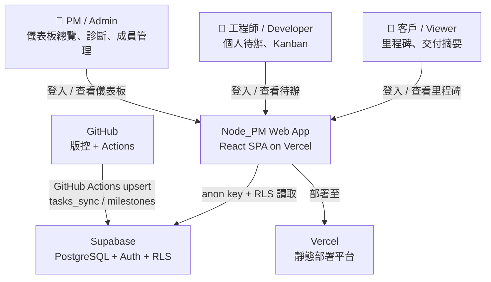
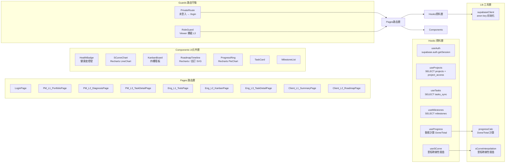

# 整合性架構與設計文件 (Unified Architecture & Design Document) - Node_PM Web App 團隊進度儀表板

---

**文件版本 (Document Version):** `v1.0`
**最後更新 (Last Updated):** `2026-06-05`
**主要作者 (Lead Author):** `PM`
**審核者 (Reviewers):** `技術負責人`
**狀態 (Status):** `草稿 (Draft)`
**對應文件:** `Web_App_PRD.md` / `Web_App_BDD.md` / `Web_App_ADR.md`

---

## 目錄 (Table of Contents)

- [第 1 部分：架構總覽](#第-1-部分架構總覽-architecture-overview)
  - [1.1 C4 模型：視覺化架構](#11-c4-模型視覺化架構)
  - [1.2 DDD 戰略設計](#12-ddd-戰略設計-strategic-ddd)
  - [1.3 Clean Architecture 分層](#13-clean-architecture-分層)
  - [1.4 技術選型與決策](#14-技術選型與決策)
- [第 2 部分：需求摘要](#第-2-部分需求摘要-requirements-summary)
- [第 3 部分：高層次架構設計](#第-3-部分高層次架構設計)
- [第 4 部分：技術選型詳述](#第-4-部分技術選型詳述)
- [第 5 部分：資料架構](#第-5-部分資料架構)
- [第 6 部分：部署與基礎設施](#第-6-部分部署與基礎設施)
- [第 7 部分：跨領域考量](#第-7-部分跨領域考量)
- [第 8 部分：風險與緩解策略](#第-8-部分風險與緩解策略)
- [第 9 部分：架構演進路線圖](#第-9-部分架構演進路線圖)
- [第 10 部分：詳細設計](#第-10-部分詳細設計)

---

**目的：** 本文件將 Node_PM Web App（模組 G）的業務需求轉化為完整技術藍圖，涵蓋系統架構、資料設計、模組實現與部署策略，作為 Phase 5 前端開發的唯一技術參考依據。

---

## 第 1 部分：架構總覽 (Architecture Overview)

### 1.1 C4 模型：視覺化架構

#### L1 - 系統情境圖 (System Context Diagram)



> Web App 是純讀取端：所有資料由 GitHub Actions 寫入 Supabase，Web App 只負責查詢與渲染。三種角色（PM/工程師/客戶）透過 Supabase Auth 登入後，依 RLS 政策限制可存取的資料。

---

#### L2 - 容器圖 (Container Diagram)

```mermaid
graph TB
    subgraph 瀏覽器端
        SPA[React SPA\nVite / Create React App\n路由: React Router DOM]
    end

    subgraph Vercel
        CDN[Static CDN\nHTTPS / 自動 Preview Deploy]
    end

    subgraph Supabase Cloud
        AUTH[Supabase Auth\nGoogle OAuth + Email Magic Link]
        DB[(PostgreSQL + RLS\nprojects / profiles\ntasks_sync / milestones\nproject_access)]
    end

    subgraph GitHub
        ACTIONS[GitHub Actions\nsync_to_supabase.yml]
    end

    SPA -->|部署 Build 產物| CDN
    SPA -->|Supabase Auth SDK\n登入 / 取得 session| AUTH
    SPA -->|@supabase/supabase-js\nanon key + RLS 查詢| DB
    AUTH -->|JWT auth.uid()| DB
    ACTIONS -->|service_role key\nupsert 任務與里程碑| DB
```

---

#### L3 - 元件圖 (Component Diagram — React SPA 內部)



---

### 1.2 DDD 戰略設計 (Strategic DDD)

#### 通用語言 (Ubiquitous Language)

| 術語 | 定義 | 對應資料表/欄位 |
| :--- | :--- | :--- |
| **Project（專案）** | 對應一個 GitHub repo 的工作單元 | `projects` |
| **Task（任務）** | WBS.md 中以 `- [ ]` 格式記錄的子任務 | `tasks_sync` |
| **Milestone（里程碑）** | WBS.md 里程碑表格的一行記錄，有計畫完成日 | `milestones` |
| **Role（角色）** | Admin / Developer / Viewer，決定可存取的專案與頁面層級 | `project_access.role` |
| **Health Status（健康度）** | 🟢正常 / 🟡注意 / 🔴異常，由 Blocked 任務與 overdue 狀態決定 | 前端動態計算 |
| **Progress（完成率）** | `Done / Total` 任務數的百分比，前端動態計算 | 前端計算，不存靜態欄位 |
| **S-Curve（進度曲線）** | 計劃完成率（里程碑線性插值）vs 實際完成率（tasks_sync）的雙線圖 | 前端計算 |
| **Overdue Task（逾期任務）** | `deadline < today AND status != 'Done'` | `tasks_sync` 篩選 |
| **Blocked Task（阻塞任務）** | `status = 'Blocked'` 的任務 | `tasks_sync.status` |
| **external_id** | WBS 任務 ID，格式 `M{模組}.{子模組}.{序號}`，如 `M3.1.3` | `tasks_sync.external_id` |
| **anon key** | Supabase 前端讀取用 API Key，受 RLS 限制 | 環境變數 |
| **service_role key** | GitHub Actions 寫入用 API Key，繞過 RLS | GitHub Secrets |

#### 限界上下文 (Bounded Contexts)

```
┌─────────────────────────────────────────────────────────────────┐
│  文件上下文（Upstream）                                           │
│  .md 文件 + YAML Frontmatter（Single Source of Truth）           │
│  由 Claude Code / 工程師透過 git push 維護                        │
└───────────────────┬─────────────────────────────────────────────┘
                    │ GitHub Actions 解析並同步（防腐層）
                    ▼
┌─────────────────────────────────────────────────────────────────┐
│  進度資料上下文（Downstream）                                      │
│  Supabase（projects / tasks_sync / milestones）                  │
│  只讀衍生資料，由 Actions 寫入，Web App 讀取                       │
└───────────────────┬─────────────────────────────────────────────┘
                    │ anon key + RLS
                    ▼
┌─────────────────────────────────────────────────────────────────┐
│  視圖上下文（Downstream）                                          │
│  React SPA — 三角色差異化儀表板                                    │
│  PM（管理）/ Engineer（執行）/ Client（查閱）                       │
└─────────────────────────────────────────────────────────────────┘
```

---

### 1.3 Clean Architecture 分層

本系統為純前端 SPA，採用「簡化版 Clean Architecture」：

| 層次 | 對應元件 | 職責 |
| :--- | :--- | :--- |
| **Domain Layer** | `lib/progressCalc.js`、`lib/sCurveInterpolation.js`、`lib/healthCalc.js` | 純業務邏輯（完成率計算、S-Curve 插值、健康度判斷），不依賴任何框架 |
| **Application Layer** | `hooks/useProjects`、`hooks/useTasks`、`hooks/useMilestones`、`hooks/useProgress` | Use Case 層：封裝 Supabase 查詢 + Domain 計算，提供給 UI 層使用 |
| **Infrastructure Layer** | `lib/supabaseClient.js`（anon key 初始化）、Supabase Auth SDK | 與外部服務（Supabase）的介接，可替換而不影響 Domain/Application |
| **Presentation Layer** | `pages/`（路由頁面）、`components/`（UI 元件）、`guards/`（路由守衛） | 純 UI 渲染，不含業務邏輯，從 Hooks 取得資料後呈現 |

**依賴方向：** Presentation → Application → Domain ← Infrastructure（Domain 不依賴任何外層）

---

### 1.4 技術選型與決策

| 決策 | 選定方案 | ADR 參考 |
| :--- | :--- | :--- |
| 前端框架 | React + Recharts | ADR-G001 |
| 認證方案 | Supabase Auth（Google OAuth + Email Magic Link） | ADR-G002 |
| 進度計算策略 | 前端動態計算，不存靜態欄位 | ADR-G003 |
| RBAC 實作 | Supabase RLS + `project_access` + 前端路由守衛 | ADR-G004 |
| 部署平台 | Vercel | ADR-G005 |
| S-Curve 計劃線 | 里程碑線性插值 | ADR-G006 |

---

## 第 2 部分：需求摘要 (Requirements Summary)

### 2.1 功能性需求摘要

| 需求 ID | 功能描述 | 對應 PRD |
| :--- | :--- | :--- |
| **FR-1** | 使用者認證（Google OAuth + Email Magic Link），登入後建立 `profiles` 記錄 | US-001 |
| **FR-2** | Admin 管理成員與角色（新增/移除/變更），三角色 RBAC 強制執行 | US-002 |
| **FR-3** | PM L1：多專案健康度燈號（🟢/🟡/🔴）+ 本週里程碑倒數 | US-003 |
| **FR-4** | PM L2：S-Curve、Overdue 清單（依 deadline 升冪）、Blocked 清單（依 updated_at 降冪） | US-004 |
| **FR-5** | PM L3：單一任務完整屬性（external_id / title / status / assignee_email / deadline / priority / yaml_data） | US-005 |
| **FR-6** | 工程師 L1：跨專案個人待辦清單，以 `assignee_email` 過濾，依 deadline 升冪排序 | US-006 |
| **FR-7** | 工程師 L2：專案 Kanban（Todo / Doing / Done / Blocked 四欄） | US-007 |
| **FR-8** | 客戶 L1：整體完成率圓環 + 里程碑達成清單 | US-009 |
| **FR-9** | 客戶 L2：Roadmap 橫軸時間軸，逾期未完成里程碑紅色標示 | US-010 |
| **FR-10** | 進度百分比前端動態計算（`Done / total`），git push 後 ≤2 分鐘反映 | US-011 |

### 2.2 非功能性需求 (NFRs)

| NFR 分類 | 具體需求 | 衡量指標/目標值 |
| :--- | :--- | :--- |
| **資料同步延遲** | git push 後 Supabase 資料更新，Web App 下次載入即反映 | ≤ 2 分鐘（由 GitHub Actions 決定） |
| **頁面載入性能** | L1 總覽頁初次載入（任務數 < 1,000 筆） | ≤ 3 秒 |
| **RBAC 正確性** | 三角色存取範圍符合 RLS 政策，無越權存取 | 100%（Phase 5 驗收） |
| **安全性** | 前端使用 `anon` key + RLS；`service_role` key 僅存於 GitHub Secrets | `service_role` key 不暴露於前端原始碼 |
| **零重複輸入** | 進度數字完全由 `tasks_sync` 動態計算，無靜態 `progress` 欄位 | `tasks_sync` schema 不含 `progress` 欄位 |
| **部署可用性** | Vercel 免費方案，main branch push 後自動部署 | 部署成功率 ≥ 99% |
| **傳輸加密** | HTTPS（Vercel 自動提供 TLS） | 所有流量走 HTTPS |

---

## 第 3 部分：高層次架構設計

### 3.1 選定的架構模式

**模式：** 無後端 SPA（Backendless SPA）+ Supabase BaaS（Backend-as-a-Service）

```
Claude Code / 工程師
      ↓ git push
  GitHub Repo
      ↓ GitHub Actions（觸發）
  Python 腳本解析 .md → Supabase upsert（service_role key）
      ↓
  Supabase（PostgreSQL + RLS + Auth）← 唯一後端
      ↓ anon key + RLS
  React SPA（Vercel CDN）← 唯一前端
      ↑ 三角色用戶瀏覽器
```

**選擇理由：** 系統的核心架構約束是「零重複輸入」——`.md` 文件是唯一寫入源，所有資料由文件派生。這使得 Web App 天然是純讀取端，不需要自建後端 API Server。Supabase 的 RLS 機制在資料庫層直接實現存取控制，`anon key` 可安全暴露於前端。

---

### 3.2 主要元件職責

| 元件 | 核心職責 | 主要技術 | 依賴 |
| :--- | :--- | :--- | :--- |
| **React SPA** | 三角色差異化儀表板渲染；路由守衛；進度計算 | React + React Router + Recharts | Supabase JS SDK |
| **Supabase Auth** | 認證（Google OAuth + Email Magic Link）；發放 JWT `auth.uid()` | Supabase Auth Service | `profiles` 表 |
| **Supabase PostgreSQL + RLS** | 儲存結構化進度資料；執行行級存取控制 | PostgreSQL 15 + RLS Policies | `project_access` 表 |
| **Vercel CDN** | 靜態資源部署；HTTPS；Preview Deploy | Vercel Edge Network | GitHub repo 連接 |
| **GitHub Actions（上游）** | 解析 `.md` 並寫入 Supabase（非 Web App 職責，但為資料來源） | Python + supabase-py | `service_role` key |

---

### 3.3 關鍵使用者旅程

#### 旅程 1：PM 早晨全局風險確認

```
1. PM 開啟瀏覽器，存取 Web App URL
2. PrivateRoute 偵測到無 session → 導向 /login
3. PM 點擊「使用 Google 帳號登入」→ Supabase Auth 處理 OAuth 流程
4. 登入成功，useAuth hook 取得 session，RoleGuard 確認 role = "admin"
5. 導向 /dashboard/pm（PM L1 組合總覽頁）
6. useProjects hook 查詢 project_access + projects 取得所有專案列表
7. 對每個專案，useTasks hook 查詢 tasks_sync 計算健康度燈號
8. useMilestones hook 查詢本週到期里程碑
9. 頁面渲染：所有專案的健康度燈號 + 里程碑倒數
10. PM 點擊 🔴 異常專案 → 進入 L2 診斷頁
11. PM_L2_DiagnosisPage 呼叫 useSCurve 計算 S-Curve、篩選 Overdue/Blocked 任務
12. PM 掌握全局，決定當日優先項目（全程 < 30 秒）
```

#### 旅程 2：工程師查看今日待辦

```
1. 工程師以 Email Magic Link 登入
2. RoleGuard 確認 role = "developer" → 導向 /dashboard/engineer
3. useAuth 取得 session，useTasks 以 assignee_email = 登入用戶 email 查詢
4. RLS 政策確保只回傳該 developer 被分配的專案任務
5. L1 頁面依 deadline 升冪排序，渲染跨專案個人待辦清單
6. 工程師點擊某專案 → Eng L2 Kanban，查看該專案完整任務分布
```

#### 旅程 3：客戶查看交付進度

```
1. 客戶以 Email Magic Link 登入（無需記憶密碼）
2. RoleGuard 確認 role = "viewer" → 導向 /dashboard/client
3. RLS 限制只能查詢被分配的專案資料
4. Client L1 頁面渲染：完成率圓環（useProgress 動態計算）+ 里程碑清單
5. 客戶點擊專案 → Client L2 Roadmap 時間軸
6. 客戶嘗試存取 L3 URL → RoleGuard 攔截，重導向至 /dashboard/client
```

---

## 第 4 部分：技術選型詳述

### 4.1 技術選型原則

1. **優先使用 Managed Services：** 不自建後端 Server，所有基礎設施由 Supabase + Vercel 管理
2. **零訂閱成本優先：** 免費方案優先，選擇有免費層的服務（Supabase Free / Vercel Hobby）
3. **與 .md 生態整合：** 所有資料來源於 `.md` 文件，工具選型須能無縫消費 Supabase 資料
4. **LLM 可生成性：** 選擇 React + Supabase 組合，LLM 生成程式碼品質最穩定（最大社群訓練資料）
5. **不過度設計：** 個人 PM 使用場景，任務數 < 1,000 筆，不需要 Redis 快取、訊息佇列、Kubernetes

### 4.2 技術棧詳情

| 分類 | 選用技術 | 選擇理由 | 備選方案 | 相關 ADR |
| :--- | :--- | :--- | :--- | :--- |
| **前端框架** | React 18 | 生態最成熟；Supabase SDK 完整支援；LLM 生成品質穩定 | Next.js（SSR 對儀表板無意義）、Vue 3（Supabase SDK 支援較少範例） | ADR-G001 |
| **圖表庫** | Recharts | 原生 React；LineChart/AreaChart/PieChart 對應 S-Curve/CFD/圓環；免費開源 | Chart.js（非 React 原生）、D3.js（客製化強但學習曲線高） | ADR-G001 |
| **路由** | React Router DOM v6 | 業界標準；PrivateRoute 模式成熟 | TanStack Router（功能更強但概念較新） | — |
| **狀態管理** | React Query（TanStack Query） | 與 Supabase 查詢整合佳；自動 refetch；快取管理 | Redux（過重）、Zustand（輕量但需手動處理 async） | — |
| **認證** | Supabase Auth | `auth.uid()` 天然對應 RLS；Google OAuth + Email Magic Link 支援；免費 | Auth0（過重、收費）、Firebase Auth（跨平台橋接複雜） | ADR-G002 |
| **資料庫** | Supabase PostgreSQL + RLS | Managed 服務；內建 Auth + RLS；`service_role` / `anon` key 分離 | Firebase Firestore（NoSQL 查詢彈性低）、PlanetScale（無 RLS） | ADR-G004 |
| **部署** | Vercel | SPA 路由零設定；Preview Deploy；環境變數管理完善；免費方案足夠 | Netlify（需手動設定 `_redirects`）、GitHub Pages（不支援 Client Routing） | ADR-G005 |
| **打包工具** | Vite | 啟動速度快；開發體驗優於 CRA；生態成熟 | Create React App（較舊、不再積極維護） | — |
| **CSS** | Tailwind CSS | Utility-first；與 React 元件組合佳；無需維護 CSS 模組 | CSS Modules（樣式隔離但開發較慢）、Styled Components（執行時成本） | — |

---

## 第 5 部分：資料架構

### 5.1 資料模型（Supabase Schema）

```
projects
├── id: UUID (PK)
├── name: TEXT
├── repo_full_name: TEXT UNIQUE  ← 'user/repo_name'
├── status: TEXT DEFAULT 'active'
├── current_phase: TEXT          ← 由 Actions 從 WBS.md frontmatter.phase 寫入
└── created_at: TIMESTAMPTZ

profiles
├── id: UUID (FK → auth.users, PK)
├── email: TEXT UNIQUE
├── full_name: TEXT
└── avatar_url: TEXT

project_access                   ← RBAC 核心
├── id: SERIAL (PK)
├── user_id: UUID (FK → profiles)
├── project_id: UUID (FK → projects)
└── role: TEXT CHECK IN ('admin','developer','viewer')

tasks_sync                       ← 由 GitHub Actions 寫入
├── id: UUID (PK)
├── project_id: UUID (FK → projects)
├── external_id: TEXT            ← WBS 任務 ID，如 M3.1.3
├── title: TEXT
├── status: TEXT CHECK IN ('Todo','Doing','Done','Blocked')
├── priority: TEXT
├── assignee_email: TEXT
├── deadline: DATE
├── yaml_data: JSONB
└── updated_at: TIMESTAMPTZ (auto-update trigger)

milestones                       ← 由 GitHub Actions 寫入
├── id: SERIAL (PK)
├── project_id: UUID (FK → projects)
├── milestone_name: TEXT
├── planned_date: DATE
├── actual_date: DATE
└── is_completed: BOOLEAN
```

**Unique Constraints：**
- `tasks_sync(project_id, external_id)` — Actions upsert 的冪等鍵
- `milestones(project_id, milestone_name)` — Actions upsert 的冪等鍵

---

### 5.2 資料流向圖

```mermaid
graph LR
    WBS[WBS.md\n- [ ] 任務\n里程碑表格] -->|GitHub Actions\nPython 解析| SB[(Supabase\ntasks_sync\nmilestones)]
    FM[YAML Frontmatter\nphase 欄位] -->|GitHub Actions\nget_or_create_project| SB
    SB -->|anon key + RLS\nSELECT| HOOKS[React Hooks\nuseProjects\nuseTasks\nuseMilestones]
    HOOKS -->|純 JS 計算| CALC[Domain Layer\nprogressCalc\nsCurveInterpolation\nhealthCalc]
    CALC -->|計算結果| UI[UI Components\nHealthBadge\nSCurveChart\nKanbanBoard\nProgressRing\nRoadmapTimeline]
```

---

### 5.3 資料一致性策略

| 場景 | 一致性策略 |
| :--- | :--- |
| **GitHub → Supabase** | GitHub Actions upsert（冪等），最終一致。Actions 失敗時 GitHub 通知 PM，可手動重觸發 |
| **Supabase → Web App** | 用戶重新整理頁面或 React Query 定時 refetch（預設 5 分鐘）取得最新資料 |
| **WBS.md 與 tasks_sync 衝突** | `.md` 文件永遠是最終依據；重觸發 Actions 即可重置 Supabase 至最新狀態 |
| **進度數字一致性** | 前端動態計算（ADR-G003），不存靜態欄位，不存在 stale 問題 |

---

### 5.4 資料生命週期

| 資料表 | 寫入時機 | 更新時機 | 刪除政策 |
| :--- | :--- | :--- | :--- |
| `projects` | 首次 push 時 Actions 自動建立 | `repo_full_name` 或 `current_phase` 變更 | 人工刪除 |
| `tasks_sync` | 每次 push `.md` 文件 | Actions upsert（key: project_id + external_id） | 隨 `projects` 刪除（CASCADE） |
| `milestones` | 每次 push `WBS.md` | Actions upsert（key: project_id + milestone_name） | 隨 `projects` 刪除（CASCADE） |
| `profiles` | 用戶首次登入時建立 | 用戶更新個人資料 | 用戶刪除帳號時 |
| `project_access` | PM 手動新增成員 | 角色變更時 | PM 移除成員時 |

---

## 第 6 部分：部署與基礎設施

### 6.1 部署視圖

```
開發者本機
├── git push → GitHub
│                │
│         GitHub Actions（自動觸發）
│                │
│           Supabase（資料更新）
│
└── PR 建立 → Vercel Preview Deploy（自動生成預覽 URL）
    main branch push → Vercel Production Deploy（自動）
```

```
用戶瀏覽器
    ↓ HTTPS
Vercel Edge CDN（靜態資源）
    ↓ @supabase/supabase-js
Supabase Auth（JWT 發放）
Supabase PostgreSQL + RLS（資料查詢）
```

---

### 6.2 CI/CD 流程

| 觸發事件 | 自動執行 | 說明 |
| :--- | :--- | :--- |
| PR 開啟 / push | Vercel Preview Deploy | 每個 PR 生成獨立預覽 URL，PM 可在合併前確認 UI |
| main branch push | Vercel Production Deploy | 自動部署至正式環境，無需手動操作 |
| main branch push（.md 變更）| GitHub Actions 同步 Supabase | 資料管道由 Node_PM 模組 F 負責，非 Web App 職責 |

---

### 6.3 環境策略

| 環境 | 觸發方式 | Supabase Project | 說明 |
| :--- | :--- | :--- | :--- |
| **Development** | 本機 `npm run dev` | Supabase Local 或 Dev Project | 開發時使用 `.env.local` |
| **Preview** | PR push → Vercel Preview | 同 Dev Project（可接受） | 驗收 UI 變更 |
| **Production** | main push → Vercel Production | Production Supabase Project | 正式環境，使用 Vercel 環境變數 |

**環境變數：**

| 變數名稱 | 說明 | 設定位置 |
| :--- | :--- | :--- |
| `VITE_SUPABASE_URL` | Supabase 專案 URL | Vercel 環境變數 + `.env.local` |
| `VITE_SUPABASE_ANON_KEY` | anon key（前端使用） | Vercel 環境變數 + `.env.local` |

> ⚠️ `service_role` key **絕不**放入前端環境變數，僅存於 GitHub Secrets。

---

### 6.4 成本效益分析

| 服務 | 方案 | 月費 | 限制 |
| :--- | :--- | :--- | :--- |
| **Supabase** | Free | $0 | 500MB 資料庫、50,000 月活躍用戶 |
| **Vercel** | Hobby | $0 | 100GB 頻寬、無商業用途限制（個人） |
| **GitHub Actions** | Free（公開 repo）| $0 | 2,000 分鐘/月（私有 repo） |

**總月費：$0**（對個人 PM 使用場景完全足夠）

---

## 第 7 部分：跨領域考量

### 7.1 可觀測性 (Observability)

| 面向 | 設計 |
| :--- | :--- |
| **前端錯誤監控** | 可整合 Sentry（免費方案）捕捉 React 錯誤邊界與 API 失敗 |
| **Supabase 查詢監控** | Supabase Dashboard → Logs → API Logs 查看查詢延遲與錯誤 |
| **GitHub Actions 監控** | GitHub Actions 頁面查看 workflow run 狀態；失敗時自動發 Email 通知 |
| **Vercel 部署監控** | Vercel Dashboard → Deployments 查看部署狀態與 Build Log |
| **資料驗證** | push 後 2 分鐘，在 Supabase Table Editor 確認 `tasks_sync` 資料更新 |

---

### 7.2 安全性與隱私

| 面向 | 設計 |
| :--- | :--- |
| **傳輸加密** | Vercel 自動提供 TLS；Supabase API 走 HTTPS |
| **認證** | Supabase Auth JWT；Token 存於 `localStorage`（Supabase SDK 預設）|
| **存取控制** | Supabase RLS 資料庫層強制執行；前端路由守衛額外保護 L3 頁面 |
| **API Key 管理** | `anon key` 暴露於前端（受 RLS 保護）；`service_role` key 僅存 GitHub Secrets |
| **資料主權** | 業務資料存於 Supabase Cloud（可選擇 EU region 滿足 GDPR）；文件原始碼在 GitHub |
| **個人資料** | `profiles` 表只存 email / full_name / avatar_url；不存密碼（Supabase Auth 負責）|

---

## 第 8 部分：風險與緩解策略

| 風險類別 | 風險描述 | 可能性 | 影響 | 緩解策略 |
| :--- | :--- | :--- | :--- | :--- |
| **安全風險** | RLS Policy 撰寫錯誤導致資料洩漏 | 低 | 高 | Phase 5 以三角色手動驗收每條 Policy；使用 `service_role` 測試 RLS bypass 確認正確 |
| **資料一致性風險** | GitHub Actions 失敗，Supabase 資料未更新，Web App 顯示過期進度 | 低 | 中 | GitHub 自動發送 fail 通知；Actions 支援手動重觸發；`.md` 文件不受影響 |
| **效能風險** | 單一專案任務數超過 500 筆，L1 頁面載入超過 3 秒 | 低 | 低 | React Query 快取；超過 500 筆時評估 Supabase Database Function 預聚合 |
| **依賴風險** | Supabase 服務中斷，Web App 無法登入或查詢資料 | 低 | 高 | 無法完全規避；建議 PM 保留 Obsidian 作為離線備援查閱工具 |
| **成本風險** | 用戶數超過 Supabase Free 方案上限（50,000 月活） | 極低 | 低 | 個人 PM 使用場景，月活不超過 20 人；若擴大評估 Supabase Pro（$25/月） |
| **技術債風險** | S-Curve 線性插值假設工作量均勻分布，里程碑設計不均時偏差明顯 | 中 | 低 | 在 L2 圖表標註「計劃線為估算值」；PM 可結合 Overdue 清單綜合判斷 |

---

## 第 9 部分：架構演進路線圖

### Phase 5 — MVP（Day 8–14）

- 實作認證、RBAC、三角色基本 Dashboard（L1）
- 驗收：三角色可正常登入並查看各自 L1 視圖
- 驗收：RLS Policy 三角色測試 100% 正確

### Phase 5+ — 功能完整（Day 15–21）

- 完成 PM L2 診斷（S-Curve、CFD、Overdue/Blocked 清單）
- 完成工程師 L2 Kanban、客戶 L2 Roadmap
- 部署至 Vercel，設定 Production 環境變數

### Post-MVP — 可選演進

| 觸發條件 | 演進方向 |
| :--- | :--- |
| 任務數 > 500 筆，L1 載入 > 3 秒 | 引入 Supabase Database Function 預聚合進度，或 Materialized View |
| 需要即時資料（不等用戶刷新）| 引入 Supabase Realtime（WebSocket 訂閱 `tasks_sync` 變更） |
| 需要 MFA 或 SSO | 升級 Supabase Pro 或評估 Auth0 |
| 需要 Audit Log（誰在何時存取）| 引入 Supabase Edge Function 記錄 API 呼叫日誌 |
| 客戶要求行動裝置原生 App | 考慮 React Native 共享 Hooks 層，Supabase SDK 原生支援 |

---

## 第 10 部分：詳細設計

### 2.1 MVP 與模組優先級

**MVP Scope（Phase 5，Day 8–14）：**

1. 認證模組（Auth）
2. RBAC / 路由守衛模組
3. PM L1 組合總覽
4. 工程師 L1 個人待辦
5. 客戶 L1 交付摘要
6. 進度計算核心（Domain Layer）

**Post-MVP（Phase 5+）：**

7. PM L2 診斷中心（S-Curve、Overdue、Blocked）
8. PM L3 任務明細
9. 工程師 L2 Kanban、L3 任務明細
10. 客戶 L2 Roadmap 時間軸
11. Admin 成員管理介面

---

### 2.2 核心模組設計

---

#### 模組 1: Auth（認證模組）

**對應 BDD Feature:** Feature 1（使用者認證）
**職責:** 處理登入、登出、session 管理，確保所有路由受 PrivateRoute 保護。

**資料模型：**
```
Supabase auth.users（由 Supabase Auth 管理，非直接存取）
profiles（id, email, full_name, avatar_url）← 登入後自動建立
```

**關鍵邏輯：**
```javascript
// lib/supabaseClient.js
import { createClient } from '@supabase/supabase-js'
export const supabase = createClient(
  import.meta.env.VITE_SUPABASE_URL,
  import.meta.env.VITE_SUPABASE_ANON_KEY
)

// hooks/useAuth.js
export function useAuth() {
  const [session, setSession] = useState(null)
  useEffect(() => {
    supabase.auth.getSession().then(({ data }) => setSession(data.session))
    const { data: { subscription } } = supabase.auth.onAuthStateChange(
      (_event, session) => setSession(session)
    )
    return () => subscription.unsubscribe()
  }, [])
  return { session, user: session?.user }
}

// 登入後自動建立 profiles 記錄（透過 Supabase Trigger 或前端初始化）
async function ensureProfile(user) {
  await supabase.from('profiles').upsert({
    id: user.id, email: user.email, full_name: user.user_metadata?.full_name
  }, { onConflict: 'id' })
}
```

**路由守衛：**
```javascript
// guards/PrivateRoute.jsx
function PrivateRoute({ children }) {
  const { session } = useAuth()
  return session ? children : <Navigate to="/login" replace />
}

// guards/RoleGuard.jsx  ← Viewer 攔截 L3
function RoleGuard({ allowedRoles, children }) {
  const { role } = useUserRole()
  return allowedRoles.includes(role) ? children : <Navigate to="/dashboard/client" replace />
}
```

---

#### 模組 2: RBAC（角色控管模組）

**對應 BDD Feature:** Feature 2（RBAC）
**職責:** 登入後查詢 `project_access` 確定用戶角色，決定導向哪個 Dashboard；Supabase RLS 在資料庫層強制執行。

**關鍵邏輯：**
```javascript
// hooks/useUserRole.js
export function useUserRole() {
  const { user } = useAuth()
  const { data } = useQuery(['userRole', user?.id], async () => {
    const { data } = await supabase
      .from('project_access')
      .select('role')
      .eq('user_id', user.id)
      .limit(1)
      .single()
    return data?.role ?? 'viewer'
  })
  return { role: data }
}
```

**Supabase RLS Policy（已定義於 Supabase_Schema設計規格書.md）：**
- `tasks_sync`：只回傳 `project_id IN (SELECT project_id FROM project_access WHERE user_id = auth.uid())`
- `milestones`：同上邏輯
- `projects`：同上邏輯

---

#### 模組 3: 進度計算（Domain Layer）

**對應 BDD Feature:** Feature 10（進度計算與資料同步）
**職責:** 純業務邏輯計算，不依賴任何框架，可獨立測試。

**關鍵演算法：**

```javascript
// lib/progressCalc.js
export function calcProgress(tasks) {
  if (!tasks.length) return 0
  const done = tasks.filter(t => t.status === 'Done').length
  return Math.round((done / tasks.length) * 100)
}

// lib/healthCalc.js
export function calcHealth(tasks, today = new Date()) {
  const hasBlocked = tasks.some(t => t.status === 'Blocked')
  if (hasBlocked) return 'critical'      // 🔴

  const overdue = tasks.filter(t =>
    t.deadline && new Date(t.deadline) < today && t.status !== 'Done'
  )
  if (overdue.length > 0) return 'warning'  // 🟡
  return 'normal'                           // 🟢
}

// lib/sCurveInterpolation.js
// 以里程碑 planned_date 線性插值估算計劃完成率
export function calcSCurvePlan(milestones, dateRange) {
  const sorted = [...milestones].sort((a, b) =>
    new Date(a.planned_date) - new Date(b.planned_date)
  )
  const N = sorted.length
  return dateRange.map(date => {
    const d = new Date(date)
    for (let i = 0; i < N; i++) {
      const d_i = new Date(sorted[i].planned_date)
      const d_next = i < N - 1 ? new Date(sorted[i + 1].planned_date) : null
      if (!d_next || d <= d_i) {
        return { date, planned: Math.round((i / N) * 100) }
      }
      if (d < d_next) {
        const ratio = (d - d_i) / (d_next - d_i)
        return { date, planned: Math.round(((i + ratio) / N) * 100) }
      }
    }
    return { date, planned: 100 }
  })
}
```

---

#### 模組 4: PM L1 組合總覽

**對應 BDD Feature:** Feature 3（PM L1）
**職責:** 渲染所有專案的健康度燈號與本週里程碑倒數。

**資料查詢：**
```javascript
// hooks/useProjects.js（查詢 admin 可見的所有專案）
const { data: projects } = useQuery(['projects'], async () => {
  const { data } = await supabase
    .from('projects')
    .select('*, project_access(role)')
    .order('name')
  return data
})

// hooks/useProjectHealth.js（每個專案的健康度）
async function fetchHealth(projectId) {
  const { data: tasks } = await supabase
    .from('tasks_sync')
    .select('status, deadline')
    .eq('project_id', projectId)
  return calcHealth(tasks)
}
```

---

#### 模組 5: PM L2 診斷中心

**對應 BDD Feature:** Feature 4（PM L2）
**職責:** S-Curve、Overdue 清單（deadline 升冪）、Blocked 清單（updated_at 降冪）。

**S-Curve 資料準備：**
```javascript
// hooks/useSCurve.js
export function useSCurve(projectId) {
  const { data: milestones } = useMilestones(projectId)
  const { data: tasks } = useTasks(projectId)
  
  return useMemo(() => {
    if (!milestones?.length) return null
    const dateRange = generateDateRange(milestones)    // 起點到終點每週一個點
    const planLine = calcSCurvePlan(milestones, dateRange)
    const actualPct = calcProgress(tasks ?? [])
    const today = new Date().toISOString().split('T')[0]
    const actualLine = dateRange.map(date => ({
      date,
      actual: date <= today ? actualPct : null         // 未來日期不顯示實際線
    }))
    return planLine.map((p, i) => ({ ...p, ...actualLine[i] }))
  }, [milestones, tasks])
}
```

---

### 2.3 非功能性需求設計

| NFR | 實現方式 |
| :--- | :--- |
| **頁面載入 ≤ 3 秒** | React Query 快取（staleTime: 5 分鐘）；Vite 程式碼分割（lazy import 各角色 Dashboard）；Vercel CDN 靜態資源邊緣快取 |
| **RBAC 正確性 100%** | Supabase RLS 資料庫層強制執行 + 前端 RoleGuard 雙層保護；Phase 5 以三角色手動驗收 |
| **service_role key 不洩漏** | 僅存於 GitHub Secrets；`.gitignore` 包含 `.env.local`；Vite 不打包 `SUPABASE_SERVICE_ROLE_KEY` |
| **傳輸加密** | Vercel 自動 TLS；Supabase API 強制 HTTPS |
| **零靜態 progress 欄位** | `tasks_sync` schema 無 `progress` 欄位；`calcProgress()` 在前端動態計算 |

---

## 附錄

### 目錄結構（建議）

```
web-app/
├── public/
├── src/
│   ├── lib/
│   │   ├── supabaseClient.js        ← Infrastructure Layer
│   │   ├── progressCalc.js          ← Domain Layer
│   │   ├── healthCalc.js            ← Domain Layer
│   │   └── sCurveInterpolation.js   ← Domain Layer
│   ├── hooks/
│   │   ├── useAuth.js               ← Application Layer
│   │   ├── useUserRole.js
│   │   ├── useProjects.js
│   │   ├── useTasks.js
│   │   ├── useMilestones.js
│   │   ├── useProgress.js
│   │   └── useSCurve.js
│   ├── guards/
│   │   ├── PrivateRoute.jsx         ← Presentation Layer (Guard)
│   │   └── RoleGuard.jsx
│   ├── pages/
│   │   ├── LoginPage.jsx
│   │   ├── pm/
│   │   │   ├── PM_L1_PortfolioPage.jsx
│   │   │   ├── PM_L2_DiagnosisPage.jsx
│   │   │   └── PM_L3_TaskDetailPage.jsx
│   │   ├── engineer/
│   │   │   ├── Eng_L1_TodoPage.jsx
│   │   │   ├── Eng_L2_KanbanPage.jsx
│   │   │   └── Eng_L3_TaskDetailPage.jsx
│   │   └── client/
│   │       ├── Client_L1_SummaryPage.jsx
│   │       └── Client_L2_RoadmapPage.jsx
│   ├── components/
│   │   ├── HealthBadge.jsx
│   │   ├── SCurveChart.jsx          ← Recharts LineChart
│   │   ├── KanbanBoard.jsx
│   │   ├── RoadmapTimeline.jsx
│   │   ├── ProgressRing.jsx         ← Recharts PieChart
│   │   ├── TaskCard.jsx
│   │   └── MilestoneList.jsx
│   ├── App.jsx                      ← 路由定義
│   └── main.jsx
├── .env.local                       ← VITE_SUPABASE_URL / ANON_KEY（不提交）
├── .gitignore
├── vite.config.js
└── package.json
```

---

**文件審核記錄:**

| 日期       | 審核人 | 版本 | 變更摘要 |
| :--------- | :----- | :--- | :------- |
| 2026-06-05 | PM     | v1.0 | 初稿提交 |
