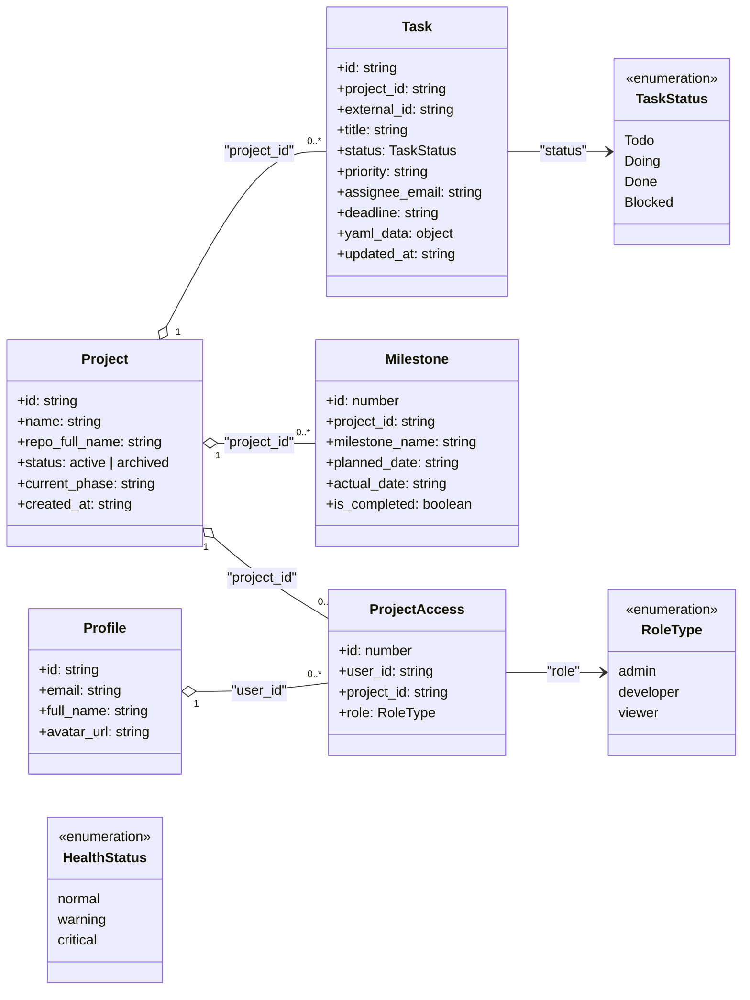
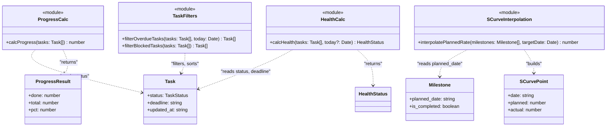
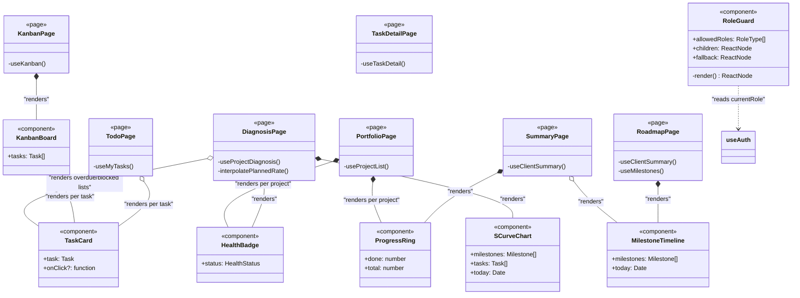
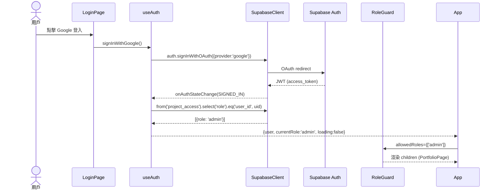
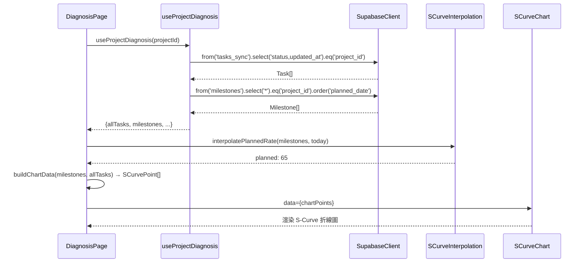

# 類別/組件關係文檔 (Class/Component Relationships Document) - Node_PM Web App

---

**文件版本 (Document Version):** `v1.0`
**最後更新 (Last Updated):** `2026-06-05`
**主要作者 (Lead Author):** `技術負責人`
**審核者 (Reviewers):** `PM`
**狀態 (Status):** `草稿 (Draft)`
**相關設計文檔:**
- 架構文件: `Web_App_Architecture.md`
- 依賴分析: `Web_App_File_Dependencies.md`
- 模組規格: `Web_App_Module_Spec_and_Tests.md`
- ADR: `Web_App_ADR.md`

---

## 目錄 (Table of Contents)

1. [概述](#1-概述)
2. [核心類別圖](#2-核心類別圖)
3. [主要類別/組件職責](#3-主要類別組件職責)
4. [關係詳解](#4-關係詳解)
5. [設計模式應用](#5-設計模式應用)
6. [SOLID 原則遵循情況](#6-solid-原則遵循情況)
7. [介面契約](#7-介面契約)
8. [技術選型與依賴](#8-技術選型與依賴)
9. [附錄：子模組詳細圖](#9-附錄子模組詳細圖)

---

## 1. 概述

### 1.1 文件目的

本文件透過 Mermaid 類別圖與詳細描述，呈現 **Node_PM Web App**（React SPA + Supabase BaaS）中主要資料模型、純函式模組、React Hooks 與 UI 元件之間的靜態結構關係。

> **適配說明：** 原始模板以 Python/OOP 為基礎，使用傳統類別（class）概念。本文件將其適配為 JavaScript/React 的等效結構：
> - **領域模型（Domain Model）** → TypeScript-style 型別介面（data shapes）
> - **服務類別（Service Class）** → React Custom Hooks（`useXxx`）
> - **靜態工具類別** → ES Module 純函式（`lib/*.js`）
> - **UI 元件** → React Function Components（props as constructor）
> - **單例（Singleton）** → `supabaseClient.js` export 的共享實例

### 1.2 建模範圍

| 項目 | 說明 |
| :--- | :--- |
| **包含範圍** | 資料模型（5 個 Supabase 表對應型別）、計算型別、Domain 純函式模組、React Hooks、核心 UI 元件 |
| **排除範圍** | Supabase SDK 內部類別、React 框架內部元件、第三方套件（Recharts）的內部結構、測試 mock 物件 |
| **抽象層級** | 專注於公開介面（public props/methods/return types），忽略內部實作細節 |

### 1.3 UML 符號說明（適配 JavaScript）

| 符號 | 意義 | 本專案實際意義 |
| :--- | :--- | :--- |
| `--|>` | 繼承（is-a） | 型別繼承或擴展（`ProjectWithHealth extends Project`） |
| `..|>` | 實現介面（implements） | Hook 實現資料取得介面契約 |
| `*--` | 組合（強所有權） | Page 元件「擁有」子元件（生命週期同步） |
| `o--` | 聚合（弱所有權） | Page 元件「使用」可複用元件（元件可獨立存在） |
| `..>` | 依賴（uses-a） | Hook/元件依賴另一個模組的函式或物件 |
| `-->` | 關聯（has-a） | 資料模型間的欄位參照關係（外鍵） |
| `<<module>>` | 自定義標籤 | ES Module 純函式集合（`lib/`） |
| `<<hook>>` | 自定義標籤 | React Custom Hook |
| `<<component>>` | 自定義標籤 | React Function Component |
| `<<page>>` | 自定義標籤 | React Page Component（對應路由） |
| `<<singleton>>` | 自定義標籤 | 全域共享實例（`supabaseClient.js`） |

---

## 2. 核心類別圖 (Core Class Diagram)

### 2.1 資料模型關係圖（Supabase Schema 對應）



---

### 2.2 Domain 純函式模組關係圖



---

### 2.3 Application Layer（Hooks）與 Infrastructure 關係圖

```mermaid
classDiagram
    direction TB

    class SupabaseClient {
        <<singleton>>
        -url: string
        -anonKey: string
        +from(table: string) QueryBuilder
        +auth: AuthClient
    }

    class useAuth {
        <<hook>>
        +user: User
        +currentRole: RoleType
        +loading: boolean
        +signInWithGoogle() void
        +signInWithEmail(email: string) void
        +signOut() void
    }

    class useProjectList {
        <<hook>>
        +projects: ProjectWithHealth[]
        +isLoading: boolean
        +error: Error
    }

    class useProjectDiagnosis {
        <<hook>>
        +allTasks: Task[]
        +overdueTasks: Task[]
        +blockedTasks: Task[]
        +milestones: Milestone[]
        +isLoading: boolean
    }

    class useMyTasks {
        <<hook>>
        +tasks: Task[]
        +isLoading: boolean
    }

    class useKanban {
        <<hook>>
        +todo: Task[]
        +doing: Task[]
        +done: Task[]
        +blocked: Task[]
        +isLoading: boolean
    }

    class useClientSummary {
        <<hook>>
        +progress: ProgressResult
        +milestones: Milestone[]
        +isLoading: boolean
    }

    class useMilestones {
        <<hook>>
        +milestones: Milestone[]
        +isLoading: boolean
    }

    class useTaskDetail {
        <<hook>>
        +task: Task
        +isLoading: boolean
    }

    class ProjectWithHealth {
        +id: string
        +name: string
        +health: HealthStatus
        +progress: number
        +upcomingMilestone: Milestone
    }

    useAuth ..> SupabaseClient : "auth.getSession()\nonAuthStateChange()"
    useProjectList ..> SupabaseClient : "from('projects').select()"
    useProjectList ..> HealthCalc : "calcHealth()"
    useProjectList ..> ProgressCalc : "calcProgress()"
    useProjectList ..> ProjectWithHealth : "returns"
    useProjectDiagnosis ..> SupabaseClient : "from('tasks_sync')\nfrom('milestones')"
    useProjectDiagnosis ..> TaskFilters : "filterOverdue()\nfilterBlocked()"
    useMyTasks ..> SupabaseClient : "from('tasks_sync').eq(assignee)"
    useKanban ..> SupabaseClient : "from('tasks_sync').eq(project)"
    useClientSummary ..> SupabaseClient : "from('tasks_sync')\nfrom('milestones')"
    useClientSummary ..> ProgressCalc : "calcProgress()"
    useMilestones ..> SupabaseClient : "from('milestones')"
    useTaskDetail ..> SupabaseClient : "from('tasks_sync').single()"
```



---

### 2.4 Presentation Layer（元件與頁面）關係圖



---

## 3. 主要類別/組件職責

### 3.1 資料模型

| 類別/型別 | 核心職責 | 主要協作者 | 所屬層 |
| :--- | :--- | :--- | :--- |
| `Project` | 代表單一專案的領域模型，含名稱、狀態、當前階段 | `Task`, `Milestone`, `ProjectAccess` | Domain |
| `Task` | 代表 WBS 單一任務，含狀態、deadline、負責人、WBS ID | `Project`, `TaskStatus` | Domain |
| `Milestone` | 代表專案里程碑，含計畫/實際完成日、是否完成 | `Project` | Domain |
| `Profile` | 代表用戶資料，與 Supabase `auth.users` 同步 | `ProjectAccess` | Domain |
| `ProjectAccess` | 代表用戶與專案的角色對應，RBAC 核心資料 | `Project`, `Profile`, `RoleType` | Domain |
| `ProjectWithHealth` | `Project` 的擴展視圖，加入健康度與完成率（前端計算） | `HealthStatus`, `ProgressResult` | Application |
| `ProgressResult` | 完成率計算結果（done / total / pct），由 `calcProgress` 產出 | `Task[]` | Domain |
| `SCurvePoint` | S-Curve 圖上的單一資料點（日期、計畫率、實際率） | `Milestone`, `Task` | Application |

### 3.2 Domain 純函式模組（`lib/`）

| 模組 | 核心職責 | 主要協作者 | 所屬層 |
| :--- | :--- | :--- | :--- |
| `ProgressCalc` | 純函式：計算任務完成率百分比；`Done / total * 100` | `Task[]` | Domain |
| `HealthCalc` | 純函式：判斷健康度燈號；Blocked 優先於 overdue | `Task[]`, `Date` | Domain |
| `SCurveInterpolation` | 純函式：里程碑線性插值計算計畫完成率 | `Milestone[]`, `Date` | Domain |
| `TaskFilters` | 純函式：過濾 overdue / Blocked 任務並排序 | `Task[]`, `Date` | Domain |

### 3.3 Infrastructure

| 類別/模組 | 核心職責 | 主要協作者 | 所屬層 |
| :--- | :--- | :--- | :--- |
| `SupabaseClient` | Supabase JS SDK 唯一初始化點，提供 `from()` 查詢與 `auth` 方法 | 所有 hooks | Infrastructure |

### 3.4 Application Layer（Hooks）

| Hook | 核心職責 | 依賴 | 所屬層 |
| :--- | :--- | :--- | :--- |
| `useAuth` | 管理認證狀態（user、role、loading）；封裝登入/登出 | `SupabaseClient` | Application |
| `useProjectList` | 取得所有可存取專案，計算各專案健康度與完成率 | `SupabaseClient`, `HealthCalc`, `ProgressCalc` | Application |
| `useProjectDiagnosis` | 取得單一專案診斷資料（全部任務 + overdue + blocked + 里程碑） | `SupabaseClient`, `TaskFilters` | Application |
| `useMyTasks` | 取得當前用戶跨專案個人待辦（依 deadline 升冪） | `SupabaseClient` | Application |
| `useKanban` | 取得專案任務並依 status 分為四欄（Todo/Doing/Done/Blocked） | `SupabaseClient` | Application |
| `useClientSummary` | 取得客戶視圖的完成率與里程碑清單 | `SupabaseClient`, `ProgressCalc` | Application |
| `useMilestones` | 取得里程碑清單（依 planned_date 升冪） | `SupabaseClient` | Application |
| `useTaskDetail` | 取得單一任務完整明細 | `SupabaseClient` | Application |

### 3.5 Presentation Layer（元件與頁面）

| 元件/頁面 | 核心職責 | 主要 Props / 依賴 | 所屬層 |
| :--- | :--- | :--- | :--- |
| `RoleGuard` | RBAC UI 守衛，依角色決定渲染 children 或 fallback | `allowedRoles`, `useAuth` | Presentation |
| `HealthBadge` | 渲染健康度燈號圖示（🟢🟡🔴）與標籤 | `status: HealthStatus` | Presentation |
| `ProgressRing` | 渲染完成率圓環圖形 | `done`, `total` | Presentation |
| `SCurveChart` | 渲染 S-Curve 折線圖（計畫 vs 實際），使用 Recharts | `milestones`, `tasks`, `today` | Presentation |
| `KanbanBoard` | 渲染四欄 Kanban 看板，包含所有 `TaskCard` | `tasks: Task[]` | Presentation |
| `TaskCard` | 渲染單一任務卡片（title、status、deadline、assignee） | `task: Task` | Presentation |
| `MilestoneTimeline` | 渲染里程碑時間軸（含完成/逾期樣式） | `milestones`, `today` | Presentation |
| `PortfolioPage` | PM L1 頁面：組合所有專案健康度燈號與完成率圓環 | `useProjectList` | Presentation |
| `DiagnosisPage` | PM L2 頁面：S-Curve + Overdue + Blocked 清單 | `useProjectDiagnosis` | Presentation |
| `TaskDetailPage` | PM/工程師 L3 頁面：任務完整屬性 | `useTaskDetail` | Presentation |
| `TodoPage` | 工程師 L1 頁面：個人跨專案待辦清單 | `useMyTasks` | Presentation |
| `KanbanPage` | 工程師 L2 頁面：專案 Kanban 視圖 | `useKanban` | Presentation |
| `SummaryPage` | 客戶 L1 頁面：完成率圓環 + 里程碑清單 | `useClientSummary` | Presentation |
| `RoadmapPage` | 客戶 L2 頁面：里程碑時間軸 Roadmap | `useMilestones` | Presentation |

---

## 4. 關係詳解

### 4.1 繼承/型別擴展

**`ProjectWithHealth` extends `Project`**

```typescript
interface Project {
  id: string; name: string; repo_full_name: string
  status: string; current_phase: string; created_at: string
}

interface ProjectWithHealth extends Project {
  health: HealthStatus         // 由 calcHealth() 前端計算
  progress: number             // 由 calcProgress() 前端計算
  upcomingMilestone?: Milestone // 最近一個未完成里程碑
}
```

**設計目的：** `Project` 是純資料模型（對應 Supabase `projects` 表），`ProjectWithHealth` 是前端計算後的視圖模型，兩者分離確保資料模型的純粹性，前端計算邏輯不污染 API 回應型別。

---

### 4.2 組合（Composition）— Page 擁有元件

**`DiagnosisPage` *-- `SCurveChart`**

`DiagnosisPage` 渲染時必然包含 `SCurveChart`，兩者生命週期一致（頁面卸載時圖表也消失）。這是強所有權關係（Composition）。

```jsx
function DiagnosisPage() {
  const { allTasks, milestones } = useProjectDiagnosis(projectId)
  const chartData = buildSCurveData(milestones, allTasks, today)  // 呼叫 sCurveInterpolation
  return <SCurveChart data={chartData} />  // 組合，非聚合
}
```

**`KanbanBoard` *-- `TaskCard`**

`KanbanBoard` 組合多個 `TaskCard`，任務卡片的顯示完全受看板容器控制。

---

### 4.3 聚合（Aggregation）— 可複用元件獨立存在

**`SummaryPage` o-- `MilestoneTimeline`**

`MilestoneTimeline` 元件可在 `SummaryPage`（L1）與 `RoadmapPage`（L2）中複用，元件本身不依賴特定頁面，生命週期獨立。這是弱所有權關係（Aggregation）。

---

### 4.4 依賴（Dependency）— 函式呼叫關係

**`useProjectList` ..> `HealthCalc`**

```javascript
// hooks/useProjectList.js
import { calcHealth } from '../lib/healthCalc'
import { calcProgress } from '../lib/progressCalc'

function useProjectList() {
  // ...取得 tasks 後：
  const health = calcHealth(projectTasks, new Date())
  const progress = calcProgress(projectTasks)
}
```

Hook 使用 Domain 純函式，但不持有其實例（純函式無狀態），屬於依賴關係（Dependency），非組合或聚合。

---

### 4.5 關聯（Association）— 資料模型的外鍵參照

**`Task` --> `Project`（via `project_id`）**

```typescript
interface Task {
  project_id: string  // FK → projects.id
}
```

`Task` 持有 `Project` 的參照（外鍵），但不持有 `Project` 物件本身（前端透過 Supabase JOIN 組合）。這是一般關聯關係。

---

## 5. 設計模式應用

| 設計模式 | 應用場景 / 涉及模組 | 設計目的 |
| :--- | :--- | :--- |
| **單例模式 (Singleton)** | `lib/supabaseClient.js`：全域唯一 Supabase 客戶端實例 | 確保同一個連線設定，避免重複初始化；所有 hooks 共享同一 `supabase` 物件 |
| **Façade 模式 (Façade)** | `lib/supabaseClient.js`：封裝 `@supabase/supabase-js` 複雜初始化 | 外部（hooks）只需 `import { supabase }`，不需知道 SDK 初始化細節；降低替換成本 |
| **策略模式 (Strategy)** | `HealthCalc`：根據任務狀態選擇不同健康度判斷策略（Blocked → critical → warning → normal） | 將判斷邏輯集中，頁面元件透過傳入不同任務集合改變結果，而非修改判斷邏輯本身 |
| **Observer 模式 (Observer)** | `useAuth`：訂閱 `supabase.auth.onAuthStateChange` 事件 | 認證狀態變化時自動通知所有依賴 `useAuth` 的元件更新，無需輪詢 |
| **模板方法（Template Method）** | 所有 hooks 的資料取得模式：`useQuery → SupabaseClient → transform → return` | 統一資料取得的 loading / error / data 生命週期管理（由 TanStack Query 實現）；各 hook 只需定義查詢邏輯 |
| **Proxy 模式 (Proxy)** | Supabase RLS：資料庫層自動過濾，前端所有查詢透過 RLS 代理 | 前端無需撰寫角色過濾邏輯，RLS 作為透明代理確保資料安全 |
| **組合模式 (Composite)** | `KanbanBoard` 組合多個 `TaskCard`；`PortfolioPage` 組合多個 `HealthBadge` + `ProgressRing` | 頁面由小元件組合而成，每個元件職責單一，組合後形成複雜視圖 |

---

## 6. SOLID 原則遵循情況

- [x] **S — 單一職責原則（Single Responsibility Principle）**
  - **評估：** ✅ 遵循
  - `ProgressCalc` 只負責計算完成率；`HealthCalc` 只負責判斷健康度；兩者不混用
  - `RoleGuard` 只負責角色守衛，不處理資料取得
  - `SupabaseClient` 只負責初始化 SDK，不含任何業務邏輯
  - **例外：** `useProjectDiagnosis` 整合了三種查詢（allTasks + overdue + blocked + milestones），未來若診斷邏輯複雜化，可考慮拆分

- [x] **O — 開放/封閉原則（Open/Closed Principle）**
  - **評估：** ✅ 部分遵循
  - 新增角色（如 `auditor`）→ 修改 `project_access.role` 的 enum + RLS Policy，但不需修改 `RoleGuard`（傳入不同 `allowedRoles` 陣列即可）
  - 新增圖表類型 → 新增 `components/dashboard/NewChart.jsx`，不需修改現有元件
  - **限制：** `HealthCalc` 的判斷規則若需擴展（如新增 `degraded` 狀態），需修改函式本身（尚未抽象為策略介面）

- [x] **L — 里氏替換原則（Liskov Substitution Principle）**
  - **評估：** ✅ 遵循（JavaScript 無強制繼承，以型別替換為準）
  - `ProjectWithHealth extends Project`：所有接收 `Project` 的地方可接受 `ProjectWithHealth`
  - 各 `useXxx` hook 都遵循統一的 `{ data, isLoading, error }` 回傳介面，頁面元件可一致處理 loading state

- [x] **I — 介面隔離原則（Interface Segregation Principle）**
  - **評估：** ✅ 遵循
  - `HealthBadge` 只需要 `status: HealthStatus`，不被迫接收完整 `Project` 物件
  - `ProgressRing` 只需要 `done: number, total: number`，不依賴 `ProgressResult` 整個型別
  - 各 hook 的回傳值只包含該頁面需要的欄位（透過 `.select('欄位清單')` 實現）

- [x] **D — 依賴反轉原則（Dependency Inversion Principle）**
  - **評估：** ✅ 遵循（透過 Façade 模式）
  - 所有 hooks 依賴 `lib/supabaseClient.js`（穩定介面），而非直接依賴 `@supabase/supabase-js`（不穩定的外部套件 API）
  - 頁面元件依賴 hooks（抽象介面），而非直接呼叫 Supabase SDK
  - **改進空間：** 目前 `supabaseClient.js` 是具體實作而非介面。若未來需要支援離線模式或測試替換，可引入 Repository 介面（但 MVP 階段過度設計，暫不實作）

---

## 7. 介面契約

### 7.1 `useAuth` Hook 契約

**目的：** 提供認證狀態與方法的統一介面，所有需要角色資訊的元件透過此 hook 取得，不直接存取 Supabase Auth。

**回傳介面：**
```typescript
interface UseAuthReturn {
  user: User | null
  currentRole: 'admin' | 'developer' | 'viewer' | null
  loading: boolean
  signInWithGoogle(): Promise<void>
  signInWithEmail(email: string): Promise<void>
  signOut(): Promise<void>
}
```

**契約：**
- **前置條件：** Hook 須在 React 元件樹中呼叫，且 `supabaseClient.js` 已初始化
- **後置條件：** `loading === false` 後，`user` 與 `currentRole` 反映真實認證狀態
- **不變性：** `loading === true` 期間，`user` 為 `null`，元件不應渲染受保護內容

---

### 7.2 `calcProgress` 純函式契約

**目的：** 標準化的完成率計算，所有角色（PM、工程師、客戶）的完成率圓環使用同一函式。

```typescript
function calcProgress(tasks: Task[]): number
// 回傳 0–100 的整數
// tasks 為空陣列時回傳 0（避免 NaN）
// 只計算 status === 'Done' 的任務
// 純函式：無副作用，不修改輸入陣列
```

---

### 7.3 `RoleGuard` 元件介面契約

**目的：** 統一的 RBAC 守衛介面，頁面路由保護與局部內容保護均使用此元件。

```typescript
interface RoleGuardProps {
  allowedRoles: Array<'admin' | 'developer' | 'viewer'>
  children: ReactNode
  fallback?: ReactNode  // 預設：<Navigate to="/forbidden" />
}
```

**契約：**
- **前置條件：** `allowedRoles` 為非空陣列；元件在 `AuthProvider` 下層使用
- **後置條件：** `currentRole in allowedRoles` → 渲染 `children`；否則渲染 `fallback`
- **不變性：** `loading === true` 時（認證狀態尚未確定），渲染 `<LoadingSpinner />`，不提前渲染或拒絕

---

### 7.4 Supabase 查詢資料一致性契約

所有 hooks 查詢 `tasks_sync` 表時，必須遵循：

| 欄位 | 約定 | 說明 |
| :--- | :--- | :--- |
| `status` | 只使用 `Todo`/`Doing`/`Done`/`Blocked` 四個值 | 其他值視為 `Todo`（前端需防禦性處理） |
| `deadline` | `YYYY-MM-DD` 字串或 `null` | `null` 表示無截止日；過濾 overdue 時需先檢查非 null |
| `updated_at` | ISO 8601 UTC 字串 | 由 Supabase trigger 自動維護，前端只讀 |
| `external_id` | `M{n}.{n}.{n}` 格式 | 顯示用，不做業務邏輯判斷 |

---

## 8. 技術選型與依賴

| 模組/層 | 語言/框架 | 關鍵庫 | 版本約束 | 適用範圍 | 選擇理由 | 備選方案 | 風險/成熟度 | 關聯 ADR |
| :--- | :--- | :--- | :--- | :--- | :--- | :--- | :--- | :--- |
| Domain 純函式 | JavaScript ES2022 | 無（零依賴） | — | `lib/*.js` | 零依賴保證可移植性和測試簡單性 | TypeScript | 低 | — |
| Infrastructure | JavaScript | `@supabase/supabase-js` | `^2.43.0` | `lib/supabaseClient.js` | BaaS 整合 Auth + DB + RLS | 自建 API Server | 中（v2 成熟） | ADR-G002 |
| Application Hooks | React 18 | `@tanstack/react-query` | `^5.40.0` | `hooks/*.js` | 查詢快取、loading/error 狀態管理 | SWR | 低 | — |
| UI 元件 | JSX | `tailwindcss` | `^3.4.0` | `components/*.jsx` | Utility-first，快速開發 | CSS Modules | 低 | ADR-G001 |
| 圖表元件 | JSX | `recharts` | `^2.12.0` | `SCurveChart.jsx` | React 生態，S-Curve 折線圖支援 | Victory, Chart.js | 中（v3 in progress） | ADR-G001 |
| 路由 | JSX | `react-router-dom` | `^6.24.0` | `App.jsx`, `pages/` | v6 穩定，Nested Routes 支援 | TanStack Router | 低 | — |
| 測試框架 | JavaScript | `vitest`, `@testing-library/react` | `^1.6.0`, `^16.0.0` | `__tests__/` | Vite 整合，快速 | Jest | 低 | — |
| 部署 | — | Vercel | — | 全前端 SPA | GitHub 整合，Preview Deploy | Netlify | 低 | ADR-G005 |

**外部基礎設施依賴：**

| 服務 | 用途 | 關鍵配置 |
| :--- | :--- | :--- |
| **Supabase PostgreSQL** | 資料持久化（5 張表）+ RLS 安全過濾 | `anon key`（前端）/ `service_role key`（GitHub Actions） |
| **Supabase Auth** | Google OAuth + Email Magic Link | `redirectTo` 設定為 Vercel 部署 URL |
| **Vercel CDN** | SPA 靜態資源托管 + 全球 CDN | `vercel.json` 設定 SPA fallback `"rewrites": [{"source": "/(.*)", "destination": "/index.html"}]` |
| **GitHub Actions** | WBS → Supabase 同步（Python 腳本） | `SUPABASE_SERVICE_ROLE_KEY` 存於 Repository Secrets |

---

## 9. 附錄：子模組詳細圖

### 9.1 認證流程類別互動圖



---

### 9.2 S-Curve 計算物件協作圖



---

**文件審核記錄:**

| 日期       | 審核人 | 版本 | 變更摘要 |
| :--------- | :----- | :--- | :------- |
| 2026-06-05 | PM     | v1.0 | 初稿提交 |
