# 模組依賴關係分析 (Module Dependency Analysis) - Node_PM Web App

---

**文件版本 (Document Version):** `v1.0`
**最後更新 (Last Updated):** `2026-06-05`
**主要作者 (Lead Author):** `技術負責人`
**審核者 (Reviewers):** `PM`
**狀態 (Status):** `草稿 (Draft)`
**對應架構文件:** `Web_App_Architecture.md`
**對應專案結構:** `Web_App_Project_Structure_Guide.md`

---

## 目錄 (Table of Contents)

1. [概述](#1-概述)
2. [核心依賴原則](#2-核心依賴原則)
3. [高層級模組依賴圖](#3-高層級模組依賴圖)
4. [模組層級職責定義](#4-模組層級職責定義)
5. [關鍵依賴路徑分析](#5-關鍵依賴路徑分析)
6. [依賴風險與管理](#6-依賴風險與管理)
7. [外部依賴管理](#7-外部依賴管理)

---

## 1. 概述

### 1.1 文件目的

本文件分析並定義 **Node_PM Web App**（React SPA + Supabase BaaS）的內部模組依賴關係，以及對外部 npm 套件的依賴結構。

目的：
- 確保 Clean Architecture 四層（Domain / Application / Infrastructure / Presentation）的依賴方向嚴格單向，不發生跨層違規
- 明確 `src/lib/supabaseClient.js` 作為 Infrastructure 封裝點的地位，防止 Supabase SDK 直接散落在各元件中
- 作為 Code Review 的參考依據：PR 若引入跨層 import 應視為架構違規
- 識別外部套件風險，提前評估替換成本

### 1.2 分析範圍

| 項目 | 說明 |
| :--- | :--- |
| **分析層級** | 模組級（檔案級 import 關係）+ 套件級（npm dependencies） |
| **包含範圍** | `src/` 目錄下所有原始碼的內部依賴；`package.json` 生產依賴 |
| **排除項目** | 瀏覽器原生 API、Node.js 標準庫、`devDependencies`（Vite、Vitest、ESLint 等開發工具）、`supabase/migrations/` SQL 腳本 |

---

## 2. 核心依賴原則

本專案遵循三個核心原則管理依賴關係：

### 2.1 依賴倒置原則（DIP — Dependency Inversion Principle）

- **實踐：** `src/lib/supabaseClient.js` 是 Supabase SDK 的唯一封裝點（Infrastructure 入口）。所有 hooks（Application Layer）透過 `supabaseClient` 存取資料庫，**不直接 import `@supabase/supabase-js`**
- **違規範例（禁止）：** 在 `PortfolioPage.jsx` 中直接 `import { createClient } from '@supabase/supabase-js'`
- **正確範例：** `import { supabase } from '../lib/supabaseClient'`（只在 hooks 中）

### 2.2 無循環依賴原則（ADP — Acyclic Dependencies Principle）

- **實踐：** 依賴關係必須形成有向無環圖（DAG）
- **禁止場景：** `useProjectList.js` import `PortfolioPage.jsx`（Application 層反向依賴 Presentation 層）
- **禁止場景：** `RoleGuard.jsx` import `useProjectDiagnosis.js`（元件內部耦合業務 hook）
- **檢測工具：** ESLint `eslint-plugin-import` + `no-cycle` 規則

### 2.3 穩定依賴原則（SDP — Stable Dependencies Principle）

穩定性由高到低排序：

```
lib/progressCalc.js       ← 最穩定（純函式，零依賴）
lib/healthCalc.js         ← 最穩定
lib/supabaseClient.js     ← 高穩定（SDK 封裝）
hooks/useAuth.js          ← 中穩定（跨所有角色共用）
components/RoleGuard.jsx  ← 中穩定（通用元件）
pages/pm/*.jsx            ← 較不穩定（業務需求驅動）
pages/engineer/*.jsx      ← 較不穩定
pages/client/*.jsx        ← 較不穩定
```

規則：**穩定的模組不應 import 不穩定的模組**。`progressCalc.js` 不 import 任何 `pages/`；`hooks/` 不 import `pages/`。

---

## 3. 高層級模組依賴圖

### 3.1 Clean Architecture 分層依賴圖

```mermaid
graph TD
    subgraph "外部服務 (External Services)"
        SUPA[(Supabase\nPostgreSQL + Auth + RLS)]
        VERCEL[Vercel CDN]
        GOOGLE[Google OAuth]
    end

    subgraph "Infrastructure Layer (封裝外部)"
        SDK["lib/supabaseClient.js\n@supabase/supabase-js"]
    end

    subgraph "Domain Layer (純函式，零外部依賴)"
        PC["lib/progressCalc.js\ncalcProgress()"]
        HC["lib/healthCalc.js\ncalcHealth()"]
        SC["lib/sCurveInterpolation.js\ninterpolatePlannedRate()"]
        TF["lib/taskFilters.js\nfilterOverdueTasks()\nfilterBlockedTasks()"]
    end

    subgraph "Application Layer (React Hooks)"
        UA["hooks/useAuth.js"]
        UPL["hooks/useProjectList.js"]
        UPD["hooks/useProjectDiagnosis.js"]
        UMT["hooks/useMyTasks.js"]
        UK["hooks/useKanban.js"]
        UCS["hooks/useClientSummary.js"]
        UM["hooks/useMilestones.js"]
    end

    subgraph "Presentation Layer (UI)"
        subgraph "共用元件 (Common Components)"
            RG["components/common/RoleGuard.jsx"]
            HB["components/dashboard/HealthBadge.jsx"]
            PR["components/progress/ProgressRing.jsx"]
            SC2["components/dashboard/SCurveChart.jsx"]
            KB["components/kanban/KanbanBoard.jsx"]
            MT["components/roadmap/MilestoneTimeline.jsx"]
        end
        subgraph "頁面 (Pages)"
            APP["App.jsx (路由)"]
            PM_L1["pages/pm/PortfolioPage.jsx"]
            PM_L2["pages/pm/DiagnosisPage.jsx"]
            PM_L3["pages/pm/TaskDetailPage.jsx"]
            ENG_L1["pages/engineer/TodoPage.jsx"]
            ENG_L2["pages/engineer/KanbanPage.jsx"]
            CLI_L1["pages/client/SummaryPage.jsx"]
            CLI_L2["pages/client/RoadmapPage.jsx"]
        end
    end

    %% Infrastructure → External
    SDK -->|"REST / WebSocket"| SUPA
    SDK -->|"OAuth redirect"| GOOGLE

    %% Application → Infrastructure
    UA --> SDK
    UPL --> SDK
    UPD --> SDK
    UMT --> SDK
    UK --> SDK
    UCS --> SDK
    UM --> SDK

    %% Application → Domain
    UPL --> HC
    UPL --> PC
    UPD --> TF
    UCS --> PC

    %% Presentation (Components) → Application
    RG --> UA
    PM_L1 --> UPL
    PM_L2 --> UPD
    PM_L2 --> SC
    ENG_L1 --> UMT
    ENG_L2 --> UK
    CLI_L1 --> UCS
    CLI_L2 --> UM

    %% Presentation (Pages) → Components
    PM_L1 --> HB
    PM_L1 --> PR
    PM_L2 --> SC2
    PM_L2 --> HB
    CLI_L1 --> PR
    CLI_L1 --> MT
    CLI_L2 --> MT
    ENG_L2 --> KB

    %% App → Pages + RoleGuard
    APP --> RG
    APP --> PM_L1
    APP --> PM_L2
    APP --> PM_L3
    APP --> ENG_L1
    APP --> ENG_L2
    APP --> CLI_L1
    APP --> CLI_L2

    classDef external fill:#f1f8e9,stroke:#81c784
    classDef infra fill:#e8f5e9,stroke:#388e3c
    classDef domain fill:#fff3e0,stroke:#f57c00
    classDef app fill:#f3e5f5,stroke:#7b1fa2
    classDef common fill:#e3f2fd,stroke:#1565c0
    classDef page fill:#e1f5fe,stroke:#0277bd

    class SUPA,VERCEL,GOOGLE external
    class SDK infra
    class PC,HC,SC,TF domain
    class UA,UPL,UPD,UMT,UK,UCS,UM app
    class RG,HB,PR,SC2,KB,MT common
    class APP,PM_L1,PM_L2,PM_L3,ENG_L1,ENG_L2,CLI_L1,CLI_L2 page
```



### 3.2 依賴方向規則

| 依賴方向 | 允許？ | 說明 |
| :--- | :--- | :--- |
| `pages/` → `hooks/` | ✅ | 頁面從 hooks 取得資料 |
| `pages/` → `components/` | ✅ | 頁面組合可複用元件 |
| `hooks/` → `lib/supabaseClient.js` | ✅ | 唯一的 SDK 存取點 |
| `hooks/` → `lib/progressCalc.js` | ✅ | Application 使用 Domain 計算 |
| `components/common/RoleGuard.jsx` → `hooks/useAuth.js` | ✅ | 守衛需要認證狀態 |
| `lib/progressCalc.js` → 任何 hooks/pages | ❌ **禁止** | Domain 不依賴上層 |
| `hooks/` → `pages/` | ❌ **禁止** | Application 不依賴 Presentation |
| `pages/` → `lib/supabaseClient.js` | ❌ **禁止** | 頁面不直接存取 SDK |
| `components/` → `lib/supabaseClient.js` | ❌ **禁止** | 元件不直接存取 SDK |
| 任何模組 → `@supabase/supabase-js`（直接） | ❌ **禁止** | 必須透過 `supabaseClient.js` |

---

## 4. 模組層級職責定義

### 4.1 Infrastructure Layer（外部服務封裝）

| 檔案 | 主要職責 | 可被哪些層 import |
| :--- | :--- | :--- |
| `lib/supabaseClient.js` | Supabase JS SDK 唯一初始化點，export `supabase` 客戶端物件 | 只有 `hooks/` |

### 4.2 Domain Layer（純函式，零外部依賴）

| 檔案 | 主要職責 | 可被哪些層 import |
| :--- | :--- | :--- |
| `lib/progressCalc.js` | `calcProgress(tasks)` → 完成率百分比（0–100） | `hooks/`、`components/`（傳 prop 前計算） |
| `lib/healthCalc.js` | `calcHealth(tasks, today?)` → 健康度狀態字串 | `hooks/` |
| `lib/sCurveInterpolation.js` | `interpolatePlannedRate(milestones, date)` → 計畫完成率 | `hooks/`、`pages/pm/DiagnosisPage.jsx` |
| `lib/taskFilters.js` | `filterOverdueTasks()`、`filterBlockedTasks()` | `hooks/` |

### 4.3 Application Layer（React Hooks，含副作用）

| 檔案 | 主要職責 | 依賴 | 可被哪些層 import |
| :--- | :--- | :--- | :--- |
| `hooks/useAuth.js` | session 狀態、角色、登入/登出方法 | `supabaseClient` | `components/`、`pages/` |
| `hooks/useProjectList.js` | 所有可存取專案 + 健康度計算 | `supabaseClient`, `healthCalc`, `progressCalc` | `pages/pm/` |
| `hooks/useProjectDiagnosis.js` | 單一專案診斷資料（全部任務 + Overdue + Blocked + 里程碑） | `supabaseClient`, `taskFilters` | `pages/pm/` |
| `hooks/useTaskDetail.js` | 單一任務完整明細 | `supabaseClient` | `pages/pm/`, `pages/engineer/` |
| `hooks/useMyTasks.js` | 個人跨專案待辦（依 deadline 升冪） | `supabaseClient` | `pages/engineer/` |
| `hooks/useKanban.js` | 單一專案 Kanban 任務（依 status 分組） | `supabaseClient` | `pages/engineer/` |
| `hooks/useClientSummary.js` | 交付摘要（完成率 + 里程碑清單） | `supabaseClient`, `progressCalc` | `pages/client/` |
| `hooks/useMilestones.js` | 里程碑清單（依 planned_date 升冪） | `supabaseClient` | `pages/client/` |

### 4.4 Presentation Layer — 可複用元件（Stateless / Minimal State）

| 檔案 | 主要職責 | 依賴 | 接收哪些 Props |
| :--- | :--- | :--- | :--- |
| `components/common/RoleGuard.jsx` | RBAC UI 守衛，控制 children 渲染 | `hooks/useAuth.js` | `allowedRoles`, `children`, `fallback?` |
| `components/dashboard/HealthBadge.jsx` | 渲染健康度燈號（🟢🟡🔴） | 無 | `status: HealthStatus` |
| `components/progress/ProgressRing.jsx` | 圓環完成率圖形 | 無 | `done: number`, `total: number` |
| `components/dashboard/SCurveChart.jsx` | S-Curve 折線圖（Recharts） | `recharts` | `milestones`, `tasks`, `today` |
| `components/kanban/KanbanBoard.jsx` | 四欄 Kanban 看板容器 | 無 | `tasks: Task[]` |
| `components/kanban/TaskCard.jsx` | 單一任務卡片 | 無 | `task: Task` |
| `components/roadmap/MilestoneTimeline.jsx` | 里程碑時間軸 | 無 | `milestones: Milestone[]`, `today` |

### 4.5 Presentation Layer — 頁面元件

| 頁面 | 依賴的 hooks | 依賴的元件 | 角色限制（RoleGuard） |
| :--- | :--- | :--- | :--- |
| `pages/pm/PortfolioPage.jsx` | `useProjectList` | `HealthBadge`, `ProgressRing`, `MilestoneCountdown` | `admin` |
| `pages/pm/DiagnosisPage.jsx` | `useProjectDiagnosis` | `SCurveChart`, `HealthBadge`, `BlockersList` | `admin` |
| `pages/pm/TaskDetailPage.jsx` | `useTaskDetail` | `TaskCard` | `admin` |
| `pages/engineer/TodoPage.jsx` | `useMyTasks` | `TaskCard` | `admin`, `developer` |
| `pages/engineer/KanbanPage.jsx` | `useKanban` | `KanbanBoard`, `TaskCard` | `admin`, `developer` |
| `pages/client/SummaryPage.jsx` | `useClientSummary` | `ProgressRing`, `MilestoneTimeline` | `admin`, `developer`, `viewer` |
| `pages/client/RoadmapPage.jsx` | `useMilestones` | `MilestoneTimeline` | `admin`, `developer`, `viewer` |

---

## 5. 關鍵依賴路徑分析

### 路徑 A：PM L1 — 專案健康度渲染

**場景：** PM 進入 `/pm`，瀏覽所有專案的健康度燈號與完成率圓環。

```
App.jsx
  └── <RoleGuard allowedRoles={['admin']}>
        └── pages/pm/PortfolioPage.jsx
              ├── hooks/useProjectList.js          ← 資料取得
              │     ├── lib/supabaseClient.js       ← SDK 封裝（Infrastructure）
              │     ├── lib/healthCalc.js           ← calcHealth()（Domain）
              │     └── lib/progressCalc.js         ← calcProgress()（Domain）
              ├── components/dashboard/HealthBadge.jsx    ← 渲染燈號
              └── components/progress/ProgressRing.jsx    ← 渲染圓環
```

**結論：** 依賴方向嚴格單向（頁面 → hooks → lib），符合 Clean Architecture。`HealthBadge` 和 `ProgressRing` 為純 UI 元件，不持有業務邏輯。

---

### 路徑 B：PM L2 — S-Curve + Overdue + Blocked

**場景：** PM 點擊專案進入 `/pm/:projectId`，查看 S-Curve 圖、Overdue 清單與 Blocked 清單。

```
pages/pm/DiagnosisPage.jsx
  ├── hooks/useProjectDiagnosis.js          ← 資料取得與過濾
  │     ├── lib/supabaseClient.js           ← 查詢 tasks_sync + milestones
  │     └── lib/taskFilters.js              ← filterOverdueTasks(), filterBlockedTasks()
  ├── lib/sCurveInterpolation.js            ← interpolatePlannedRate()（頁面直接使用，建構圖表資料）
  └── components/dashboard/SCurveChart.jsx
        └── recharts (LineChart)            ← 外部圖表套件
```

**注意：** `DiagnosisPage.jsx` 直接 import `sCurveInterpolation.js`（Domain Layer），是允許的例外情境（頁面組合計算結果後傳給圖表元件），但需確保 `sCurveInterpolation.js` 保持純函式，不引入副作用。

**結論：** 符合原則。`taskFilters` 在 hooks 層執行過濾，`sCurveInterpolation` 在頁面層執行插值計算，`SCurveChart` 純渲染。

---

### 路徑 C：認證 → RBAC 守衛

**場景：** 任意用戶進入受保護路由，系統判斷角色並決定渲染或重導向。

```
App.jsx（路由設定）
  └── <RoleGuard allowedRoles={['admin']}>
        ├── hooks/useAuth.js                ← 讀取 currentRole
        │     └── lib/supabaseClient.js     ← auth.getSession(), onAuthStateChange()
        └── <Outlet /> 或 <Navigate to="/forbidden" />
```

**結論：** `RoleGuard` 是 Presentation Layer 元件，但允許依賴 `useAuth`（Application Layer），因為這是 RBAC 守衛的設計需求（元件需要角色狀態）。此依賴不構成跨層問題，因為 `useAuth` 不依賴 `RoleGuard`（無循環）。

---

### 路徑 D：工程師 L1 — 個人跨專案待辦

**場景：** 工程師進入 `/engineer`，查看自己跨所有專案的待辦任務。

```
pages/engineer/TodoPage.jsx
  └── hooks/useMyTasks.js
        └── lib/supabaseClient.js
              └── Supabase RLS（自動過濾 assignee_email = auth.uid() 的 email）
```

**結論：** 最短依賴路徑之一。RLS 在資料庫層負責安全過濾，前端無需額外角色驗證邏輯（已由 `RoleGuard` 在路由層處理）。

---

### 路徑 E：客戶 L1 — 完成率圓環

**場景：** 客戶（Viewer）進入 `/client/:projectId`，查看專案完成率。

```
pages/client/SummaryPage.jsx
  └── hooks/useClientSummary.js
        ├── lib/supabaseClient.js     ← 查詢 tasks_sync（SELECT status）
        └── lib/progressCalc.js      ← calcProgress(tasks)
              └── [純函式，無依賴]
```

**結論：** Viewer 僅能看到 L1/L2（由 `RoleGuard` 保護），`calcProgress` 純函式確保計算邏輯可獨立測試。

---

## 6. 依賴風險與管理

### 6.1 循環依賴（Circular Dependencies）

**檢測工具：**
```bash
# eslint-plugin-import 的 no-cycle 規則
npm install --save-dev eslint-plugin-import

# .eslintrc.js 設定
{
  "plugins": ["import"],
  "rules": {
    "import/no-cycle": ["error", { "maxDepth": 3 }]
  }
}
```

**已知高風險點與解決策略：**

| 潛在風險 | 場景 | 解決策略 |
| :--- | :--- | :--- |
| `useAuth` ↔ `RoleGuard` 循環 | `RoleGuard` import `useAuth`，若 `useAuth` 又 import `RoleGuard` 則循環 | `useAuth` 只 export 狀態與方法，不 import 任何元件 |
| hooks 間循環 | `useProjectList` import `useProjectDiagnosis`（為了共用查詢） | 提取共用查詢邏輯至 `lib/supabaseClient.js` 的 helper function，由兩個 hook 分別呼叫 |
| `SCurveChart` import `sCurveInterpolation` | 元件內執行計算邏輯（元件變胖） | 計算邏輯在頁面層執行，傳入已計算好的 `data` prop 給 `SCurveChart` |

### 6.2 不穩定依賴（Unstable Dependencies）

**最高風險：Supabase JS SDK（`@supabase/supabase-js`）**

| 項目 | 說明 |
| :--- | :--- |
| **風險** | Supabase 未來可能變更 SDK API（v2 → v3），影響所有 hooks |
| **隔離策略** | 所有 Supabase SDK 呼叫封裝在 `lib/supabaseClient.js` + `hooks/`；頁面/元件不直接接觸 SDK |
| **替換成本** | 若需替換，只需修改 `lib/supabaseClient.js` 與各 hooks（共 8 個檔案），不影響頁面/元件 |

**中風險：Recharts（圖表套件）**

| 項目 | 說明 |
| :--- | :--- |
| **風險** | API 可能在 major 版本變更 |
| **隔離策略** | Recharts 只在 `components/dashboard/SCurveChart.jsx` 使用，其他元件不 import |
| **替換成本** | 只需修改 `SCurveChart.jsx` 一個檔案 |

**低風險：React Router DOM、TanStack Query**

| 套件 | 隔離狀態 | 說明 |
| :--- | :--- | :--- |
| `react-router-dom` | 集中在 `App.jsx` | 路由定義集中，替換影響範圍小 |
| `@tanstack/react-query` | 在各 hooks 中使用 `useQuery` | 若替換，修改各 hook 內的 `useQuery` 呼叫 |

---

## 7. 外部依賴管理

### 7.1 生產依賴清單（`dependencies`）

| 套件 | 建議版本 | 用途 | 風險評估 |
| :--- | :--- | :--- | :--- |
| `react` | `^18.3.0` | UI 框架核心 | 🟢 低（主流、穩定、長期支援） |
| `react-dom` | `^18.3.0` | DOM 渲染 | 🟢 低 |
| `react-router-dom` | `^6.24.0` | 客戶端路由 | 🟢 低（v6 已穩定） |
| `@supabase/supabase-js` | `^2.43.0` | Supabase 客戶端（Auth + REST + Realtime） | 🟡 中（v2 成熟，v3 路線圖需觀察） |
| `@tanstack/react-query` | `^5.40.0` | 伺服器狀態管理（快取、refetch） | 🟢 低（v5 穩定，社群活躍） |
| `recharts` | `^2.12.0` | S-Curve / 圓環圖表 | 🟡 中（主流但 v3 在開發中） |
| `tailwindcss` | `^3.4.0` | Utility-first CSS | 🟢 低（v3 穩定，v4 alpha 中） |

### 7.2 開發依賴清單（`devDependencies`，不打包至生產）

| 套件 | 建議版本 | 用途 |
| :--- | :--- | :--- |
| `vite` | `^5.3.0` | 開發伺服器 + 生產打包 |
| `@vitejs/plugin-react` | `^4.3.0` | Vite React 插件（Babel/SWC） |
| `vitest` | `^1.6.0` | 單元測試框架（Vite 整合） |
| `@testing-library/react` | `^16.0.0` | React 元件測試工具 |
| `@testing-library/jest-dom` | `^6.4.0` | DOM 斷言擴充（`toBeInTheDocument` 等） |
| `jsdom` | `^24.1.0` | Vitest 的瀏覽器環境模擬 |
| `eslint` | `^8.57.0` | 靜態分析 |
| `eslint-plugin-import` | `^2.29.0` | import 路徑與循環依賴檢測 |
| `@supabase/supabase-js` 的 mock | — | 在 `vi.mock()` 中模擬 SDK |

### 7.3 依賴更新策略

**工具：** GitHub Dependabot（自動掃描 `package.json` 安全漏洞）

```yaml
# .github/dependabot.yml
version: 2
updates:
  - package-ecosystem: "npm"
    directory: "/"
    schedule:
      interval: "weekly"
    open-pull-requests-limit: 5
    ignore:
      - dependency-name: "tailwindcss"
        update-types: ["version-update:semver-major"]  # v4 major 升級需人工評估
```

**升級流程：**

1. Dependabot 開 PR → CI（`vitest run`）自動執行
2. 測試通過 → 人工 Code Review（確認無 API breaking change）
3. major 版本升級須額外在 staging 環境驗證
4. 合併 PR → Vercel 自動 Preview Deploy → 人工驗收

**關鍵版本鎖定原則：**

| 升級類型 | 策略 |
| :--- | :--- |
| `patch`（1.0.x）| 自動升級，CI 通過即合併 |
| `minor`（1.x.0）| CI 通過 + Code Review 後合併 |
| `major`（x.0.0）| 需評估 breaking change，修改相關 hooks/元件後合併 |

### 7.4 套件替換成本評估

若未來需要替換核心套件，影響範圍如下：

| 替換場景 | 影響檔案數 | 預估工時 |
| :--- | :--- | :--- |
| Supabase → 自建後端 | `lib/supabaseClient.js` + 8 個 hooks | 2–3 天（hooks 全部重寫） |
| Recharts → 其他圖表套件 | `components/dashboard/SCurveChart.jsx` | 0.5 天 |
| React Router → TanStack Router | `App.jsx` + 各頁面的 `useParams`/`useNavigate` | 1 天 |
| TanStack Query → SWR | 8 個 hooks 的 `useQuery` 替換 | 1 天 |
| Tailwind → CSS Modules | 所有元件 `className` 重寫 | 3–5 天 |

---

**使用指南：**

- **持續維護：** 每次新增模組或 import 路徑，需確認不違反第 2 節的依賴規則，並更新第 4 節的職責定義表
- **Code Review 參考：** PR 中若有跨層 import（如 `pages/` 直接 import `supabaseClient.js`），應視為架構違規，要求重構
- **循環依賴掃描：** 建議在 CI 中加入 `eslint --max-warnings 0`，確保 `no-cycle` 規則零容忍

---

**文件審核記錄:**

| 日期       | 審核人 | 版本 | 變更摘要 |
| :--------- | :----- | :--- | :------- |
| 2026-06-05 | PM     | v1.0 | 初稿提交 |
