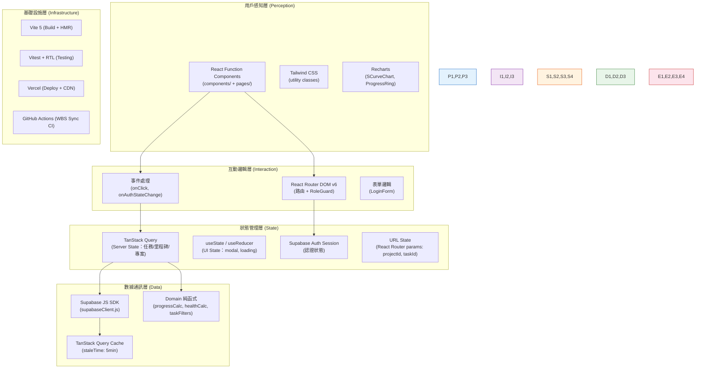
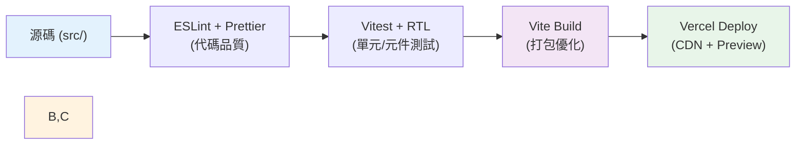

# 前端架構與開發規範 (Frontend Architecture Specification) - Node_PM Web App

---

**文件版本 (Document Version):** `v1.0`
**最後更新 (Last Updated):** `2026-06-05`
**主要作者 (Lead Author):** `技術負責人`
**審核者 (Reviewers):** `PM`
**狀態 (Status):** `草稿 (Draft)`

**相關文件:**
- 專案 PRD: `Web_App_PRD.md`
- 系統架構: `Web_App_Architecture.md`
- API 設計規範: `Web_App_API_Specification.md`
- BDD 情境: `Web_App_BDD.md`
- 專案結構指南: `Web_App_Project_Structure_Guide.md`
- 依賴關係分析: `Web_App_File_Dependencies.md`

---

## 目錄 (Table of Contents)

- [第一部分：前端架構的第一性原理](#第一部分前端架構的第一性原理)
- [第二部分：前端架構的系統化分層](#第二部分前端架構的系統化分層)
- [第三部分：前端設計系統](#第三部分前端設計系統)
- [第四部分：技術選型與架構決策](#第四部分技術選型與架構決策)
- [第五部分：效能與優化策略](#第五部分效能與優化策略)
- [第六部分：可用性與無障礙設計](#第六部分可用性與無障礙設計)
- [第七部分：前端工程化實踐](#第七部分前端工程化實踐)
- [第八部分：Supabase 協作契約（前端視角）](#第八部分supabase-協作契約前端視角)
- [第九部分：監控、日誌與安全](#第九部分監控日誌與安全)
- [第十部分：前端開發檢查清單](#第十部分前端開發檢查清單)
- [附錄](#附錄)

---

## 第一部分：前端架構的第一性原理

> **核心理念：** Node_PM Web App 是一個「工具效率」導向的資料儀表板，前端的唯一目標是讓 PM、工程師、客戶以最低認知負擔取得各自需要的進度資訊。

### 1.1 根本目的：工具效率型應用

Node_PM Web App 屬於**工具效率（Productivity）**類型的前端應用，而非行銷網站或電商平台。

| 目的類別 | Node_PM 定位 | 核心 KPI | 設計重點 |
| :--- | :--- | :--- | :--- |
| **商業轉換** | ❌ 不適用 | — | — |
| **內容消費** | ❌ 不適用 | — | — |
| **工具效率** | ✅ **核心目標** | 任務完成時間、操作步驟數、角色切換效率 | 資訊密度高、導航清晰、資料即時性 |
| **品牌體驗** | ⚠️ 次要（客戶端 Viewer 視圖） | 客戶對專案進度的信心分數 | 簡潔專業、數字清晰、里程碑可見 |

**因果邏輯：**
```
PM 進入 L1 → 3 秒內看到所有專案健康度 → 快速決定是否需要介入
工程師進入 L1 → 1 秒內看到個人今日待辦 → 專注執行，無認知雜訊
客戶進入 L1 → 立即看到完成率圓環 → 建立對交付的信心
```

### 1.2 前端架構的終極目標

| 維度 | 定義 | Node_PM 目標 |
| :--- | :--- | :--- |
| **性能 (Performance)** | 資料載入速度與圖表渲染速度 | 首次有意義繪製（FCP）< 2s；Supabase 查詢回應 < 500ms |
| **可用性 (Usability)** | 三個角色無需說明書即可完成核心任務 | PM 進入 L2 診斷頁操作步驟 ≤ 2 次點擊 |
| **可維護性 (Maintainability)** | 新增角色視圖或調整計算邏輯不影響其他模組 | Clean Architecture 四層隔離；Domain 純函式 100% 測試覆蓋 |
| **可靠性 (Reliability)** | Supabase 連線中斷或角色查詢失敗有明確提示 | 所有 hooks 回傳 `error` 狀態；`ErrorBoundary` 全域捕獲 |

### 1.3 前端決策的因果鏈

**決策 1：選擇 React SPA（非 Next.js SSR）**
```
決策：React SPA + Vite（ADR-G001）
↓
原因：儀表板資料需依角色動態過濾，無 SEO 需求；Vite 開發體驗最佳
↓
結果：HMR 速度 < 100ms；Supabase RLS 過濾在客戶端完全適用
↓
商業影響：開發週期縮短；無伺服器維護成本（配合 Vercel 零設定部署）
```

**決策 2：使用 Supabase BaaS 取代自建 API Server**
```
決策：Supabase JS SDK 直接查詢（ADR-G002/G004）
↓
原因：Auth + DB + RLS 一體整合；無需維護自建後端
↓
結果：前端直接 import SDK；anon key 受 RLS 保護可安全暴露
↓
商業影響：MVP 開發時間減少 30%；雲端托管費用 $0（Free tier 內）
```

**決策 3：動態計算完成率，不儲存靜態欄位**
```
決策：前端 calcProgress() 動態計算（ADR-G003）
↓
原因：消除資料不一致風險；GitHub Actions 只需 upsert 任務狀態
↓
結果：完成率永遠與 tasks_sync 即時同步；Domain 邏輯 100% 可測試
↓
商業影響：資料可信度高；工程師不需手動更新進度欄位
```

---

## 第二部分：前端架構的系統化分層



### 2.1 用戶感知層（Perception Layer）

**核心職責：** 渲染角色對應的 Dashboard 視圖，呈現健康度燈號、完成率圓環、S-Curve 圖表等視覺元件。

**設計模式 — 原子化元件層次：**

```
原子 (Atoms)
  └── HealthBadge（燈號）、ProgressRing（圓環）、TaskCard（任務卡片）

分子 (Molecules)
  └── MilestoneCountdown（里程碑倒數 = 燈號 + 日期文字）
      BlockersList（Blocked 清單 = TaskCard × N）

組織 (Organisms)
  └── KanbanBoard（四欄看板 = 四組 TaskCard 列表）
      SCurveChart（Recharts 折線圖）
      MilestoneTimeline（時間軸）

頁面 (Pages)
  └── PortfolioPage / DiagnosisPage / TodoPage / SummaryPage 等
```

**核心原則：**
- 元件盡可能設計為**純展示型（Presentational）**：只接收 props，不呼叫 Supabase SDK
- 業務資料由 hooks 取得後以 props 傳入元件
- 例外：`RoleGuard` 依賴 `useAuth`（因為守衛本身就是邏輯元件）

### 2.2 互動邏輯層（Interaction Layer）

**路由設計：**

```javascript
// App.jsx — 路由結構反映資訊架構（IA）
<Routes>
  <Route path="/login"         element={<LoginPage />} />
  <Route path="/auth/callback" element={<AuthCallbackPage />} />
  <Route path="/forbidden"     element={<ForbiddenPage />} />

  {/* PM：admin 角色 */}
  <Route path="/pm" element={<RoleGuard allowedRoles={['admin']}><Outlet /></RoleGuard>}>
    <Route index              element={<PortfolioPage />} />        {/* L1 */}
    <Route path=":projectId"  element={<DiagnosisPage />} />       {/* L2 */}
    <Route path="tasks/:taskId" element={<TaskDetailPage />} />    {/* L3 */}
  </Route>

  {/* 工程師：admin + developer */}
  <Route path="/engineer" element={<RoleGuard allowedRoles={['admin','developer']}><Outlet /></RoleGuard>}>
    <Route index                    element={<TodoPage />} />       {/* L1 */}
    <Route path=":projectId/kanban" element={<KanbanPage />} />    {/* L2 */}
    <Route path="tasks/:taskId"     element={<TaskDetailPage />} />{/* L3 */}
  </Route>

  {/* 客戶：所有角色（Viewer 被擋在 L3 之外）*/}
  <Route path="/client" element={<RoleGuard allowedRoles={['admin','developer','viewer']}><Outlet /></RoleGuard>}>
    <Route path=":projectId"         element={<SummaryPage />} />  {/* L1 */}
    <Route path=":projectId/roadmap" element={<RoadmapPage />} />  {/* L2 */}
    {/* L3 TaskDetail：Viewer 無路由 → RoleGuard 攔截 */}
  </Route>
</Routes>
```

**URL State 設計：**

| 路由參數 | 用途 | 範例 |
| :--- | :--- | :--- |
| `:projectId` | 當前選擇的專案 UUID | `/pm/uuid-proj-a` |
| `:taskId` | 當前查看的任務 UUID | `/pm/tasks/uuid-task-1` |

登入後 → 依 `currentRole` 自動重導向：
- `admin` → `/pm`
- `developer` → `/engineer`
- `viewer` → `/client/:firstProjectId`（取第一個可存取專案）

### 2.3 狀態管理層（State Management Layer）

**狀態分類與對應技術：**

| 狀態類型 | 範例 | 儲存位置 | 持久化 | 技術 |
| :--- | :--- | :--- | :--- | :--- |
| **Server State（主要）** | projects, tasks, milestones | TanStack Query cache | 暫存（staleTime） | `useQuery` |
| **認證狀態** | user, currentRole | `useAuth` hook（`useState` + Supabase session） | `localStorage`（Supabase 自動管理） | Supabase Auth |
| **UI 本地狀態** | modal 開關、tab 選中 | 元件 `useState` | 否 | `useState` |
| **URL 狀態** | projectId, taskId | React Router URL params | 是（URL 本身） | `useParams`, `useNavigate` |
| **表單狀態** | email input（LoginForm） | 元件 `useState` | 否 | `useState` |

**TanStack Query 快取設定：**

```javascript
// 不同資料類型的 staleTime 設定
const queryClient = new QueryClient({
  defaultOptions: {
    queries: {
      staleTime: 5 * 60 * 1000,     // 預設 5 分鐘：任務清單
      retry: 2,                       // 失敗重試 2 次
      refetchOnWindowFocus: true      // 切換視窗時重新驗證
    }
  }
})

// 里程碑：變動頻率低，快取較長
const { data: milestones } = useQuery({
  queryKey: ['milestones', projectId],
  queryFn: () => fetchMilestones(projectId),
  staleTime: 10 * 60 * 1000  // 10 分鐘
})

// 健康度相關任務：需要較即時
const { data: tasks } = useQuery({
  queryKey: ['tasks', projectId],
  queryFn: () => fetchTasks(projectId),
  staleTime: 2 * 60 * 1000   // 2 分鐘
})
```

**狀態決策原則（不使用 Zustand 或 Redux）：**

本專案規模（< 10 頁面）不需要全域 UI 狀態管理庫。所有「跨元件共享狀態」均為 Server State，由 TanStack Query 管理；認證狀態由 `useAuth` hook 的 React Context 提供。

### 2.4 數據通訊層（Data Communication Layer）

**Supabase SDK 封裝設計（取代傳統 API Client）：**

```javascript
// src/lib/supabaseClient.js — 唯一初始化點
import { createClient } from '@supabase/supabase-js'
export const supabase = createClient(
  import.meta.env.VITE_SUPABASE_URL,
  import.meta.env.VITE_SUPABASE_ANON_KEY
)

// 所有 hooks 只 import supabase，不直接 import @supabase/supabase-js
// 這是 Façade 模式：降低 SDK 替換成本
```

**查詢分層設計：**

```
supabaseClient.js（Infrastructure 封裝）
    ↓
useXxx.js hooks（Application Layer：查詢 + 轉換 + 計算）
    ↓
pages + components（Presentation Layer：渲染）
```

**快取失效策略：**
- 所有資料為**唯讀**（前端不寫入 Supabase，寫入只由 GitHub Actions 執行）
- 因此無需 `useMutation` 或 `queryClient.invalidateQueries`
- 唯一例外：`useAuth` 的 `signOut()` 會觸發 Supabase Auth session 清除

**例外情境（Admin 成員管理，Post-MVP）：**

```javascript
// MVP 階段：Admin 成員管理透過 Supabase Dashboard 手動操作
// Post-MVP：透過 Supabase Edge Function 實作（不在前端直接使用 service_role key）
```

### 2.5 基礎設施層（Infrastructure Layer）

**前端工程化工具鏈：**



---

## 第三部分：前端設計系統

> **定位：** Node_PM Web App 是內部工具型儀表板，設計系統的目標是**清晰高效**而非美觀炫技。

### 3.1 設計原則

| 原則 | 定義 | 實踐指南 |
| :--- | :--- | :--- |
| **資訊密度優先** | 儀表板需在單一視圖展示最多有效資訊 | L1 頁面所有專案燈號一覽無遺；避免過多留白 |
| **角色隔離清晰** | 三個角色看到完全不同的視圖，不混淆 | 路由分層（`/pm`, `/engineer`, `/client`）反映在 UI 導覽列 |
| **數字為主角** | 完成率、天數倒數、任務數量是核心資訊 | 大字體數字 + 小字體標籤；進度圓環數字居中 |
| **燈號語義固定** | 🟢🟡🔴 三種顏色在整個 App 語義一致 | 所有 `HealthBadge` 使用同一顏色 token |

### 3.2 視覺語言系統（Tailwind CSS）

**色彩系統（語義化 Tailwind class）：**

```javascript
// tailwind.config.js — 語義化顏色擴充
module.exports = {
  theme: {
    extend: {
      colors: {
        // 健康度燈號（與 calcHealth() 回傳值對應）
        health: {
          normal:  '#22c55e',  // green-500：🟢 正常
          warning: '#f59e0b',  // amber-500：🟡 注意
          critical:'#ef4444',  // red-500：🔴 異常
        },
        // 任務狀態標籤顏色
        status: {
          todo:    '#6b7280',  // gray-500
          doing:   '#3b82f6',  // blue-500
          done:    '#22c55e',  // green-500
          blocked: '#ef4444',  // red-500
        },
        // 品牌主色（儀表板 header / sidebar）
        brand: {
          primary: '#1e40af',  // blue-800
          surface: '#f8fafc',  // slate-50
        }
      }
    }
  }
}
```

**健康度燈號元件（HealthBadge）顏色對應：**

| `status` prop | Tailwind class | 顯示 | 語義 |
| :--- | :--- | :--- | :--- |
| `'normal'` | `bg-health-normal` | 🟢 正常 | 無 Blocked，無 overdue |
| `'warning'` | `bg-health-warning` | 🟡 注意 | 有 overdue 任務 |
| `'critical'` | `bg-health-critical` | 🔴 異常 | 有 Blocked 任務 |

**字體排印（Tailwind 預設 + 中文回退）：**

```javascript
// tailwind.config.js
fontFamily: {
  sans: [
    'Inter',
    '-apple-system',
    'BlinkMacSystemFont',
    '"Segoe UI"',
    '"Noto Sans TC"',  // 中文
    'sans-serif'
  ],
  mono: [
    '"Fira Code"',
    'Consolas',
    'monospace'
  ]
}
```

**字體階層：**

| 用途 | Tailwind class | 大小 |
| :--- | :--- | :--- |
| 頁面標題 | `text-2xl font-bold` | 24px |
| 區塊標題 | `text-lg font-semibold` | 18px |
| 進度圓環數字 | `text-4xl font-bold` | 36px |
| 里程碑倒數天數 | `text-3xl font-bold` | 30px |
| 任務卡片標題 | `text-sm font-medium` | 14px |
| 輔助說明文字 | `text-xs text-gray-500` | 12px |

**間距系統（Tailwind 預設 4px 基準）：**

```
p-1 (4px), p-2 (8px), p-3 (12px), p-4 (16px),
p-6 (24px), p-8 (32px)
```

### 3.3 元件庫架構

```plaintext
src/components/
├── common/
│   ├── RoleGuard.jsx         # RBAC 守衛（有邏輯的特殊元件）
│   ├── LoadingSpinner.jsx    # 全局 loading（Tailwind animate-spin）
│   ├── ErrorBoundary.jsx     # 錯誤邊界（class component）
│   └── EmptyState.jsx        # 空資料提示

├── dashboard/
│   ├── HealthBadge.jsx       # 🟢🟡🔴 燈號（純展示）
│   ├── SCurveChart.jsx       # S-Curve 折線圖（Recharts）
│   └── BlockersList.jsx      # Blocked 清單容器

├── progress/
│   ├── ProgressRing.jsx      # SVG 圓環（純展示，接收 done/total）
│   └── MilestoneCountdown.jsx # 倒數計日（純展示）

├── kanban/
│   ├── KanbanBoard.jsx       # 四欄容器（純展示）
│   └── TaskCard.jsx          # 任務卡片（純展示）

└── roadmap/
    └── MilestoneTimeline.jsx # 時間軸（純展示）
```

**元件設計檢查清單：**
- [ ] 純展示元件：不直接呼叫 Supabase SDK
- [ ] Props 介面明確定義（JSDoc 或 PropTypes）
- [ ] 有 `isLoading` 狀態的骨架屏（Skeleton）
- [ ] 有 `error` 狀態的 fallback UI
- [ ] `null` / `undefined` 資料的防禦處理

### 3.4 設計令牌（Tailwind Config 即設計令牌）

本專案以 `tailwind.config.js` 作為唯一設計令牌來源，避免引入 Style Dictionary 等額外工具的複雜度（MVP 規模不需要）。

```javascript
// 使用方式：class 名稱而非硬編碼顏色值
// ✅ 正確
<span className="text-health-normal">● 正常</span>

// ❌ 禁止（硬編碼，難以全局修改）
<span style={{ color: '#22c55e' }}>● 正常</span>
```

---

## 第四部分：技術選型與架構決策

### 4.1 前端框架

| 選項 | 結論 | 理由 |
| :--- | :--- | :--- |
| **React 18** | ✅ 採用 | Supabase SDK 完整支援；生態豐富；關聯 ADR-G001 |
| Next.js | ❌ 不採用 | 無 SEO 需求；Supabase RLS 在 SPA 完全適用；無需 SSR |
| Vue / Svelte | ❌ 不採用 | 無明確優勢；團隊熟悉度低於 React |

### 4.2 狀態管理

| 狀態類型 | 選用方案 | 理由 |
| :--- | :--- | :--- |
| Server State（主要） | TanStack Query v5 | 自動快取、refetch、loading/error 狀態管理 |
| 認證狀態 | `useAuth` hook（`useState` + Supabase session） | 輕量；Auth 狀態本質上是 server state |
| UI 本地狀態 | `useState` | 無需全域；符合「最小化狀態」原則 |
| 全域 UI 狀態 | React Context（僅 AuthContext） | 規模不需要 Zustand / Redux |

### 4.3 構建與工具鏈

```json
{
  "構建工具": "Vite 5（HMR < 100ms，Build < 30s）",
  "套件管理器": "npm（統一，避免混用 pnpm/yarn）",
  "代碼檢查": "ESLint（eslint-plugin-react, eslint-plugin-import）",
  "代碼格式化": "Prettier（統一風格，pre-commit 自動套用）",
  "Git Hooks": "Husky + lint-staged（pre-commit: lint + format）",
  "測試框架": "Vitest + @testing-library/react（整合在 vite.config.js）",
  "部署": "Vercel（零設定 SPA 部署，Preview Deploy per PR）"
}
```

### 4.4 樣式方案

**選用：Tailwind CSS v3**

| 優勢 | 說明 |
| :--- | :--- |
| 開發速度 | Utility-first：不需命名 class，直接在 JSX 中組合樣式 |
| 一致性 | 設計令牌統一定義在 `tailwind.config.js` |
| 打包體積 | PurgeCSS 自動移除未使用 class，生產包 < 20KB CSS |
| 自定義 | 透過 `extend` 新增語義化顏色（`health-normal`、`status-done`） |

**不採用 CSS-in-JS（Styled-Components / Emotion）：** 運行時開銷不必要；儀表板不需要動態主題。

---

## 第五部分：效能與優化策略

### 5.1 核心網頁指標目標

| 指標 | 目標 | 優化重點 |
| :--- | :--- | :--- |
| **FCP** (First Contentful Paint) | < 2.0s | Vite 分割 + Vercel CDN |
| **LCP** (Largest Contentful Paint) | < 2.5s | 避免大型圖片；骨架屏取代 loading spinner |
| **CLS** (Cumulative Layout Shift) | < 0.1 | 所有圖表元件有固定高度佔位（`h-64`） |
| **TTI** (Time to Interactive) | < 3.5s | 路由級代碼分割；首屏只載入 LoginPage |

### 5.2 載入效能優化

**路由級代碼分割（React.lazy）：**

```jsx
// App.jsx — 所有頁面延遲載入，首屏只需 LoginPage
import { lazy, Suspense } from 'react'

const PortfolioPage   = lazy(() => import('./pages/pm/PortfolioPage'))
const DiagnosisPage   = lazy(() => import('./pages/pm/DiagnosisPage'))
const TaskDetailPage  = lazy(() => import('./pages/pm/TaskDetailPage'))
const TodoPage        = lazy(() => import('./pages/engineer/TodoPage'))
const KanbanPage      = lazy(() => import('./pages/engineer/KanbanPage'))
const SummaryPage     = lazy(() => import('./pages/client/SummaryPage'))
const RoadmapPage     = lazy(() => import('./pages/client/RoadmapPage'))

// Recharts 也延遲載入（較重，~400KB gzipped）
const SCurveChart = lazy(() => import('./components/dashboard/SCurveChart'))
```

**骨架屏（Skeleton）防止 CLS：**

```jsx
// 圖表區域固定高度，防止載入前後佈局偏移
function DiagnosisPage() {
  const { allTasks, isLoading } = useProjectDiagnosis(projectId)

  return (
    <div className="h-64">  {/* 固定高度，避免 CLS */}
      <Suspense fallback={<div className="h-64 bg-gray-100 animate-pulse rounded-lg" />}>
        {!isLoading && <SCurveChart tasks={allTasks} milestones={milestones} />}
      </Suspense>
    </div>
  )
}
```

### 5.3 運行時效能優化

**React 渲染優化：**

```jsx
// 純展示元件使用 React.memo 防止父元件重渲染時的不必要渲染
const HealthBadge = React.memo(function HealthBadge({ status }) {
  const config = {
    normal:   { label: '正常', cls: 'bg-health-normal' },
    warning:  { label: '注意', cls: 'bg-health-warning' },
    critical: { label: '異常', cls: 'bg-health-critical' },
  }
  return (
    <span className={`${config[status].cls} text-white text-xs px-2 py-1 rounded-full`}>
      {config[status].label}
    </span>
  )
})

// TaskCard 同樣使用 React.memo（Kanban 中大量渲染）
const TaskCard = React.memo(function TaskCard({ task }) { /* ... */ })
```

**S-Curve 計算 useMemo：**

```jsx
// DiagnosisPage — 避免每次渲染重新計算 S-Curve 資料點
function DiagnosisPage({ projectId }) {
  const { allTasks, milestones } = useProjectDiagnosis(projectId)
  const today = useMemo(() => new Date(), [])  // 當天日期在渲染週期內固定

  const chartData = useMemo(() => {
    if (!milestones || !allTasks) return []
    return buildSCurveData(milestones, allTasks, today)
  }, [milestones, allTasks, today])

  return <SCurveChart data={chartData} />
}
```

**不需要虛擬化：** 任務數量 < 1,000 筆，無需 `react-window`。若未來任務數超過 500 筆，再評估。

### 5.4 資源優化

**Vite 生產構建設定：**

```javascript
// vite.config.js
export default defineConfig({
  build: {
    rollupOptions: {
      output: {
        manualChunks: {
          'vendor-react':    ['react', 'react-dom', 'react-router-dom'],
          'vendor-supabase': ['@supabase/supabase-js'],
          'vendor-query':    ['@tanstack/react-query'],
          'vendor-recharts': ['recharts'],  // Recharts 獨立 chunk（較大）
        }
      }
    },
    chunkSizeWarningLimit: 500  // KB
  }
})
```

**目標打包大小：**

| Chunk | 目標大小（gzipped） |
| :--- | :--- |
| `vendor-react` | ~45KB |
| `vendor-supabase` | ~35KB |
| `vendor-recharts` | ~80KB（延遲載入） |
| 應用程式碼 | ~30KB |

---

## 第六部分：可用性與無障礙設計

### 6.1 響應式設計策略

**斷點定義（Tailwind 預設）：**

```css
sm:  640px  /* 大手機（橫向）*/
md:  768px  /* 平板 */
lg:  1024px /* 筆電 / 桌面 — PM 和工程師主要使用環境 */
xl:  1280px /* 大桌面 */
```

**設計策略：** 桌面優先（Desktop-first）
- PM 和工程師使用桌機/筆電，L2 診斷頁需要較大螢幕展示 S-Curve 圖
- 客戶（Viewer）的 L1 摘要頁設計為可在手機上閱讀

**各頁面響應式規格：**

| 頁面 | 手機（sm）| 桌面（lg）|
| :--- | :--- | :--- |
| PM L1 PortfolioPage | 單欄列表（燈號 + 名稱） | 3 欄網格（燈號 + 圓環 + 里程碑） |
| PM L2 DiagnosisPage | 隱藏 S-Curve；顯示 Overdue/Blocked | 左側 S-Curve + 右側清單 |
| 工程師 L2 KanbanPage | 單欄滾動（一次看一欄） | 四欄並排 |
| 客戶 L1 SummaryPage | 圓環置中 + 里程碑列表 | 左圓環 + 右里程碑 |

### 6.2 無障礙性（A11y）

**WCAG 2.1 Level AA 最低要求：**

```jsx
// HealthBadge — 顏色不是唯一資訊傳達方式
function HealthBadge({ status }) {
  const labels = { normal: '🟢 正常', warning: '🟡 注意', critical: '🔴 異常' }
  return (
    <span
      role="status"
      aria-label={`專案健康度：${labels[status]}`}
      className={`health-badge health-badge--${status}`}
    >
      {labels[status]}
    </span>
  )
}

// ProgressRing — 為螢幕閱讀器提供文字替代
function ProgressRing({ done, total }) {
  const pct = calcProgress([...])
  return (
    <div role="img" aria-label={`完成率 ${pct}%，共 ${total} 個任務，已完成 ${done} 個`}>
      {/* SVG 圓環 */}
    </div>
  )
}

// 動態更新 loading 狀態
<div role="status" aria-live="polite">
  {isLoading ? '資料載入中...' : null}
</div>
```

**對比度檢查清單：**
- [ ] `text-health-normal`（#22c55e）在白底對比度 ≥ 3:1（大文字合規）
- [ ] `text-health-critical`（#ef4444）在白底對比度 ≥ 4.5:1（合規）
- [ ] `text-gray-500`（#6b7280）在白底對比度 ≥ 4.5:1（合規）

### 6.3 國際化（i18n）

**MVP 階段：繁體中文單語，不引入 i18n 框架。**

所有 UI 文字直接寫在元件中（如 `'🟢 正常'`、`'完成率'`）。若未來需要英文版，再引入 `react-i18next`。

---

## 第七部分：前端工程化實踐

### 7.1 代碼品質保證

**ESLint 設定（`.eslintrc.cjs`）：**

```javascript
module.exports = {
  extends: [
    'eslint:recommended',
    'plugin:react/recommended',
    'plugin:react-hooks/recommended',
    'plugin:jsx-a11y/recommended',
    'plugin:import/recommended',
    'prettier'
  ],
  plugins: ['import'],
  rules: {
    'react/react-in-jsx-scope': 'off',       // React 17+，不需 import React
    'react-hooks/exhaustive-deps': 'warn',    // hooks 依賴漏寫警告
    'no-console': ['warn', { allow: ['warn', 'error'] }],
    'import/no-cycle': ['error', { maxDepth: 3 }]  // ⚠️ 禁止循環依賴
  }
}
```

**Prettier 設定（`.prettierrc`）：**

```json
{
  "semi": false,
  "singleQuote": true,
  "tabWidth": 2,
  "trailingComma": "es5",
  "printWidth": 100
}
```

**Git Hooks（Husky + lint-staged）：**

```json
// package.json
{
  "lint-staged": {
    "*.{js,jsx}": ["eslint --fix", "prettier --write"],
    "*.{css,md}": ["prettier --write"]
  }
}
```

### 7.2 測試策略

**測試金字塔（Node_PM Web App）：**

```
         /\
        /E2E\           5%  → 不在 MVP 實作（Vitest 已足夠）
       /------\
      /Integration\    25%  → hooks mock Supabase SDK（useAuth, useProjectList）
     /------------\
    /  Unit Tests  \   70%  → lib/ 純函式（100% 覆蓋）+ RoleGuard
   /----------------\
```

**覆蓋率目標（詳見 `Web_App_Module_Spec_and_Tests.md`）：**

| 層 | 目標 | 重點 |
| :--- | :--- | :--- |
| `lib/` Domain 純函式 | 100% | `calcProgress`, `calcHealth`, `sCurveInterpolation`, `taskFilters` |
| `hooks/` Application | 80%+ | `useAuth`（mock Supabase）|
| `components/` UI 元件 | 90%+ | `RoleGuard`（所有角色 × 允許/拒絕）|
| `pages/` 頁面 | 不強制（E2E 階段再補）| — |

**執行指令：**

```bash
npx vitest run           # 一次性執行所有測試
npx vitest               # Watch 模式（TDD 開發時）
npx vitest run --coverage # 生成覆蓋率報告
```

### 7.3 CI/CD 整合

**`ci.yml`（PR 自動觸發 Vitest）：**

```yaml
name: CI
on:
  pull_request:
    branches: [main]

jobs:
  test:
    runs-on: ubuntu-latest
    steps:
      - uses: actions/checkout@v4
      - uses: actions/setup-node@v4
        with: { node-version: '20', cache: 'npm' }
      - run: npm ci
      - run: npm run lint
      - run: npx vitest run --coverage
```

**Vercel 自動部署：**

| 事件 | 部署目標 | URL |
| :--- | :--- | :--- |
| `push` 到 `main` | Production | `node-pm.vercel.app` |
| PR 開啟 / 更新 | Preview | `node-pm-git-{branch}.vercel.app` |

**`vercel.json`（SPA 路由 fallback）：**

```json
{
  "rewrites": [
    { "source": "/(.*)", "destination": "/index.html" }
  ]
}
```

---

## 第八部分：Supabase 協作契約（前端視角）

> 本章取代傳統「前後端協作契約」，描述前端與 Supabase BaaS 的介面規範。

### 8.1 Supabase 查詢規範

**所有查詢須遵循：**

```javascript
// ✅ 正確：只取需要的欄位（減少傳輸量）
const { data, error } = await supabase
  .from('tasks_sync')
  .select('id, external_id, title, status, deadline, assignee_email')
  .eq('project_id', projectId)

// ❌ 禁止：SELECT * 取全部欄位
const { data } = await supabase.from('tasks_sync').select('*')
```

**型別前置條件（前端防禦）：**

```javascript
// deadline 可能為 null，使用前必須檢查
const overdue = tasks.filter(t =>
  t.deadline !== null &&  // ← 必須先檢查 null
  new Date(t.deadline) < today &&
  t.status !== 'Done'
)
```

### 8.2 錯誤處理策略

**Supabase 錯誤分類與前端處理：**

| HTTP 狀態碼 | Supabase 場景 | 前端處理 |
| :--- | :--- | :--- |
| `200` | 查詢成功（可能空陣列） | 渲染資料；空陣列顯示 `EmptyState` |
| `401` | JWT 過期 | `useAuth` 自動重新整理 session；失敗則導向 `/login` |
| `403` | RLS 拒絕（無權限）| 顯示「無存取權限」提示 |
| `406` | `.single()` 查詢無結果 | 顯示「資料不存在」提示 |
| `429` | Auth API 速率限制（Magic Link）| 顯示「請稍後再試（每小時最多 3 次）」|
| `500` | Supabase 伺服器錯誤 | `ErrorBoundary` 捕獲；顯示「服務暫時不可用」|

**統一錯誤處理 hook 模式：**

```javascript
// 所有 hooks 統一回傳格式，頁面元件不直接接觸 error 物件
function useProjectList() {
  return useQuery({
    queryKey: ['projects'],
    queryFn: async () => {
      const { data, error } = await supabase.from('projects').select('...')
      if (error) throw new Error(error.message)  // 轉換為 standard Error
      return data
    },
    onError: (err) => console.error('useProjectList error:', err.message)
  })
}

// 頁面元件
function PortfolioPage() {
  const { data: projects, isLoading, error } = useProjectList()
  if (isLoading) return <LoadingSpinner />
  if (error)     return <ErrorMessage message={error.message} />
  if (!projects.length) return <EmptyState />
  return <ProjectGrid projects={projects} />
}
```

### 8.3 認證與授權

**Supabase Auth 生命週期（前端視角）：**

```
App 啟動
  ↓
useAuth：supabase.auth.getSession()
  ├─ session 存在 → loading = false, user = session.user
  └─ session 為 null → loading = false, user = null → App 重導向 /login

用戶點擊登入
  ↓
signInWithGoogle() 或 signInWithEmail(email)
  ↓
supabase.auth.onAuthStateChange (SIGNED_IN)
  ↓
useAuth 更新 user 與 currentRole
  ↓
App 依 currentRole 重導向對應首頁
```

**安全邊界：**
- 前端只使用 `VITE_SUPABASE_ANON_KEY`（受 RLS 保護）
- `service_role` key **只存於 GitHub Secrets**，絕不出現在任何前端程式碼或環境變數

---

## 第九部分：監控、日誌與安全

### 9.1 前端監控策略（MVP 階段）

**MVP 階段監控工具：Vercel Analytics（免費 + 零設定）**

| 指標 | 採集工具 | 查看位置 |
| :--- | :--- | :--- |
| Core Web Vitals（LCP/CLS/FID） | Vercel Speed Insights | Vercel Dashboard |
| 頁面流量 / 訪客 | Vercel Analytics | Vercel Dashboard |
| JS 錯誤 | `window.onerror`（console） | 開發者 DevTools |
| Supabase 查詢效能 | Supabase Dashboard → Logs | Supabase Dashboard |

**Post-MVP：** 若 JS 錯誤增多，引入 Sentry（Free tier 支援 5,000 errors/month）。

### 9.2 錯誤追蹤

**全域 ErrorBoundary 實作：**

```jsx
// src/components/common/ErrorBoundary.jsx
class ErrorBoundary extends React.Component {
  state = { hasError: false, error: null }

  static getDerivedStateFromError(error) {
    return { hasError: true, error }
  }

  componentDidCatch(error, info) {
    // MVP：console.error；Post-MVP：Sentry.captureException(error)
    console.error('ErrorBoundary caught:', error, info.componentStack)
  }

  render() {
    if (this.state.hasError) {
      return (
        <div className="flex flex-col items-center justify-center min-h-screen">
          <p className="text-red-500 text-lg">發生錯誤，請重新整理頁面</p>
          <button
            className="mt-4 px-4 py-2 bg-blue-500 text-white rounded"
            onClick={() => window.location.reload()}
          >
            重新整理
          </button>
        </div>
      )
    }
    return this.props.children
  }
}
```

### 9.3 前端安全實踐

**XSS 防護：**
- React 預設轉義所有 JSX 表達式（`{value}`）
- 不使用 `dangerouslySetInnerHTML`
- WBS `yaml_data` JSONB 欄位顯示時只讀取純文字欄位，不渲染 HTML

**API Key 安全：**

| Key 類型 | 儲存位置 | 備註 |
| :--- | :--- | :--- |
| `anon key` | `.env.local` + Vercel 環境變數 | `VITE_` 前綴，打包進 bundle — 受 RLS 保護，可公開 |
| `service_role key` | GitHub Secrets（`SUPABASE_SERVICE_ROLE_KEY`）| 絕不出現在前端任何檔案 |

**Content Security Policy（`vercel.json` Headers）：**

```json
{
  "headers": [
    {
      "source": "/(.*)",
      "headers": [
        {
          "key": "Content-Security-Policy",
          "value": "default-src 'self'; script-src 'self' 'unsafe-inline'; connect-src 'self' https://*.supabase.co; img-src 'self' data: https:; style-src 'self' 'unsafe-inline'"
        },
        { "key": "X-Frame-Options", "value": "DENY" },
        { "key": "X-Content-Type-Options", "value": "nosniff" }
      ]
    }
  ]
}
```

**依賴安全：**
- [ ] 每月執行 `npm audit`（或 CI 中自動執行）
- [ ] Dependabot 設定（見 `Web_App_File_Dependencies.md#7.3`）

---

## 第十部分：前端開發檢查清單

### 開發前（規劃）

- [ ] 已閱讀 BDD Feature（`Web_App_BDD.md`）確認驗收情境
- [ ] 已確認元件歸屬（原子 / 分子 / 頁面）
- [ ] 已確認 hook 查詢的 Supabase 欄位（`Web_App_API_Specification.md`）
- [ ] 已確認此功能的角色限制（`allowedRoles` 清單）

### 開發中（實作）

**架構規範**
- [ ] 頁面元件只依賴 hooks 取得資料，不直接呼叫 Supabase SDK
- [ ] 純展示元件（HealthBadge, ProgressRing 等）不含 API 呼叫
- [ ] 新增 import 後執行 `eslint --rule 'import/no-cycle'` 確認無循環依賴
- [ ] `lib/` 純函式不 import `hooks/` 或 `pages/`（單向依賴）

**安全規範**
- [ ] 環境變數只用 `VITE_SUPABASE_URL` 和 `VITE_SUPABASE_ANON_KEY`
- [ ] 沒有任何 `service_role` 字樣出現在 `src/` 下的任何檔案
- [ ] `.env.local` 已在 `.gitignore` 中

**UI 規範**
- [ ] 健康度燈號顏色使用 `bg-health-{status}` token，不硬編碼顏色值
- [ ] 圖表元件有固定高度（`h-64` / `h-96`），避免 CLS
- [ ] 所有 loading 狀態有骨架屏或 `LoadingSpinner`
- [ ] 空資料狀態有 `EmptyState` 元件

### 測試

- [ ] Domain 純函式測試：`calcProgress`, `calcHealth` 等覆蓋率 100%
- [ ] `RoleGuard` 測試：覆蓋 3 種角色 × 允許 / 拒絕 / 未登入
- [ ] hook 測試：`useAuth` 的三種狀態（已登入 / 未登入 / 登出）
- [ ] `npx vitest run` 全部通過，無 failing test

### 上線前

**代碼審查**
- [ ] 通過 `npm run lint`（ESLint 零錯誤）
- [ ] 無 `console.log`（只允許 `console.warn` / `console.error`）
- [ ] PR 描述說明 BDD Scenario 對應

**效能**
- [ ] `npm run build` 成功；無 chunk size 超過 500KB 的警告
- [ ] Vercel Preview Deploy 正常；`/pm`, `/engineer`, `/client` 路由可存取
- [ ] Lighthouse Performance 分數 ≥ 80

**安全**
- [ ] `npm audit` 無 high / critical 漏洞
- [ ] CSP headers 已設定（`vercel.json`）
- [ ] Supabase RLS Policy 驗證：Viewer 無法查詢 L3 任務明細（API Spec 驗收）

---

## 附錄

### A. 相關 ADR 索引

| ADR | 決策 | 文件位置 |
| :--- | :--- | :--- |
| ADR-G001 | 選擇 React + Recharts（非 Next.js / Metabase） | `Web_App_ADR.md#ADR-G001` |
| ADR-G002 | Supabase Auth（Google OAuth + Email Magic Link） | `Web_App_ADR.md#ADR-G002` |
| ADR-G003 | 動態計算完成率，不儲存靜態欄位 | `Web_App_ADR.md#ADR-G003` |
| ADR-G004 | Supabase RLS + RoleGuard 雙層 RBAC | `Web_App_ADR.md#ADR-G004` |
| ADR-G005 | Vercel 部署 | `Web_App_ADR.md#ADR-G005` |
| ADR-G006 | 里程碑線性插值 S-Curve | `Web_App_ADR.md#ADR-G006` |

### B. 術語表

| 術語 | 定義 |
| :--- | :--- |
| **RLS** | Row Level Security：Supabase PostgreSQL 的資料列級安全機制，依 JWT 自動過濾資料 |
| **anon key** | Supabase 公開 API 金鑰，受 RLS 保護，可安全暴露於前端 |
| **service_role key** | Supabase 超級管理員金鑰，繞過 RLS，只能存放於 GitHub Secrets |
| **Pure Function** | 純函式：相同輸入永遠產生相同輸出，無副作用（lib/ 全部為此類型） |
| **TanStack Query** | React 的伺服器狀態管理庫（前稱 React Query），提供快取 / loading / error 管理 |
| **BaaS** | Backend as a Service：Supabase 提供資料庫、認證、API 一體化的後端服務 |
| **Hydration** | SSR 術語，本專案為純 SPA，無 hydration 問題 |
| **CLS** | Cumulative Layout Shift：頁面載入時元素位移的程度，影響視覺穩定性 |

### C. 參考文件

1. `Web_App_Architecture.md` — 系統架構（C4 圖、資料流）
2. `Web_App_API_Specification.md` — Supabase SDK 查詢規範
3. `Web_App_BDD.md` — 10 個 Gherkin Feature（驗收標準）
4. `Web_App_Module_Spec_and_Tests.md` — 6 個模組 TDD 測試案例
5. `Web_App_Project_Structure_Guide.md` — 目錄結構與命名規範
6. `Web_App_File_Dependencies.md` — 依賴關係與安全邊界

---

**文件審核記錄:**

| 日期       | 審核人 | 版本 | 變更摘要 |
| :--------- | :----- | :--- | :------- |
| 2026-06-05 | PM     | v1.0 | 初稿提交 |
